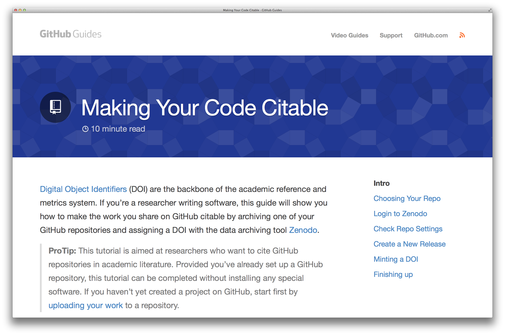

============================
Improving GitHub for science
============================

:URL: https://github.com/blog/1840-improving-github-for-science

GitHub is being used today to build scientific software that's helping
`find Earth-like planets <https://github.com/dfm/emcee>`__ in other
solar systems, `analyze DNA <https://github.com/ged-lab/khmer>`__, and
`build open source rockets <https://github.com/psas/av3-fc>`__.

Seeing these projects and all this momentum within academia has pushed
us to think about how we can make GitHub a better tool for research. As
scientific experiments become more complex and their datasets grow,
researchers are spending more of their time writing tools and software
to analyze the data they collect. Right now though, these efforts often
happen in isolation.

Citable code for academic software
~~~~~~~~~~~~~~~~~~~~~~~~~~~~~~~~~~

Sharing your work is good, but collaborating while also getting required
academic credit is even better. Over the past couple of months we've
been working with the `Mozilla Science
Lab <http://mozillascience.org>`__ and data archivers,
`Figshare <http://figshare.com/>`__ and
`Zenodo <https://zenodo.org/>`__, to make it possible to get a Digital
Object Identifier (DOI) for any GitHub repository archive.

DOIs form the backbone of the academic reference and metrics system.
With a DOI for your GitHub repository archive, your code becomes
citable. Our newest
`Guide <https://guides.github.com/activities/citable-code/>`__ explains
how to create a DOI for your repository.

|citable-code-screencap-01|

Academic accounts on GitHub
~~~~~~~~~~~~~~~~~~~~~~~~~~~

We also know that as a scientific researcher, sometimes you're going to
want to work privately. That's why we've created a discount where
individual academic researchers can receive a free micro plan with 5
private repos, while research groups can receive a free silver plan with
20 repos.

To set up an academic account on GitHub, first `associate an academic
email address with your
account <https://help.github.com/articles/setting-up-email-verification>`__
and then `request a GitHub Education
discount <https://education.github.com/discount>`__.

Awesome science happening on GitHub
~~~~~~~~~~~~~~~~~~~~~~~~~~~~~~~~~~~

If you're interested in seeing all the science happening on GitHub,
check out some of `our favorite
projects <https://github.com/showcases/science>`__, including
`rOpenSci <https://github.com/ropensci>`__. This group recently held a
Hackathon at GitHub HQ, where `their team worked with collaborators from
academia, business, and various research
labs <http://youtu.be/iUcm5COsKJo>`__ to build open source tools for
science.

Have feedback on this post? Let `@github <https://twitter.com/intent/tweet?text=@github%20&related=github&url=https://github.com/blog/1840-improving-github-for-science>`__ know on Twitter.
--------------------------------------------------------------------------------------------------------------------------------------------------------------------------------------------

Need help or found a bug? `Contact us </contact>`__.

