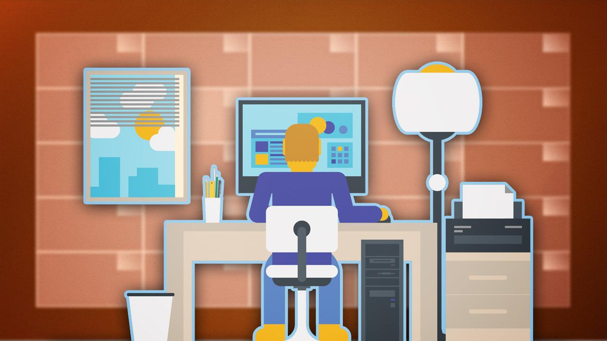
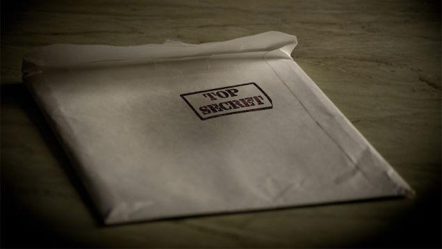

============================================================
10 Lessons I Learned from a Year of Productivity Experiments
============================================================

:URL: http://lifehacker.com/10-lessons-i-learned-from-a-year-of-productivity-experi-1584800618

Over the last 12 months I have conducted countless `productivity
experiments <http://ayearofproductivity.com/experiments/>`__ on myself,
`interviewed <http://ayearofproductivity.com/category/interviews/>`__
some of the most productive people in the world, and
`read <http://ayearofproductivity.com/favorite-books-productivity/>`__ a
ton of books and academic literature on productivity, all to explore how
I could become as productive as possible. This is what I've learned.

This post originally appeared on `A Year of
Productivity <http://ayearofproductivity.com/top-lessons-learned-a-year-of-productivity/>`__.

When I graduated University with a business degree last May, I received
two incredible full-time job offers, both of which I declined because I
had a plan. For exactly one year, from May 1, 2013, through May 1, 2014,
I would devour everything I could get my hands on about productivity,
and write every day about the lessons I learned on `A Year of
Productivity <http://ayearofproductivity.com/>`__.

One year, 197 articles, and over one million hits later, I've reached
the end of my year-long journey, but not before going out with a bang.

To close out my year of productivity, I have assembled a collection of
all of the biggest things I've learned in my journey to become as
productive as possible. Below are the ten biggest productivity lessons I
learned over the course of my project.

10. Work on Your Highest-Leverage Tasks to Become More Productive
~~~~~~~~~~~~~~~~~~~~~~~~~~~~~~~~~~~~~~~~~~~~~~~~~~~~~~~~~~~~~~~~~

There are just a few tasks in every area of your life (like your mind,
body, emotions, relationships, career, finances, and fun) that
contribute most of the value in each area. For example, there are likely
just a few activities in your work through which you contribute 80-90%
of your value to whomever you work for.

One of the best ways to accomplish more is to `identify and then work on
the highest-leverage tasks in each area of your
life <http://ayearofproductivity.com/how-to-determine-highest-leverage-activities-work/>`__,
because these are the activities that give you the greatest return for
your time, energy, and attention.

9. The Three Most Effective Tips Are Also the Most Boring
~~~~~~~~~~~~~~~~~~~~~~~~~~~~~~~~~~~~~~~~~~~~~~~~~~~~~~~~~

I think that behind every cliché is a truth that's so powerful that
people feel compelled to repeat the phrase over and over and over. This
holds true for productivity advice, as well.

Over the last year I experimented with integrating countless habits and
productivity techniques into my life, but at the end of the day, the
three productivity techniques that worked the best for me were:

#. Eating well
#. Getting enough sleep
#. Exercising

These pieces of advice are repeated so often that they lose almost all
of their meaning. But take it from me, as someone who has experimented
with hundreds of techniques to better manage my time, energy, and
attention over the last decade: nothing has made me more productive than
eating well, getting enough sleep, and exercising.

8. Always Question Blanket Productivity Advice
~~~~~~~~~~~~~~~~~~~~~~~~~~~~~~~~~~~~~~~~~~~~~~

.. image:: 10-lessons-productivity-images/10-lessons-productivity-02.jpeg

There are some pieces of advice that work well for most people—eating
well, getting enough sleep, exercise, and meditation included—but there
are also exceptions to every rule.

**It's okay to buck conventional wisdom if something else works better
for you.** Find you get more done when you don't wake up at 5:30 every
morning? Then sleep in! Find you get more done when you don't do your
most important task first thing in the morning, and instead answer a
bunch of emails? Then answer your email!

There is usually a kernel of truth behind every piece of productivity
advice and conventional wisdom, but there are also a ton of productivity
techniques that simply won't work for you. Everyone thinks differently
and has different priorities, so no piece of productivity advice will
work perfectly for 100% of people, 100% of the time.

`It's okay
<http://lifehacker.com/5965826/seven-productivity-myths-debunked-by-science-and-common-sense>`__
to `buck conventional wisdom
<http://lifehacker.com/more-productivity-myths-debunked-by-science-and-commo-514253858>`__
if something else works better for you—and you should.

The end goal of "productivity" is to spend less time doing the things you have
to do so... `Read more
<http://lifehacker.com/5965826/seven-productivity-myths-debunked-by-science-and-common-sense>`__

"A cluttered desk is a cluttered mind." "If you had more hours in the day, you'd
be more... `Read more
<http://lifehacker.com/more-productivity-myths-debunked-by-science-and-commo-514253858>`__"

7. Forming Good Habits Makes You More Productive Automatically
~~~~~~~~~~~~~~~~~~~~~~~~~~~~~~~~~~~~~~~~~~~~~~~~~~~~~~~~~~~~~~

I think one of the best ways to become more productive is to convert
new, productive behaviors into habits so you do them automatically.

According to Charles Duhigg, the author of `The Power of
Habit <http://www.amazon.com/dp/1400069289/?&tag=lifehackeramzn-20&ascsubtag=[type|link[postId|1584800618[asin|1400069289[authorId|494647335>`__,
40-45% of our daily activities are automatic habits. Habit formation
isn't easy, and it sometimes takes a few months to integrate a new habit
into your life, but once a new behavior becomes a habit, you
automatically level up to become more productive.

For example, it took me a few months to form a habit to `wake up at 5:30
every
morning <http://ayearofproductivity.com/waking-up-early-solidify-morning-wakeup-ritual/>`__,
but after I did, waking up early became a `keystone
habit <http://ayearofproductivity.com/3-ways-identify-keystone-habits-habits-set-chain-reaction-change-everything/>`__
and I woke up early every morning automatically. It also took me several
weeks to integrate a `new eating
regimen <http://ayearofproductivity.com/body-composition-experiment-introduction/>`__
into my life, but after I did, my new eating habits simply became part
of the tapestry of my life; blending in with all of my other automatic
behaviors.

If you want to learn how to integrate new habits into your life, check
out `my interview with
Charles <http://ayearofproductivity.com/resolutions/chapter5/>`__.
Forming new habits isn't easy, especially when you have to expend
willpower to will yourself into changing your behavior at first, but
`things get progressively easier as you go
on <http://lifehacker.com/how-to-trick-your-brain-to-create-a-new-healthy-habit-868231704>`__,
until you finally become more productive automatically.

Have you ever started a diet or exercise program but didn't stick with it? If
you're like... `Read more
<http://lifehacker.com/how-to-trick-your-brain-to-create-a-new-healthy-habit-868231704>`__

6. The Three Ingredients of Productivity Are Time, Energy, and Attention
~~~~~~~~~~~~~~~~~~~~~~~~~~~~~~~~~~~~~~~~~~~~~~~~~~~~~~~~~~~~~~~~~~~~~~~~

.. image:: 10-lessons-productivity-images/10-lessons-productivity-06.jpeg

Toward the end of my project, I realized that every single article I
wrote could be classified into one (or more) of three categories: how to
better manage your **time**, how to better manage your **energy**, and
how to better manage your **attention**.

**I think all three ingredients are absolutely essential if you want to
be productive on a daily basis.** Some people have an amazing amount of
energy and focus, but they're not good at managing their time, so they
don't work on the right things and don't get a lot done. Some people are
great at managing their time and have a lot of energy, but they're
constantly distracted so they procrastinate and don't get a lot done.
Some people have laser-like focus and they know how to manage their time
well, but they're not good at managing their energy so they drag their
feet and don't get a lot done.

Productive people know how to effectively manage all three.

5. There's No Single Productivity Secret, but There Are Hundreds of Tactics
~~~~~~~~~~~~~~~~~~~~~~~~~~~~~~~~~~~~~~~~~~~~~~~~~~~~~~~~~~~~~~~~~~~~~~~~~~~

If there is a secret to becoming more productive, I didn't find it
during my year of experimenting with and exploring productivity.

But what I did discover were hundreds of tactics that I could use to
better manage my time, energy, and attention. In fact, **I uncovered so
many of these tactics that I assembled** `a list of my favorite
100 <http://ayearofproductivity.com/100-time-energy-attention-hacks-will-make-productive>`__
**tactics when I closed out my year.**

Productivity is very much a holistic concept, characterized by the
understanding of its interconnected parts. There are hundreds (if not
thousands) of factors that contribute to how much you get done every
day, every single one of which has to do with being able to manage your
time, energy, and attention.

There isn't one secret to becoming more productive—there are hundreds.

4. Working Too Hard or Too Much Shatters Your Productivity
~~~~~~~~~~~~~~~~~~~~~~~~~~~~~~~~~~~~~~~~~~~~~~~~~~~~~~~~~~

Over the course of my project, I found that working too hard or too much
completely shattered my productivity.

As a `productivity
experiment <http://ayearofproductivity.com/experiments/>`__ I worked
90-hour weeks for a month, alternating between working 90 hours one week
and then 20 hours the next. I actually found that I got about as much
work done in both my 90-hour and 20-hour weeks, for a simple reason:
**when I limited how much time I spent on a task, I forced myself to
exert more energy over less time so I could get the task done in what
limited time I had**. When I threw more time at my work in my longer
weeks, I tended to procrastinate more, work on lower-leverage
activities, and waste more time.

What happens when you work too hard and throw too much *energy* at a task? You
burn out. (Interestingly, I didn't uncover any adverse effects to throwing more
*attention* at a task, though I find that your attention and energy levels often
rise and fall in tandem.) I think of energy as the fuel a person burns
throughout the day to get work done. **When you throw more energy at your work
without taking the time to recharge or nurture your energy levels along the
way—like by `exercising
<http://ayearofproductivity.com/exercise-to-boost-your-focus/>`__, `taking
breaks <http://ayearofproductivity.com/get-work-done-take-breaks/>`__, `eating
well
<http://ayearofproductivity.com/body-composition-experiment-introduction/>`__,
or investing in `effective stress relief strategies
<http://ayearofproductivity.com/9-stress-relief-strategies-that-actually-work/>`__
**—you're going to run out of fuel and burn out.**

Working too much or too hard completely shatters your productivity
because doing so robs you of two of your most valuable resources: your
time, and your energy.

3. The Best Way to Feel Motivated Is to Know *Why* You Want to Get Something Done
~~~~~~~~~~~~~~~~~~~~~~~~~~~~~~~~~~~~~~~~~~~~~~~~~~~~~~~~~~~~~~~~~~~~~~~~~~~~~~~~~

The most motivated (and productive) people are the ones who constantly
question why they're doing what they are doing.

When you focus on doing more things, as opposed to doing things that are
aligned to your values and what you believe in, you may be able to push
yourself to be productive in the short run, but in the long run you're
going to be a lot less satisfied and productive. The key is to determine
what you value and what motivates you the most, and then take on tasks
and responsibilities that fit with your values.

Just because you're constantly busy and you produce a lot doesn't mean
you're productive—in fact, I'd argue that the opposite is the case.
Productivity isn't about how much you do, it's about whether you achieve
the outcomes that are the most important to you.

When you always know why you're doing something, you're going to be `a lot more
motivated
<http://lifehacker.com/5958782/four-strategies-that-build-lasting-motivation-and-how-to-use-them-to-achieve-your-goals>`__
and productive.

When it comes to motivation—especially for health and fitness goals—being an
"inny" or an... `Read more
<http://lifehacker.com/5958782/four-strategies-that-build-lasting-motivation-and-how-to-use-them-to-achieve-your-goals>`__

2. Becoming More Productive Is Pointless If You're Not Kind to Yourself in the Process
~~~~~~~~~~~~~~~~~~~~~~~~~~~~~~~~~~~~~~~~~~~~~~~~~~~~~~~~~~~~~~~~~~~~~~~~~~~~~~~~~~~~~~

The reason I write so much about being kind to yourself on A Year of
Productivity is because it's the part of productivity that I struggle
with the most.

When I first started AYOP, I dove head-first into the project because
there isn't anything I'm more passionate about than becoming more
productive. It was easy, and at first I loved it; I didn't put too much
pressure on myself, so I had no problem getting work done.

But as this project grew, and as this site went from receiving a few
thousand visits a month to a hundred thousand visits a month, I put more
and more pressure on myself to write, experiment, and perform. And as a
result, I had a lot less fun.

That's hard to admit, particularly when a lot of people would kill to be
in the position I find myself in today—exploring the topic I'm most
passionate about, and making a go of it. But it just goes to show how
important it is to be kind to yourself when you pressure yourself into
becoming more productive.

Becoming more productive doesn't happen without effort—you have to put
pressure on yourself to perform better, but in the process it's all too
easy to be hard on yourself while you're trying to make positive changes
to your life.

Constantly be mindful of how kind you are to yourself when you're
pushing yourself to get more done. When `80% of what you say to yourself
in your head is already
negative <http://ayearofproductivity.com/resolutions/chapter7/>`__, it's
important that you are kind to yourself every chance you get,
particularly when you're putting more pressure on yourself to become a
better human being.

1. Productivity Isn't About How Much You Produce, It's About How Much You Accomplish
~~~~~~~~~~~~~~~~~~~~~~~~~~~~~~~~~~~~~~~~~~~~~~~~~~~~~~~~~~~~~~~~~~~~~~~~~~~~~~~~~~~~

When I first started my year of productivity, I created a
`Stats <http://ayearofproductivity.com/statistics/>`__ page so I could
share exactly how productive I was every day. Every day I posted the
number of words I wrote, pages I read, and hours I worked, because I
considered these to be pretty good measurements of how productive I was.

I couldn't have been more wrong.

**Unless you run a factory, measuring your productivity based only on
how much you produce gives you only a shallow, limited picture of how
productive you are.** In fact, if you come up with an intelligent and
creative approach to a problem—let's say that you find a way to write
500 words in 100—when you measure your productivity simply by how much
you produce, you're much\ *less* productive!

It's easy to get caught up on measurements and statistics, but as far as
personal productivity is concerned, statistics are secondary.
Productivity isn't about how much you produce, it's about how much you
accomplish.

It's important to do tasks that are high leverage and meaningful, and
it's also important that you know how to manage your time, energy, and
attention so you have the resources you need to get more done. But at
the end of the day, when you have no more time, energy, or attention
left, the only thing you're left with is what you have accomplished, and
the difference you have made in the world because you did something
valuable with a day of your life.

That's what productivity is all about.

`The top 10 lessons I learned from A Year of
Productivity <http://ayearofproductivity.com/top-lessons-learned-a-year-of-productivity/>`__
\| A Year of Productivity

--------------

*Chris Bailey covers tools and techniques to better manage your time, energy,
and focus, and become more productive at* `A Year of Productivity
<http://ayearofproductivity.com/>`__.

Photos by `Alan
Levine <https://www.flickr.com/photos/cogdog/8709798822>`__ (Flickr),
`Michelangelo
Carrieri <https://www.flickr.com/photos/malakhkelevra/4951863053>`__
(Flickr), `Craig
Stanfill <https://www.flickr.com/photos/photo_fiend/7925660222/>`__
(Flickr). Image remixed from
`Bloomua <http://www.shutterstock.com/pic.mhtml?id=155521646&src=id>`__
(Shutterstock) and
`Openclips <http://pixabay.com/en/calendar-date-agenda-schedule-162126/>`__.

*Want to see your work on Lifehacker?* Email
`Andy <mailto:andy@lifehacker.com>`__.

