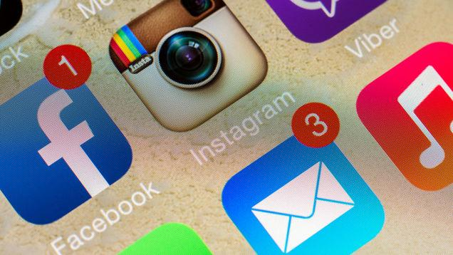
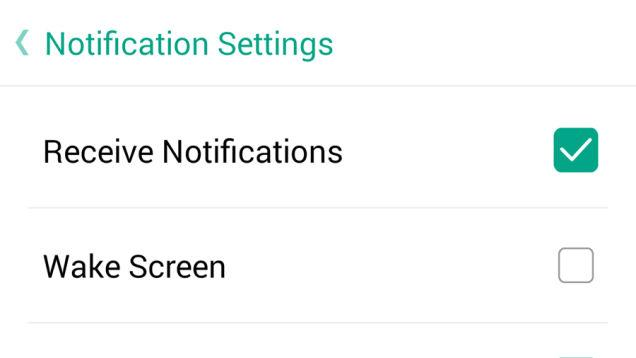
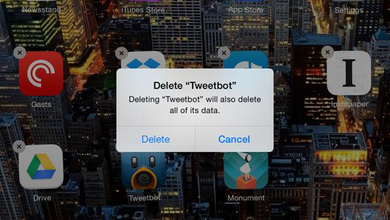
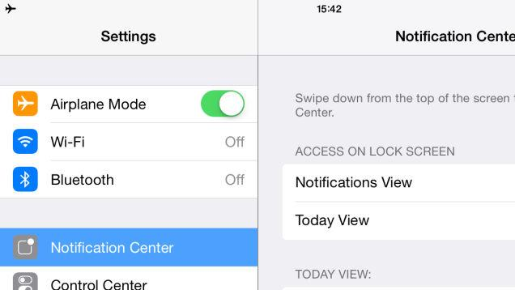
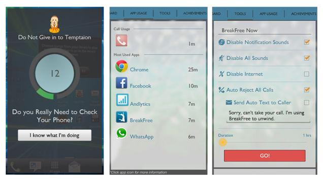
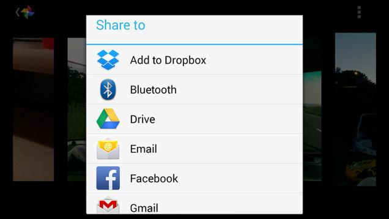

======================================
How to Break Your Smartphone Addiction
======================================

:URL: http://fieldguide.gizmodo.com/how-to-break-your-smartphone-addiction-1595290636/+whitsongordon

|How-to-Break-Your-Smartphone-Addiction-01|

A couple of
`reports <http://www.kpcb.com/insights/2013-internet-trends>`__
published during the course of last year suggested we unlock our phones
anywhere between 110 and 150 times every single day. That's a lot of
checking, often done habitually without any deliberate thought or goal.

Not only is the time you spend gazing at your mobile time you could use
doing something else, incessant phone checking interrupts whatever you
were doing—be it working, chatting to a friend or watching a movie—and
makes it difficult to get back on track.

Are you ready to break free from your smartphone addiction and claim
some of your valuable time back? We've got some simple, effective
remedies for you to try out.

Turn off notifications
~~~~~~~~~~~~~~~~~~~~~~

The technology that enables our phone to buzz whenever we get an
Instagram like, WhatsApp message or Twitter reply is a modern marvel,
but you don't have to accept it by default. Almost every app on your
phone can be tweaked so that push notifications are disabled, and in
many cases you can finely tune what you really need to hear about and
what you don't.

|How-to-Break-Your-Smartphone-Addiction-02|

On Android you'll need to delve into the options inside the app itself;
on iOS, head to the **Settings** app and open up the **Notification
Center**. For example, you could manually check your Gmail account once
an hour rather than getting distracted by every newsletter and email
thread update that arrives in your inbox. If you get email updates for
social media activity, you're getting pulled out of reality not once but
twice for the same event.

What's the end result? You start to check Snapchat or Facebook once a
day rather than every time something happens on any of your social
networks. Sure, you may be late to a tweet or two, but unless your
family and friends use social media for urgent, emergency messages
you're not going to miss out to any great extent. You may get a build up
of emails and tweets to respond to, but you can address them all at once
instead of every five minutes.

Uninstall apps
~~~~~~~~~~~~~~

If turning off notifications doesn't really work for you, go nuclear and
uninstall unnecessary apps completely. You could start by focusing on
the apps that bring websites and online services to your mobile: do you
really need to have Facebook and Twitter on your phone as well as your
laptop? Is it essential that you have access to email on the go? Can you
wait until you're back at your computer to check Pinterest? Besides, in
a pinch you can always just access them through the mobile web.

|How-to-Break-Your-Smartphone-Addiction-03|

Go through the apps installed on your smartphone and work out whether or
not you'll miss those
`Yo's <http://gizmodo.com/yo-review-yo-1593276009>`__ and stock updates
and new comment alerts. Treat your time on your smartphone as a precious
commodity—anything that takes away time from other, more worthwhile
pursuits can come under scrutiny. Take back your attention span by
`limiting the number of
apps <http://lifehacker.com/how-i-turned-my-iphone-into-a-simple-distraction-free-1175739059>`__
that go everywhere with you and which can interrupt you at any time.

Not only does removing redundant apps mean there are fewer notifications
to check and fewer updates to install, it also frees up storage space on
your device and reduces clutter on your home screens too. If you haven't
run a recent audit of all the apps on your smartphone, now might be a
good time to decide what you really need and what you can live without.
If you haven't reinstalled it in a month, you almost definitely didn't
need it in the first place.

Activate Airplane Mode
~~~~~~~~~~~~~~~~~~~~~~

We've written before on `the different ways you can use airplane
mode <http://fieldguide.gizmodo.com/three-uses-for-airplane-mode-that-dont-involve-flying-1584166499>`__
away from the airport, and it's a quick and easy way of shutting off all
notifications on your phone. The benefit over simply turning off your
mobile completely is that you can still snap pictures and access local
files on the device.

|How-to-Break-Your-Smartphone-Addiction-04|

Airplane mode blocks SMS messages and phone calls from coming through as
well, which means you're unavailable if someone really, really needs to
get in touch with you, but you might consider it a price worth paying.
As you may remember, humankind managed to get by for several millennia
before the invention of the smartphone, so it's possible that you can
survive a few hours of interruption-free time.

It can make a difference when you wake up too. Rather than having dozens
of notifications to check while you're still under the covers
(particularly if you work with people in other parts of the world), you
can enjoy a more natural and leisurely start to the morning. When you're
ready to let the real world back in, a couple of taps on your smartphone
and you're connected again.

Use a dedicated quitting tool
~~~~~~~~~~~~~~~~~~~~~~~~~~~~~

Beyond the settings in your mobile OS of choice, there are several apps
that can monitor your mobile activity and put limits on it if required.
One of our recent favorites is BreakFree, out now `on
Android <https://play.google.com/store/apps/details?id=mrigapps.andriod.breakfree.deux&hl=en>`__
and coming soon to iOS—the app gives you a detailed breakdown about
which apps are taking up most of your time and how often you're checking
your mobile.

|How-to-Break-Your-Smartphone-Addiction-05|

There are options to disable some or all notifications, and you can even
set up an automatic SMS reply if you want to let people know that you're
trying to take a break. Sounds and Internet use can be disabled as and
when required, and you can set specific blocks of time during which you
don't want to be disturbed. BreakFree will display a permanent
notification showing your current addiction levels should you require a
constant reminder.

You'll find several alternatives out there, most prominently on Android.
`StayOnTask <https://play.google.com/store/apps/details?id=valavg.stayontask>`__
reminds you when you should be working (and not checking your phone),
while
`AppDetox <https://play.google.com/store/apps/details?id=de.dfki.appdetox>`__
helps to wean you off your reliance on all those tempting notifications.
We haven't found anything compelling on iOS, so for now you're best off
using the Internet and notification-disabling features already built
into Apple's software.

Hide your phone
~~~~~~~~~~~~~~~

Put up barriers that prevent you from checking your phone regularly—a
complicated unlock code or password is one example. While you're at work
you might want to leave your phone in a drawer and resolve to only check
it two or three times a day; at home, you could do the same if you want
to give your undivided attention to a sports game or movie.

|How-to-Break-Your-Smartphone-Addiction-06|

You could even draw up a set of rules for yourself to govern your
smartphone habits. Do you have to share a photo as soon as you take it,
or can it wait until later? Would it hurt to take a step back from the
Twitter feed for a while? Cutting down on anything that requires taking
your phone out—whether it's to get directions or check the time—can help
you avoid getting lost down a rabbit hole of update streams and
notifications.

We're by no means anti-mobile, but as with anything else there's a
balance to be found. Ultimately you want to reach a situation where
you're in control of how many times you check your phone and not the
other way around, irrespective of how many incoming notifications you
get.

*Header image: `Radu
Bercan <http://www.shutterstock.com/gallery-1481615p1.html>`__ /
`Shutterstock.com <http://www.shutterstock.com/index-in.mhtml>`__*

When people see my iPhone they’re like, “My God, man, do you have some
kind of crazy phone virus?” It’s got no web browser. No email. No
Twitter, no… `Read
more <http://lifehacker.com/how-i-turned-my-iphone-into-a-simple-distraction-free-1175739059>`__

If you're not a frequent flyer then you might never have used Airplane
mode on your phone or tablet; and thanks to the FAA relaxing
restrictions … `Read
more <http://fieldguide.gizmodo.com/three-uses-for-airplane-mode-that-dont-involve-flying-1584166499>`__

