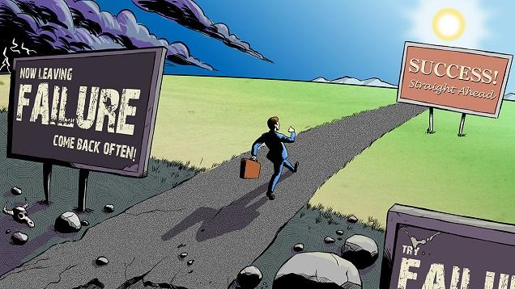
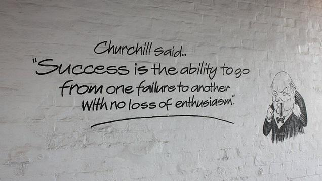
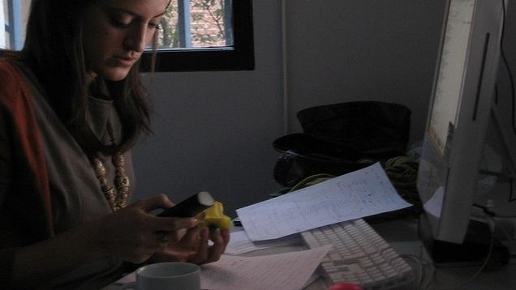
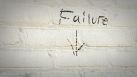

========================
How to Move Past Failure
========================

:URL: http://lifehacker.com/how-to-move-past-failure-1597951611

|How-to-Move-Past-Failure-01|

Failure is the most important step to reaching success, but it can still
feel like it's crushing your soul. To make failure your friend and not
your enemy, you must overcome it. Here are some strategies for moving on
after a tough break.

What Is Failure?
~~~~~~~~~~~~~~~~

Failure is defined as a lack of success, but its true definition is
really up to you. Small things can be failures. Maybe you blew an easy
sale today at work, or forgot to grab something important when you were
at the store. We all make mistakes, and the mistakes we make that have
some weight to them—big or small—make us feel like we've failed.

Normally, though, we reserve the word failure for the bigger things. The
times when we've let others down, and, more importantly, ourselves.
Trying your hardest to do something important and failing is when it
really stings and shakes your confidence. Maybe your startup business
idea failed, you lost the big game, or you let someone you care about
down. Sometimes failure can leave a mark—but it doesn't have to.

Feel What You Need to Feel
~~~~~~~~~~~~~~~~~~~~~~~~~~

|How-to-Move-Past-Failure-02|

Failure can take a hefty emotional toll, and that's okay. What's
important is getting the negative feelings you have out of your system
so you can regroup and tackle what's next. Don't keep how you feel
trapped inside of you like a shaken up soda. Bottling your emotions can
lead to two things:

-  **An emotional outburst:** Eventually the pressure will build and it
   will be too much for you to contain. In a moment of weakness,
   everything you've kept inside could explode and set you back even
   further. This not only affects your mental state, but it can affect
   your relationships too. When you have an outburst, the people you
   care about often end up in the crossfire.
-  **Creeping negativity:** If you only loosen the cap, the negativity
   will slowly and persistently enter your mind. You need to openly
   confront the mistakes you made and give yourself the chance to feel
   it all. Otherwise, anxiety will start to linger in the back of your
   mind and the soft hiss of failure will continue. `Constant anxiety is
   incredibly
   unhealthy <http://lifehacker.com/what-anxiety-actually-does-to-you-and-what-you-can-do-a-1468128356>`__
   and can lead to even more problems.

So, how do you let it all out? There are a few ways to get the bad,
and—most importantly—retain the knowledge you gained:

-  **Set aside some time:** It's okay to feel like you've hit rock
   bottom. Completely ignoring what happened isn't helpful, so `set
   aside a specific amount of time to wallow as much as you
   want <http://lifehacker.com/give-yourself-24-hours-to-deal-with-failure-and-move-on-1596134647>`__.
   Take some time to be angry, upset, and frustrated so you can get it
   all out. If it's something small, all you may need is an hour to pace
   around or cry in a pillow. For something larger, give yourself a full
   24 hours to let it all out and wake up the next day with a clean
   slate. If you need more than a day, that's okay, but make sure it's
   an amount of time set by you and that you stick to it. You get that
   time to be as mopey as you want, but when it's over, move on.
-  **Talk about it:** Talk to somebody you know about how you're
   feeling. It's well known that just talking about something can make
   you feel better. Take a load off and express yourself. Chances are
   whoever you talk to will try to make you feel better, but even if
   they don't, saying how you feel out loud puts that information out
   somewhere besides your brain.
-  **Don't let it become a part of your identity:** Failure is something
   that happens, not something you are. Susan Tardanico at Forbes
   explains that `just because you haven't found a successful way to do
   something doesn't mean you are a
   failure <http://www.forbes.com/sites/susantardanico/2012/09/27/five-ways-to-make-peace-with-failure/>`__.
   Be careful not to blur the lines between making mistakes and being
   someone who only makes mistakes. Our actions may define us, but our
   failures do not. The actions you take to move past failure and reach
   success will define you in the end.

Failure can leave an open wound and it's unwise to ignore it. Without
acknowledging it, your wound will continue to hurt, take longer to heal,
and possibly get infected.

Look at the Failure of Others
~~~~~~~~~~~~~~~~~~~~~~~~~~~~~

|How-to-Move-Past-Failure-03|

Don't think for a second that you're the only person on the planet to
nose dive. Often we look at other's success and assume they have
everything together when the reality is that they encounter failure just
as much as anyone. Some are better at hiding it than others, but failure
is universal. Before you start bashing yourself for not hitting the
mark, explore the world of failure and see how vast it truly is.

What successful person do you look up to? Take a look at the failures
they've encountered in their lives and work. Read biographies, blogs,
and listen to speeches. Successful people talk about failure just as
much as they talk about success, and it's because they respect how
important it is to embrace it. Even the greatest people in our world
have fallen, and fallen hard at one point or another.

Your friends and family fail too. Think about the failures they have
encountered, and remember that you're not alone. It's not to point and
laugh, but to show yourself that failure is okay. You're human, just
like everybody else.

Change Your Definition of Failure
~~~~~~~~~~~~~~~~~~~~~~~~~~~~~~~~~

|How-to-Move-Past-Failure-04|

Have we mentioned that failure is good? It can be hard to think that
way, but `changing your definition of
failure <http://lifehacker.com/reframe-how-you-think-about-failure-by-changing-its-def-596193760>`__
can help you cope. Failure is a learning and growing opportunity that is
necessary for growth.

|image4|

It is said that failure is a necessary precursor to ultimate success.
Want to make it big in the…\ `Read moreRead
on <http://lifehacker.com/reframe-how-you-think-about-failure-by-changing-its-def-596193760>`__

Robert Spadinger at Pick the Brain has `a list of
truths <http://www.pickthebrain.com/blog/10-great-lessons-can-learn-highly-successful-people-failure/>`__
that can help adjust your own definition of failure:

    #1: Failure is an integral part on the way to success and self
    realization.

    #2: Whenever you step outside the comfort zone and whenever you try
    something new, failure becomes inevitable.

    #3: Each failure brings you one step closer to reaching your goals.

    #4: Failure is a great teacher and it allows you to learn some of
    the most valuable life lessons.

    #4: Each failure makes you stronger, bigger and better.

    #6: Making mistakes is not a big deal as long as you learn from them
    and avoid repeating them.

    #7: Failure teaches you that a certain approach may not be ideal for
    a specific situation and that there are better approaches.

    #8: Successful people will never laugh at you or judge you when you
    fail, because they have already been there and they know about the
    valuable lessons you can learn from failure.

    #9: No matter how often you fail, you are not a failure as long as
    you don't give up.

    #10: Each time you fail, your fear of failure becomes smaller, which
    allows you to take on even bigger challenges.

Every mistake is a learning opportunity, and after you've moved past
your emotions, it's important to revisit your mistakes with a new
perspective. Look at what you did that went wrong, but also look at what
you did that was right, and what you can do better next time. Failure is
rarely so black and white.

**Start the Next Project to Occupy Your Mind**
~~~~~~~~~~~~~~~~~~~~~~~~~~~~~~~~~~~~~~~~~~~~~~

|How-to-Move-Past-Failure-06|

Once you've had your grieving time, try again or move on to the next
thing. Fill your head with thoughts on the next task at hand so there's
no room for negativity to slither in. You don't want to completely block
out the mistakes you've made—you won't learn that way—but you also don't
want to dwell on them either.

Get started on your next project and really focus on it. Filmmaker Hayao
Miyazaki suggests `having your next project
ready <http://lifehacker.com/filmmaker-miyazaki-on-escaping-perfectionism-start-you-1586284165>`__
so you're always equipped to carry on. Nothing takes your mind off of
things like hard work. If you need some time away from work, find a
hobby. There's bound to be something you enjoy and are good at that will
keep your mind moving forward. The key is to switch your focus and give
yourself time to remember that failing isn't the end of the world.

|image6|

When you're a perfectionist, it's hard not to look at your last project
and constantly…\ `Read moreRead
on <http://lifehacker.com/filmmaker-miyazaki-on-escaping-perfectionism-start-you-1586284165>`__

The best part about failure is that you often get another chance. Angel
Chernoff at Marc and Angel Hack Life points out that `mistakes are
simply a form of
practice <http://www.marcandangel.com/2012/04/05/keep-you-motivated-after-a-mistake/>`__:

    Every great artist was once an amateur. The sooner you get
    comfortable with practicing and making mistakes, the quicker you'll
    learn the skills and knowledge necessary to master your art. You'll
    never be 100% sure it will work, but you can always be 100% sure
    doing nothing won't work. So get out there and try again. Either you
    succeed or you learn a vital lesson. Win – Win.

It's okay to fail at something over and over, but as soon as you give up
altogether—that's the real failure.

--------------

Remember, failure is inevitable, but it's not something that has to
define you. It's actually good for you, and `setting yourself up for it
can be good for you
too <http://lifehacker.com/5985565/how-and-why-to-intentionally-set-yourself-up-for-failure>`__.
Make failure a tool, a stepping stone, to get you where you want to go.
It's okay to feel defeated when it happens, but losing the battle never
means losing the war.

|image7|

The old mantra is that you're never supposed to set yourself up for
failure. That's true…\ `Read moreRead
on <http://lifehacker.com/5985565/how-and-why-to-intentionally-set-yourself-up-for-failure>`__

*Photos by Kevin Necessary, `Lloyd
Morgan <https://www.flickr.com/photos/lloydm/2305701220>`__, `Harald
Groven <https://www.flickr.com/photos/kongharald/229625673/in/photolist-cEJDC3-cEJusL-6yQ26f-nGpiZg-mmVPdV-dXDrCi-6enTV6-aDeTWB-7JDaYL-QvK3J-3zf3id-7RWgWs-6wavwA-hoMFSS-mhTHk-n7kWzT-diBgZi-2AjH4z-diB5KF-djgWR8-dEXFN4-f4HeM7-5CVwQq-61T8sa-65W9K5-9hXhL1-9Rxbcv-61T9dD-iJ4kBq-4rGioF-6KgK16-68mAYo-7WfdUs-9JVYS2-9JVUox-4RL7Ak-7xMoXo-7JGpz4-7AaUAB-5RtYy6-7fT2HC-diBF6d-ddjuA-6MCx7Q-5vV3FC-e3UWAo-dHRhG2-89NBaJ-5JNnEK-6ozJcT>`__,
`Gareth
Williams <https://www.flickr.com/photos/gareth1953/5219326886>`__,
`Roger
Casas-Alatriste <https://www.flickr.com/photos/casasroger/2109783801>`__*\ *.*

