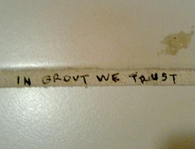

===================================================================
How to Find Time to Learn Something New or Tackle a Passion Project
===================================================================

:URL: http://lifehacker.com/5590732/how-to-find-time-to-learn-something-new-or-tackle-a-passion-project

|Time-to-Learn+Passion-Project-01|

You've got a career, friends, family, and a mountain of other
responsibilities that have a monopoly on your time. So how, amidst all
those time-consuming responsibilities, do you find time to learn
something new or tackle a passion project?

Photo by `blodgettesq <http://www.flickr.com/photos/blodgett-esq/4597911831/>`__.

There's little I love more than a good passion project, and I've
generally got at least one outside-of-work project that I'm dedicating
time to. (Lately, most of these projects involve programming, like
`learning to build a web site with no
experience <http://lifehacker.com/5336113/how-to-build-a-web-site-from-scratch-with-no-experience>`__;
right now I'm working on an `open-source, cross-platform note-taking
application <http://github.com/adampash/Textify>`__.) My writers have on
occasion marveled at everything I appear to accomplish outside of the
daily grind involved in keeping the wheels from falling off here at
Lifehacker. While I think they have an overly inflated sense of just how
much I get done, I've also promised them that I'd do my best to explain
how I find time to learn new things and take on rather large projects.
So here goes.

|image1|

I took one (bad) computer science class in college, and I'm not a web
developer. So in early `Read more on <http://lifehacker.com/5336113/how-to-build-a-web-site-from-scratch-with-no-experience>`__

*NOTE:* While a silver bullet for getting more done is always enticing,
there's not much any of us can do about squeezing more than 24 hours
into any day. As with most productivity advice, what follows probably
falls into the category of common sense, but sometimes it's helpful to
get a little common sense reminder from time to time.

Grout Your Days with What You Want to Accomplish
~~~~~~~~~~~~~~~~~~~~~~~~~~~~~~~~~~~~~~~~~~~~~~~~

Last year at a `Twitter
conference <http://parnassusgroup.com/twitterconference/>`__ here in Los
Angeles, `nerd <http://twitter.com/NERDIST>`__, comedian, tech lover,
frequent tweeter, and `friend of
Lifehacker <http://lifehacker.com/5233138/how-nerdist-chris-hardwick-gets-things-done>`__
`Chris Hardwick <http://www.nerdist.com/>`__ addressed criticisms that
using Twitter was a big, narcissistic waste of time. In making his
point, Hardwick offered an analogy that stuck with me. He explained that
it's not as though he's spending hour after hour devising and composing
his next tweet, and Twitter's not taking time away from anything else
he'd already be doing. Rather, he *grouts* his days with Twitter. He's
got a free moment here and there, he's got a thought/idea/link/joke he
wants to share, and he shares it.

|image2|

Funny guy Chris Hardwick reviews gadgets, writes for Wired, does
stand-up, acts in TV and movies, `Read more on <http://lifehacker.com/5233138/how-nerdist-chris-hardwick-gets-things-done>`__

Say what you will about Twitter (a lot of Lifehacker readers `aren't big
fans <http://lifehacker.com/5403214/do-you-use-twitter>`__), but you can
extend Hardwick's analogy beyond Twitter to things you may want to learn
or projects you may want to tackle. And because I like his analogy so
much, I'll be using it throughout this little post.

|image3|

There's no question that Twitter has received all kinds of hype this
past year, but Lifehacker  `Read more on <http://lifehacker.com/5403214/do-you-use-twitter>`__

Most of your days are composed of big tiles of immovable time—time
that's filled with obligations you can't and often shouldn't ignore. For
most of us, that's unavoidable. But no tiles fit perfectly together, and
you've got all kinds of gaps of free time that you can fill—or, rather,
grout—with whatever you like.

Choose Your Grout
~~~~~~~~~~~~~~~~~

Fact is, you're already grouting your days with all kinds of things. At
work, it may be the occasional, relaxing internet surfing session where
you peek at what's been happening on Facebook/Twitter/your favorite
blog. After work, maybe you're catching up on a great TV show or playing
a video game. In general, I consider grout to be those things that you
fill your day with that *aren't* immovable, tile-y responsibilities.

Am I saying you're wasting too much time watching TV, playing video
games, and surfing the internet? Definitely not. This is a judgment-free
conversation, and whatever you choose to grout your days is just fine.
(I love TV, video games, and the internet!) But what you need to keep in
mind is that you've only got so much extra time to fill, and often,
you're in control of what you choose to fill that extra time with. If
you really want to learn something new, or get into a new personal
project you're excited about, you may have to cut down on some of that
other grout and start grouting your days with your passion instead.

|Time-to-Learn+Passion-Project-05|

Ideally, it's something you're excited to do. For example: I'm not an
avid gamer, but I do enjoy playing video games occasionally. And when I
really get into a video game, I can find myself thinking about it when
I'm not playing it, or getting excited for the next chance I'll have to
play it. And when that's the case, I generally will make it a point to
use that form of entertainment as my grout whenever I get the chance.

My point isn't that video games are addictive. Instead, I'm leading to
this: I experience the same feelings of excitement and anticipation when
I'm in the midst of learning about something or taking on a project I'm
really into. And I doubt I'm alone. Once you get started grouting your
days with something you're passionate about, you'll start finding more
time and more ways to grout your day with it.

Now for a hard truth: If you've made it this far, but you're thinking,
"Yeah, that sounds great, except I've got a full-time job, a family, and
plenty of other responsibilities that even my grout time is spoken for,"
then none of this may be particularly helpful. As I said at the top of
the post, I don't have any magical tricks for squeezing more than 24
hours into any day, and the last thing I'd recommend is stealing your
extra time from the Sandman. That said, there are some things you can do
to make it easier to grout your day with the stuff you're passionate
about. *Photo by
`Koshiro.kun <http://www.flickr.com/photos/koshiro_kun/4460210703/>`__*.

Make It Easy
~~~~~~~~~~~~

I'm no social scientist, but it would seem that at least part of the
reason Facebook—or internet "time-wasting" in general—is so prevalent at
the workspace is that it's *so* accessible. Finding out what your
friends are up to is just one quick click away. It's extremely easy to
grout your workday with Facebook. So if you want to start filling your
free time with something else, you need to make it just as easy—or at
least as easy as possible—to do so.

Accomplishing that may vary significantly based on what it is you're
doing, but my toolkit for making it easy to grout spare time with my
passion projects looks a little like this:

  |Time-to-Learn+Passion-Project-06|

-  **Ubiquitous capture:** Last week I explained my `holy grail of
   ubiquitous plain-text
   capture <http://lifehacker.com/5584924/the-holy-grail-of-ubiquitous-plain+text-capture>`__,
   essentially describing how I can take notes on any computer, any iOS
   device, and any Android phone, and they'll all stay in perfect sync.
   A major part of the appeal of this system is that whenever I have an
   idea related to a project, I can simply pull up my notes application,
   dash off a quick note, and get back to what I was doing. When I've
   got more than a tiny sliver of time to grout, I've got all my ideas
   waiting for me, again, accessible from my desktop, my phone, or my
   tablet.

   |Time-to-Learn+Passion-Project-07|
-  **A good bookmarking tool for reading things later:** I'm a big, big
   fan of `Instapaper <http://www.instapaper.com/>`__, and a lot of
   other Lifehacker folks love `Read It
   Later <http://readitlaterlist.com/>`__. Use whatever you prefer, but
   I employ these smart bookmarking tools extensively when I'm
   researching a passion project. If I stumble onto a link that looks
   worth reading, I simply click my Read Later Instapaper bookmarklet,
   and when I've got a sufficiently large enough chunk of time to grout,
   I don't have to go looking for something to research or learn—it's
   waiting there for me.

The point is that you want to make it as easy as possible to switch into
project or learning mode whenever the opportunity arises. What you don't
want is to waste your precious grout time looking around for things to
do related to your passion project. Likewise, depending on what it is
you're interested in, you want to make it as easy as possible to dive
right into working on your project. When I'm doing programming projects,
for example, that also involves having my text editor ready to roll at a
drop of a hat and a to-do list ready to be done.

Beyond the Grout
~~~~~~~~~~~~~~~~

|Time-to-Learn+Passion-Project-08|

Grout's a nice idea and all, and you can probably imagine several ways
you could better grout your days if you're interested in learning
something new or making progress on a project you're excited about, but:
Can you ever really learn something new or crank out a big old project
by simply filling cracks in your day?

Photo by `jm3 <http://www.flickr.com/photos/jm3/457087329/>`__.

As much as I'd like the answer to be, "Yes," that's probably
unrealistic. (This is also probably the point at which I stray a bit
from the intention of Hardwick's analogy. I'm sure he won't mind.) For
me, most projects start as grout. I generally start off with an idea
that I need to learn more about before I know whether or not I can
realistically turn it into a full-fledged project. So I start grouting
my days with notes and articles and tutorials and reference materials.
My `ubiquitous capture
setup <http://lifehacker.com/5584924/the-holy-grail-of-ubiquitous-plain+text-capture>`__
and Instapaper help me enormously at this point.

|image8|

Despite all the cool productivity porn modern technology has birthed,
the Holy Grail for me is `Read more on <http://lifehacker.com/5584924/the-holy-grail-of-ubiquitous-plain+text-capture>`__

Then I start working on the project every chance I get. I stop playing
as many video games or watching as much television (at least actively—I
still sometimes enjoy having a TV show in the background I'm only half
paying attention to). Eventually, what started out as grout often ends
up transforming into more of a tile—a regular part of my day that I make
a point to find dedicated time for. I still have family. I still have my
job. I still have a social life. But I've also got my project, and
sometimes, it's the most exciting work I'm doing.

--------------

As I said, there's no silver bullet here, and no matter how much you
wish otherwise, it still takes the Earth 24 hours to rotate on its axis.
But if you really want to learn something new or take on a new project
that you're excited about, you may want to start by examining how you
grout your days. You may discover you have more time to tackle that
passion project than you thought.

`Adam Pash <http://adampash.com/>`__, editor of Lifehacker, lives and
breathes for his next passion project. You can read his stuff regularly
here on Lifehacker or follow him on more off-topic journeys on Twitter
`@adampash <http://twitter.com/adampash>`__.

