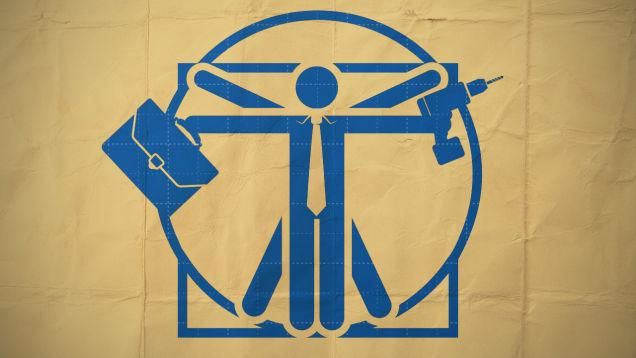
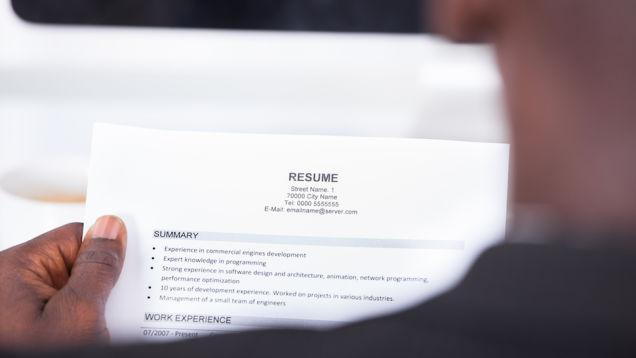
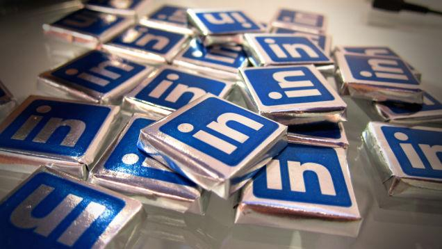
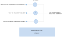
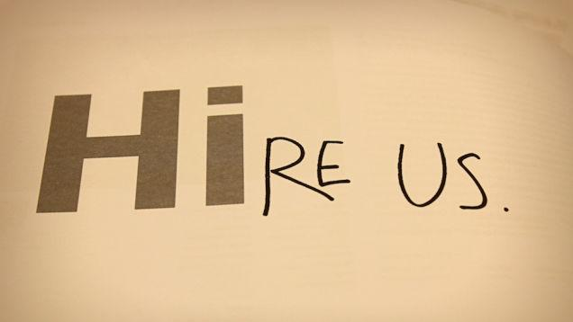
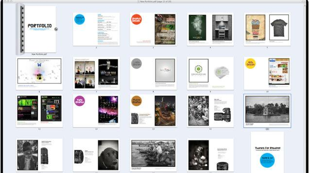

=====================================
How to Give Yourself a Career Tune-Up
=====================================

:URL: http://lifehacker.com/how-to-give-yourself-a-career-tune-up-1616639595

|career-tune-up-01|

There's a point in everyone's career where we get a little lax. We're
not engaged with our work, we don't stay in touch with references, or we
forget to keep our resume up to date. Here's how to give career a
tune-up and keep your professional life humming along smoothly.

A quick career tune-up will save you time and headache in the long run.
Instead of waiting until you're looking for work (or have to find work
quickly), getting on top of these things now will give you a jumpstart
when you do need to find something new. It doesn't take a lot of time to
go through these steps, but you will want to set aside an afternoon or a
day one weekend for them all. Power through them together so you don't
lose focus. Let's get started.

Update Your Resume the Right Way
~~~~~~~~~~~~~~~~~~~~~~~~~~~~~~~~

|career-tune-up-02|

I've been guilty of waiting to update my resume until I'm fed up and
ready to look for something better. Don't wait until then—it's the worst
time for you to think critically about the great work you've done at
your current company, what types of jobs you really want to reach for,
and how you should put all of that into your resume. Instead, update
your resume now, and keep it updated regularly over time. Here are some
suggestions to help:

-  **Schedule time, maybe monthly, to update your resume**. Give your
   resume, your portfolio, and any examples of your work a fresh look
   regularly to make sure they have all the information you'd want
   someone to see. Even if one month you have nothing to add or change,
   it's better to look it over from a fresh perspective than to let it
   get stale.
- **Keep a work diary you can draw from for updates**. `url <http://lifehacker.com/5816473/keep-a-work-diary-to-minimize-mistakes-and-document-successes>`__
   We've discussed how important it is to `keep track of your wins, even the
   small ones
   <http://lifehacker.com/5958265/keep-track-of-your-small-wins-to-stay-motivated-and-productive>`__.
   If you keep a work diary, you can log the events you want to remember,
   progress you've made, and your achievements. Those achievements and successes
   are great resume fodder. You won't have to rack your brain to remember them
   later if you write them down as they happen.
- **Steer clear of resume killers**. `url <http://lifehacker.com/5934177/what-resume-items-can-kill-my-chances-at-getting-a-new-job>`__
   Remove resume items that are outdated, not applicable to the jobs you want,
   or just make your resume less useful or interesting to someone who'll read
   it. Long objective statements, unwanted personal details, your old pizza
   delivery job—it's all likely irrelevant and taking up space. Do make sure to
   `highlight relevant keywords and skills
   <http://lifehacker.com/survey-reveals-keywords-do-still-matter-on-your-resume-1610503963>`__
   that will help `your resume get past robots
   <http://lifehacker.com/5866630/how-can-i-make-sure-my-resume-gets-past-resume-robots-and-into-a-humans-hand>`__,
   however, and make sure to `tie those keywords to results
   <http://lifehacker.com/tie-your-words-to-results-to-avoid-a-buzzword-packed-re-1569598035>`__
   you can talk about in an interview.
- **Build multiple resumes for different types of jobs you want to apply for**.
   `url <http://lifehacker.com/5944861/create-resume-templates-to-save-time-and-avoid-sending-the-same-resume-to-every-job-you-apply-for>`__
   Common wisdom is that you should tailor every resume to the job you want, and
   that's absolutely true, but having some templates won't hurt. They'll give
   you a jumpstart, so you can pull out your "engineer" template when applying
   for something technical, or you "manager" template when applying for
   something administrative. From there, customize it and send it away.
-  **Seek out experiences that will get you your dream job**. Even if
   you're not working in your dream field right now, pay attention to
   the things you do right now that can help you get there. Remember.
   `even if you don't think you have the experience for your dream
   job <http://lifehacker.com/how-can-i-build-a-resume-when-i-have-nothing-to-put-on-1555349531>`__,
   you're probably doing things that can help you get it, and those
   things should go on your resume.
-  **Get the training and skills that will make you more valuable—either
   at this job or the next**. While it's not technically updating your
   resume, update yourself with skills to put on your resume. Most jobs
   offer `training in-house, or will pay for relevant classes or
   certifications <http://lifehacker.com/5865128/how-can-i-take-better-advantage-of-my-employment-and-benefits>`__.
   Take advantage of them, and use those skills to bolster your resume.
   Even if they don't, `consider beefing up your resume with volunteer
   experience <http://lifehacker.com/5991869/beef-up-a-too-short-resume-with-detailed-accomplishments-and-volunteer-service>`__.
   Both options make you more valuable, skilled, and give you plenty to
   talk about in an interview (or the next time you ask for a raise.)

We've discussed `some of your resume-updating
challenges <http://lifehacker.com/5985384/whats-your-biggest-challenge-when-writing-or-updating-your-resume>`__
before, so head there for tips if you run into trouble. Keeping your
resume up to date over time makes sure that any hiring manager or
recruiter always sees your most recent accomplishments and achievements.
Since many job boards and hiring sites float recently-updated resumes to
the top of the pile, this way you'll always be at the top of the list
when companies look for candidates.

|image2|

Writing a resume isn't easy. You have to be creative, focused, concise,
and target your `Read more on <http://lifehacker.com/5985384/whats-your-biggest-challenge-when-writing-or-updating-your-resume>`__

Update Your Social Networks with Current Information
~~~~~~~~~~~~~~~~~~~~~~~~~~~~~~~~~~~~~~~~~~~~~~~~~~~~

|career-tune-up-04|

The next big step is to make sure your social networks and your public
persona are updated. You don't necessarily `have to have completely
separate public and private online
lives <http://lifehacker.com/5898370/should-i-keep-my-personal-and-professional-identities-completely-separate-online>`__,
but you can bet that the first thing a potential employer will do is go
Google you, check out your social profiles, and see what they can learn
about you. At the very least, make sure your Facebook privacy settings
are where you want them to be, and your public persona on sites like
`LinkedIn <http://linkedin.com/>`__ (which, `has two-factor
authentication <http://lifehacker.com/linkedin-just-added-two-factor-authentication-so-enabl-510680312>`__)
are updated with current information and accomplishments. Ideally, you
want someone doing a Google search for you to turn up a consistent
message that lines up with your resume, but doesn't hide your
personality.

|image4|

Dear Lifehacker, I'm a pretty savvy person when it comes to getting my
work on the web where `Read more on <http://lifehacker.com/5898370/should-i-keep-my-personal-and-professional-identities-completely-separate-online>`__

After all, `your social profiles can be great
tools <http://lifehacker.com/5895468/spruce-up-your-social-network-profiles-before-applying-for-a-new-job-to-boost-your-chances-of-getting-hired>`__
to help you get a job. All you have to do is `clean them up a little
bit <http://lifehacker.com/5963864/how-to-clean-up-your-online-presence-and-make-a-great-first-impression>`__
and you'll make a great impression on anyone who goes looking for
them—and you can be `absolutely sure that they
will <http://lifehacker.com/5916590/get-hired>`__.

|image5|

Most people (hopefully) know by now to keep their social networks clean,
in case anyone from a `Read more on <http://lifehacker.com/5895468/spruce-up-your-social-network-profiles-before-applying-for-a-new-job-to-boost-your-chances-of-getting-hired>`__

|image6|

Odds are someone is searching the web for you right now, or at least has
looked you up fairly `Read more on <http://lifehacker.com/5963864/how-to-clean-up-your-online-presence-and-make-a-great-first-impression>`__

|image7|

So you've got a job interview in your near future. Congrats! Prepared as
you may be to deliver `Read more on <http://lifehacker.com/5916590/get-hired>`__

Craft a Perfect Cover or Intro Letter Before You Need It
~~~~~~~~~~~~~~~~~~~~~~~~~~~~~~~~~~~~~~~~~~~~~~~~~~~~~~~~

|career-tune-up-09|

Next, write the perfect cover letter that tells your personal story and
explains why you're interested in your dream field. `It's important to
write one that employers will actually
read <http://lifehacker.com/5880545/how-to-write-a-cover-letter-that-employers-will-actually-read>`__,
since there's plenty of evidence that `no one actually reads them
anyway <http://lifehacker.com/5909168/ditch-the-cover-letter-when-applying-for-a-new-job-no-one-reads-them-anyway>`__.
Even if you don't use your letter as a cover letter, it can also be a
great way to introduce yourself to potential employers or companies that
interest you.

|image9|

When you're applying for a new job, you often have to write a cover
letter to accompany your `Read more on <http://lifehacker.com/5880545/how-to-write-a-cover-letter-that-employers-will-actually-read>`__

|image10|

The cover letter is a mainstay of job applications and job sites, but
all too often they're `Read more on <http://lifehacker.com/5909168/ditch-the-cover-letter-when-applying-for-a-new-job-no-one-reads-them-anyway>`__

Your cover letter should be tailored to the job you're applying for, but
again, it doesn't hurt to have a template or two ready for tweaking when
you find something you want to apply for. The basics, like your contact
information, introduction, skills you'll want to highlight for any job,
and `a strong, clear closing
statement <http://lifehacker.com/add-a-strong-closing-sentence-to-your-cover-letter-to-s-900977545>`__
should be consistent across all of your templates. We've also mentioned
that `writing your cover letter like an acceptance
speech <http://lifehacker.com/write-your-cover-letter-like-an-acceptance-speech-1587406177>`__
is a good way to make an impression.

|image11|

If you're going to bother writing a cover letter at all, make sure you
write one employers `Read more on <http://lifehacker.com/add-a-strong-closing-sentence-to-your-cover-letter-to-s-900977545>`__

|image12|

Cover letters can be pretty boring, and some hiring managers don't
bother looking at them at `Read more on <http://lifehacker.com/write-your-cover-letter-like-an-acceptance-speech-1587406177>`__

The acceptance speech angle is useful because it requires you to learn a
bit about the company and the job before you even send the letter in.
Going that extra mile and explaining how your goals and skills line up
exactly with what the company is looking for—and thanking them for
realizing it—means the hiring manager doesn't have to figure it out.
Crafting a good letter takes time and effort. Don't wait until you're
rushed for time or need to apply for a dozen jobs—start now.

Build That a Professional Portfolio You've Been Meaning to Put Together
~~~~~~~~~~~~~~~~~~~~~~~~~~~~~~~~~~~~~~~~~~~~~~~~~~~~~~~~~~~~~~~~~~~~~~~

|career-tune-up-14|

Even if you don't work in a field that traditionally "produces"
something, you could probably stash away some examples of your work to
show others. Of course, if you wait until you're jobless to build your
portfolio, you're stuck digging through months or years of work looking
for high points. Instead, build your portfolio as you go along, and
highlight those big wins and accomplishments we mentioned earlier.

In some cases, it's as easy as saving a few praise-filled emails from
customers or awards from your manager. For others, save a copy of
something you designed or built that really made you proud. Whatever it
is, if you stash them away when you feel good about them, the final form
your portfolio takes is less important—you'll already have material to
put into it. We touched on this in `our guide to promoting yourself
without being
sleazy <http://lifehacker.com/5883298/how-to-promote-yourself-without-being-sleazy>`__:
Whether your portfolio is a website that highlights your artwork, saved
copies of your writing, GitHub code examples, a book of projects you
led, or testimonials to your brilliance, it's important just to have
it—and you don't want to spend time putting that together when you're
hunting for jobs.

|image14|

Whether due to modesty, timidity, or just a desire not to annoy anyone,
most of us suck at `Read more on <http://lifehacker.com/5883298/how-to-promote-yourself-without-being-sleazy>`__

Reach Out to Your Network to See If *They* Need Help
~~~~~~~~~~~~~~~~~~~~~~~~~~~~~~~~~~~~~~~~~~~~~~~~~~~~

|career-tune-up-16|

When you're looking for work—or worse, jobless—is probably the worst
time to reconnect out of the blue with your professional network.
Remember, your professional network is really just your group of work
friends who have agreed to help each other out whenever they can.
Waiting until you need something from them is a bit like only asking
your friends to hang out when you need them to help you move.

Instead, `use the layoff test to decide who to reach out
to <http://lifehacker.com/5971451/use-the-layoff-test-to-build-your-professional-network>`__.
In short, if you were to get laid off right now, who would be the first
five or ten people you'd call to see if they had leads in your field?
Give them a call, reconnect, and see if *you* can help *them*. Catch up
on your respective careers, and offer your help if you have any to give.
The same rule applies to people you consider professional references. If
it's been years since you spoke to someone you list on your resume, it's
been too long.

|image16|

Your professional network may be just as valuable a job hunting tool as
your resume, but if you `Read more on <http://lifehacker.com/5971451/use-the-layoff-test-to-build-your-professional-network>`__

Of course, if you can't think of five people, much less ten, it's time
to `beef up your professional
network <http://lifehacker.com/how-to-skip-the-sleaze-and-build-a-real-professional-ne-510256651>`__.
Think about the people you used to work with and whether you could vouch
for them (and if they could vouch for you.) Managers you got along with,
clients you trusted, even vendors or coworkers you worked well with are
all great candidates—and in most cases, they can use your help as much
as you can use theirs. Look them up now, before you actually need to ask
them if they know anyone hiring or to be a reference for you.

|image17|

You've heard it before: "It's not what you know, it's who you know."
Of `Read more on <http://lifehacker.com/how-to-skip-the-sleaze-and-build-a-real-professional-ne-510256651>`__

Get Re-Engaged With Your Current Work
~~~~~~~~~~~~~~~~~~~~~~~~~~~~~~~~~~~~~

|career-tune-up-19|

Finally, while much of this advice is how to tune up everything you need
to get a new or better job, you should also take some time to treat your
current job. After all, `if your job sucks, there may be something you
can do about
it <http://lifehacker.com/5936851/how-to-avoid-the-inevitable-feeling-that-your-job-sucks>`__
to make it better. If you're just feeling down and disengaged from your
work, `there's plenty you can do about that
too <http://lifehacker.com/the-three-step-guide-to-finding-satisfaction-at-work-1608434493>`__,
and none of it involves "mandatory fun."

|image19|

It's inevitable. After enough time at any job, you have a day that
really sucks. Then, `Read more on <http://lifehacker.com/5936851/how-to-avoid-the-inevitable-feeling-that-your-job-sucks>`__

|image20|

Many people struggle to find joy at work, but if you're proactive, you
can grow to find more `Read more on <http://lifehacker.com/the-three-step-guide-to-finding-satisfaction-at-work-1608434493>`__

The first thing you should do is identify why you're disengaged, or
where your current pain points are. Sit down `and do a proper
self-review to identify what you like or
hate <http://lifehacker.com/5967786/how-to-do-a-proper-self-review-and-identify-your-professional-pain-points-before-your-boss-does>`__
about your current gig. If you put some time and thought into it, you'll
be able to identify the things that drag you down. If those things
aren't integral to your job, talk to your boss about them and try to get
them removed (so you can focus on the important stuff) or delegated.
Alternatively, if you're just overwhelmed and struggling to get
organized, we can't say enough good things about `taking time out for a
weekly
review <http://lifehacker.com/5908816/the-weekly-review-how-one-hour-can-save-you-a-weeks-worth-of-hassle-and-headache>`__.
Doing so puts you back in touch with what you have on your plate and
gets you out of "busy mode" and able to see the big picture again. It
also gives you the flexibility to `find a productivity method that works
for
you. <http://lifehacker.com/5828033/how-to-build-your-own-productivity-style-by-remixing-from-the-best>`__

|image21|

It's the end of the year, which means it's performance review season for
many of you at `Read more on <http://lifehacker.com/5967786/how-to-do-a-proper-self-review-and-identify-your-professional-pain-points-before-your-boss-does>`__

|image22|

You have a busy life and a to-do list a mile long. Unfortunately simply
adding a new task to your `Read more on <http://lifehacker.com/5908816/the-weekly-review-how-one-hour-can-save-you-a-weeks-worth-of-hassle-and-headache>`__

|image23|

You've tried everything: asked around, played with a few theories about
"how you work `Read more on <http://lifehacker.com/5828033/how-to-build-your-own-productivity-style-by-remixing-from-the-best>`__

If you need some more tips on how to stay engaged at
work,\ ` <http://lifehacker.com/5828033/how-to-build-your-own-productivity-style-by-remixing-from-the-best>`__\ `this
thread at Hacker News <https://news.ycombinator.com/item?id=8111190>`__
is full of good ones. Some are pretty basic, like remembering to
appreciate the fact that you have a reliable paycheck, but others, like
finding side projects you're passionate about or even mentoring juniors
at your job to give it a little more meaning, are great. Other important
things you may not consider are covered too—like making sure you take
care of yourself, eat well, exercise, and get enough sleep. All of those
things have more to do with how you handle a job—crappy or not—than you
might think.

--------------

Ideally, these tips will make sure you're ready to hit the ground
running if you need to look for something new, or give you confidence to
reconnect with your current job and stick with what you have. Wherever
you land, a quick career tune up makes sure you'll be in a good mental
place, and your credentials will be ready for anything.

*Photos by `Mario
Savoia <http://www.shutterstock.com/pic.mhtml?id=122451976&src=id>`__
(Shutterstock),
`Andrey\_Popov <http://www.shutterstock.com/pic.mhtml?id=172979210&src=id>`__
(Shutterstock), `Nan
Palmero <http://commons.wikimedia.org/wiki/File:Linkedin_Chocolates.jpg>`__,
`Dita
Margarita <https://www.flickr.com/photos/ditaditamargarita/7118559995/>`__,
`Hung Lee <https://www.flickr.com/photos/netcreative/4805383850>`__,
`Pawel Loj <https://www.flickr.com/photos/limaoscarjuliet/114032359>`__,
and `Lars
Plougmann <https://www.flickr.com/photos/criminalintent/4642664133>`__.*

LinkedIn has just jumped on the (very important) two-factor
authentication wagon. You can, and should, now enable this enhanced
security layer for… `Read moreRead
on <http://lifehacker.com/linkedin-just-added-two-factor-authentication-so-enabl-510680312>`__

.. |image6| image:: career-tune-up-images/image6.jpeg
   :target: http://lifehacker.com/5963864/how-to-clean-up-your-online-presence-and-make-a-great-first-impression

.. |image23| image:: career-tune-up-images/image23.jpeg
   :target: http://lifehacker.com/5828033/how-to-build-your-own-productivity-style-by-remixing-from-the-best
