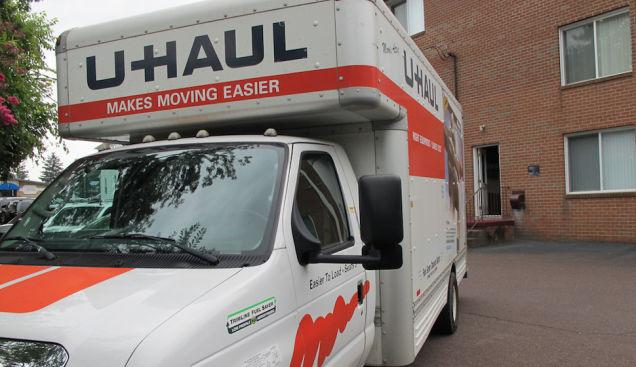

==============================================
Should I Move to a New City to Look for a Job?
==============================================

:URL: http://lifehacker.com/should-i-move-to-a-new-city-to-look-for-a-job-1588074995

| Dear Lifehacker,
|
|   I'm looking for a new job. Should I move to a new city where I've
| heard there are lots of businesses that do what I want to do, or should
| I tough it out here and see what I can find? The job market here isn't
| terrible, but I feel like it'd be easier to find work elsewhere. Should
| I "follow the money?"
|
| Sincerely,
|  Career Hunter
|
| Dear Career Hunter,
|  It's easy to assume that to work in tech you have to move to Silicon
| Valley, or to work in marketing you have to move to New York City. Sure,
| some cities are hubs for specific industries, but that doesn't mean you
| have to give up everything and move there just to find work. You have a
| lot to consider. Let's take a look.
|

Dig Deep and See What's Available at Home
~~~~~~~~~~~~~~~~~~~~~~~~~~~~~~~~~~~~~~~~~

Many people assume that because a city is well known for their field,
they *have* to go there. That's not the case. Sure, if you want to work
for a specific company, you have to go where that company is located,
but even that shouldn't be a "move first, job second" kind of decision.
If you want to work in tech, for example, you may be surprised at the
options near you. Look at companies headquartered where you live, or
large companies with branches in your area. You may find options in your
field that you would never have considered.

Want to work in tech? You don't have to move to San Francisco—almost
every company or office has an IT department, even if it's a small team.
Remember that companies that don't seem like "tech companies" may rely
heavily on IT, and need skilled work. Everyone wants to work for
Microsoft or Google, but forget that construction companies, marketing
firms, and healthcare companies need developers and engineers as much as
Google does—and they're often overlooked. Consider working for local or
state governments, or schools and universities. My career in tech
started in my alma mater's IT department, and while it wasn't the
fast-paced glitz and glamour of Mountain View, it was a great job and
taught me all of the skills I needed to survive there. Every city is
different, but a job that's perfect for you may be hiding under your
nose.

Do a Mock Job Search from Home First
~~~~~~~~~~~~~~~~~~~~~~~~~~~~~~~~~~~~

If you're certain you won't find work where you are, do a mock job
search in the city you want to live in. It's easy to say "there are lots
of car industry jobs in Detroit," because you assume all the car company
headquarters are there. Find out for sure. Pretend like you live there
and you're looking for work. Fire up `your favorite job
boards <http://lifehacker.com/5792788/five-best-job-search-sites>`__ and
visit the web sites of the companies you're interested in. See what's
available, and what you're qualified for. Then, head over to
`Glassdoor <http://glassdoor.com/>`__,
`Salary.com <http://salary.com/>`__, or
`PayScale <http://payscale.com/>`__ to see how much those jobs would
actually pay.

Unemployment rates are improving, which means more and more people are
actually finding work-and... `Read more
on <http://lifehacker.com/5792788/five-best-job-search-sites>`__

Look over those job openings and ask yourself if they look good to you,
and whether you think you could land it, considering you'll probably be
up against some serious competition. If you're moving from a small town
to a big city, or even from one city to a well-known industry hub,
competition increases. You want to make sure you're qualified enough to
find well-paying work, the jobs there are jobs you can actually get, and
you'll make enough to survive.

Factor In the Cost of Living in Your New City
~~~~~~~~~~~~~~~~~~~~~~~~~~~~~~~~~~~~~~~~~~~~~

Looking for jobs in a new city is one thing, but making sure you can
actually live comfortably is another. Check the city's cost of living to
see if you'll be able to find a place to live, buy groceries, or pay for
transportation. The `Cost of Living Index <http://www.coli.org/>`__
compares cities directly so you can see how far your dollars will
stretch. `Expatistan <http://www.expatistan.com/cost-of-living>`__ is
another helpful simple webapp that `we've mentioned
before <http://lifehacker.com/5610088/expatistan-compares-cost-of-living-between-two-cities>`__.
This `previously
mentioned <http://lifehacker.com/your-living-wage-find-out-the-minimum-you-need-to-supp-1541333892>`__
`MIT calculator <http://livingwage.mit.edu/>`__ can help too, as can
`this interactive
guide <http://www.npr.org/blogs/money/2014/05/20/313131559/how-far-your-paycheck-goes-in-356-u-s-cities>`__.
Remember, just because a job in your field pays more in Denver, for
example, than in Little Rock, doesn't mean that you'll be able to
survive in Denver on that salary—even if it looks like a huge raise to
someone living in Little Rock. Compare the salaries you found to the
actual cost of living. That big salary won't feel like one when you're
spending twice as much on rent and groceries.

.. image:: new-city-for-a-job-images/image5.png
   :target: http://lifehacker.com/5610088/expatistan-compares-cost-of-living-between-two-cities

Cost of living calculators can be nebulous. What exactly does it mean if
the cost of living is 13%... `Read more
on <http://lifehacker.com/5610088/expatistan-compares-cost-of-living-between-two-cities>`__

Ever wonder just how much money is enough to survive on? This calculator
from MIT tells you how... `Read more
on <http://lifehacker.com/your-living-wage-find-out-the-minimum-you-need-to-supp-1541333892>`__

Those calculators are useful, but they give you a high-level, averaged
view. A city's average rent price may be $1500/mo, but the neighborhoods
close to work or safest to live in may come in closer to $2000/mo.
You'll need to `do your homework and look into the
details <http://lifehacker.com/how-to-learn-all-about-a-new-city-without-leaving-your-511561572>`__
to learn more. Study the neighborhoods in the city, and where you'd
likely want to live. Check housing prices, and use Google Street View to
drive around those areas. Check the potential commute to where you want
to work. After all, many people flock to Silicon Valley/San Francisco to
work in tech, but don't make enough to live anywhere near their jobs.

If you're thinking about picking up and moving to a new city, you have a
lot of research to do... `Read more
on <http://lifehacker.com/how-to-learn-all-about-a-new-city-without-leaving-your-511561572>`__

Don't Forget Moving Costs, Transportation, and Other Relocation Costs
~~~~~~~~~~~~~~~~~~~~~~~~~~~~~~~~~~~~~~~~~~~~~~~~~~~~~~~~~~~~~~~~~~~~~

Moving before you find a job means you'll be responsible for all of the
costs, and you won't have a job to cover them. Even if you're confident
enough to move before you find work, don't ignore `all of the
incidentals associated with moving long
distances <http://lifehacker.com/seven-things-i-learned-after-moving-across-the-country-1221354282>`__.
Transporting your stuff, finding a place to live, registering your car,
switching over your driver's license, getting around town, setting up
utilities, and so on can quickly drain your bank account. If you're
planning to live on savings until you find work, make sure those savings
will last a good long while.

A cross-country move is not only a logistical nightmare, but it wreaks
havoc on your nerves. By the... `Read more
on <http://lifehacker.com/seven-things-i-learned-after-moving-across-the-country-1221354282>`__

The Bottom Line: Find the Job, then Move
~~~~~~~~~~~~~~~~~~~~~~~~~~~~~~~~~~~~~~~~

For most people, it just makes sense to find the job and then move.
You've already done a mock job search—consider doing the real thing from
home. We're assuming you have a job already, so you have the flexibility
to look around with a safety net under you. `We have a guide to help get
you
started <http://lifehacker.com/5828668/how-do-i-find-a-job-in-a-new-city>`__.
Unless you have a spouse or partner who can support you until you find
work, or you crash with friends until you land a gig, moving without a
job lined up is a recipe for stress and strained finances.

Dear Lifehacker, I've always wanted to live in a new city, and I have my
eyes on one a long... `Read more
on <http://lifehacker.com/5828668/how-do-i-find-a-job-in-a-new-city>`__

Looking for a job in a city you don't live in can be difficult. You'll
have to travel for interviews—sometimes long distances—and do a lot of
things sight-unseen. If the company is really interested in you, they
may fly you out, or even offer to cover your relocation expenses. If
they're not, they may insist you move before they extend a job offer. If
you're going to look first, you may want to skip job boards and target
specific companies instead. Network with people in those companies and
state your interest. If you can make real connections before you even
move, you may land a job before you go—or at least have a support
network there for you when you land.

It may make sense to move first if you have big savings, you're dabbling in a
new career, or you want to move anyway. Some people have skills or jobs that are
so portable they can go anywhere. People who work on the internet, for example,
or highly trained, highly educated professionals. Most people, however, can't
just move to a new city and *then* start their job search. It's important to
look before you leap, and if possible, `make sure you'll land softly
<http://lifehacker.com/5798087/the-stress-free-guide-to-settling-down-in-a-new-city>`__
when it's time to pack your bags.

Whether you're moving to a new side of town or moving across the country (or
beyond), getting... `Read more Read on
<http://lifehacker.com/5798087/the-stress-free-guide-to-settling-down-in-a-new-city>`__

| Good luck,
| Lifehacker

*Have a question or suggestion for Ask Lifehacker?* Send it to
`tips+asklh@lifehacker.com <mailto:tips+asklh@lifehacker.com>`__.

Title photo by `yskii
<http://www.shutterstock.com/pic.mhtml?id=112620554&src=id>`__ (Shutterstock)
and `yskii <http://www.shutterstock.com/pic.mhtml?id=101717701&src=id>`__
(Shutterstock). Other photos by `Brenda Gottsabend
<https://www.flickr.com/photos/gottgraphicsdesign/5863884809>`__, `Robert S
Donovan <https://www.flickr.com/photos/booleansplit/3887516326>`__, `Jackie
<https://www.flickr.com/photos/sis/89803558>`__, and `Egan Snow
<https://www.flickr.com/photos/egansnow/268912393>`__.

