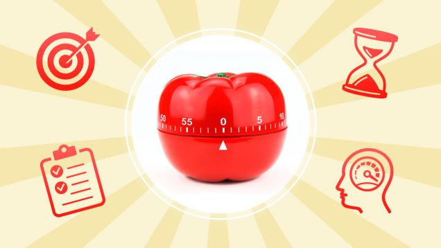
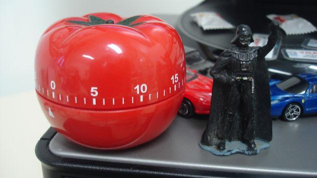
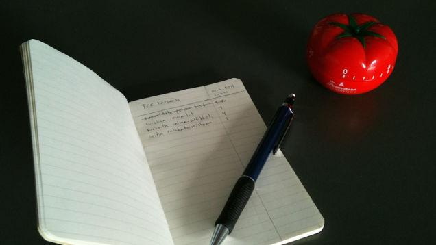

====================================================
Productivity 101: A Primer to The Pomodoro Technique
====================================================

:URL: http://lifehacker.com/productivity-101-a-primer-to-the-pomodoro-technique-1598992730

The Pomodoro Technique can help you power through distractions, hyper-focus, and
get things done in short bursts, while taking frequent breaks to come up for air
and relax. Best of all, it's easy. If you have a busy job where you're expected
to produce, it's a great way to get through your tasks. Let's break it down and
see how you can apply it to your work.

We've definitely discussed the Pomodoro Technique before. We gave `a brief
description of it
<http://lifehacker.com/5377906/the-pomodoro-technique-fights-deadline-anxiety-with-a-timer>`__
a few years back, and `highlighted its distraction-fighting, brain training
benefits
<http://lifehacker.com/5554725/the-pomodoro-technique-trains-your-brain-away-from-distractions>`__
around the same time. You even voted it `your favorite productivity method
<http://lifehacker.com/5890129/five-best-productivity-methods>`__. However,
we've never done a deep dive into how it works and how to get started with it.
So let's do that now.

When its time to buckle down and get some serious work done, we would
hope that you have a go-to... `Read more <http://lifehacker.com/5890129/five-best-productivity-methods>`__

What Is the Pomodoro Technique?
~~~~~~~~~~~~~~~~~~~~~~~~~~~~~~~

`The Pomodoro Technique <http://pomodorotechnique.com/>`__ was invented
in the early 90s by developer, entrepeneur, and author `Francesco
Cirillo <http://francescocirillo.com/>`__. Cirillo named the system
"Pomodoro" after the tomato-shaped timer he used to track his work as a
university student. The methodology is simple: When faced with any large
task or series of tasks, break the work down into short, timed intervals
(called "Pomodoros") that are spaced out by short breaks. This trains
your brain to focus for short periods and helps you stay on top of
deadlines or constantly-refilling inboxes. With time it can even help
`improve your attention span and
concentration <http://lifehacker.com/how-can-i-improve-my-short-attention-span-949006493>`__.

Pomodoro is a cyclical system. You `work in short
sprints <http://lifehacker.com/124390/beat-procrastination-with-a-dash>`__,
which makes sure you're consistently productive. You also get to `take
regular
breaks <http://lifehacker.com/5860787/learn-to-take-real-breaks-to-stay-motivated-and-creative-through-the-day>`__
that bolster your motivation and keep you creative.

If you find your attention wandering over the course of the day and you
have a difficult time... `Read more <http://lifehacker.com/5860787/learn-to-take-real-breaks-to-stay-motivated-and-creative-through-the-day>`__

How the Pomodoro Technique Works
~~~~~~~~~~~~~~~~~~~~~~~~~~~~~~~~

The Pomodoro Technique is probably one of the simplest productivity
methods to implement. All you'll need is a timer. Beyond that, there are
no special apps, books, or tools required. Cirillo's book, *`The
Pomodoro
Technique <http://www.amazon.com/The-Pomodoro-Technique-Francesco-Cirillo/dp/3981567900/?tag=lifehackeramzn-20&ascsubtag=[type|link[postId|1598992730[asin|3981567900[authorId|5716553178370339807>`__*,
is a helpful read, but Cirillo himself doesn't hide the core of the
method behind a purchase. Here's how to get started with Pomodoro, in
five steps:

    #. Choose a task to be accomplished.
    #. Set the Pomodoro to 25 minutes (the Pomodoro is the timer)
    #. Work on the task until the Pomodoro rings, then put a check on
       your sheet of paper
    #. Take a short break (5 minutes is OK)
    #. Every 4 Pomodoros take a longer break

That "longer break" is usually on the order of 15-30 minutes, whatever
it takes to make you feel recharged and ready to start another 25-minute
work session. Repeat that process a few times over the course of a
workday, and you actually get a lot accomplished—and took plenty of
breaks to grab a cup of coffee or refill your water bottle in the
process.

It's important to note that a pomodoro is an indivisible unit of
work—that means if you're distracted part-way by a coworker, meeting, or
emergency, you either have to end the pomodoro there (saving your work
and starting a new one later), or you have to postpone the distraction
until the pomodoro is complete. If you can do the latter, Cirillo
suggests the "inform, negotiate, and call back" strategy:

#. **Inform** the other (distracting) party that you're working on
   something right now.
#. **Negotiate** a time when you can get back to them about the
   distracting issue in a timely manner.
#. **Schedule** that follow-up immediately.
#. **Call back** the other party when your pomodoro is complete and
   you're ready to tackle their issue.

Of course, not every distraction is that simple, and some things demand
immediate attention—but not every distraction does. Sometimes it's
perfectly fine to tell your coworker "I'm in the middle of something
right now, but can I get back to you in....ten minutes?" Doing so
doesn't just keep you in the groove, it also gives you control over your
workday.

How to Get Started with the Pomodoro Technique
~~~~~~~~~~~~~~~~~~~~~~~~~~~~~~~~~~~~~~~~~~~~~~

.. image:: productivity-pomodoro-images/productivity-pomodoro-05.jpeg

Since a timer is the only essential Pomodoro tool, you can get started
with any phone with a timer app, a countdown clock, or even a plain old
egg timer. Cirillo himself prefers a manual timer, and says winding one
up "`confirms your determination to
work <http://en.wikipedia.org/wiki/Pomodoro_Technique#Tools>`__." Even
so, we've highlighted a number of Pomodoro apps that offer more features
than a simple timer offers. Here are a few to consider:

-  **`Marinara Timer <http://www.marinaratimer.com/>`__\ (Web)** is a
   `webapp we've highlighted
   before <http://lifehacker.com/marinara-timer-is-a-flexible-web-based-pomodoro-timer-1191288959>`__\ that
   you can keep open in a pinned tab. You can select your timer alerts
   so you know when to take a break, or reconfigure the work times and
   break times to suit you. It's remarkably flexible, and you don't have
   to install anything.
-  **`Tomighty <http://www.tomighty.org/download>`__ (Win/Mac/Linux)**
   is a cross-platform `desktop Pomodoro
   timer <http://lifehacker.com/5818856/tomighty-is-a-simple-elegant-pomodoro-timer-for-boosting-productivity>`__
   that you can fire and forget, following the traditional Pomodoro
   rules, or use to customize your own work and break periods.
-  **`Pomodorable <http://www.eggscellentapp.com/>`__ (OS X)** is a
   combination Pomodoro timer and to-do app. It offers `more visual cues
   when your tasks are
   complete <http://lifehacker.com/5935275/pomodorable-is-a-visual-pomodoro-timer-that-integrates-with-os-x-reminders>`__
   and what you have coming up next, and it integrates nicely with OS
   X's Reminders app. Plus, you can estimate how many pomodoros you'll
   need to complete a task, and then track your progress.
-  **`Simple
   Pomodoro <https://play.google.com/store/apps/details?id=com.dacer.simplepomodoro>`__
   (Android)** is a free, open-source timer with a minimal aesthetic.
   Tap to start the timer and get to work, and take your breaks when
   your phone's alarm goes off. You can't do a lot of tweaking to the
   work and break periods, but you get notifications when to take your
   breaks and when to go back to work, and you can go back over your day
   to see how many Pomodoros you've accomplished over the day. It even
   integrates with Google Tasks.
-  **`Focus
   Timer <https://itunes.apple.com/us/app/pomodoropro/id340156917?mt=8>`__
   (iOS)** `used to be
   calledPomodoroPro <http://lifehacker.com/5882559/pomodoropro-for-iphone-keeps-you-on-task-and-productive>`__,
   and is a pretty feature-rich timer for iPhone and iPad. You can
   customize work and break durations, review your work history to see
   how your focus is improving, easily see how much time is left in your
   work session, and the app even offers a star-based rating system to
   keep you motivated. You can even customize the sounds, and hear the
   clock ticking when you lock your phone so you stay on task.

These are just a few good tools to choose from. Don't hesitate to
experiment with others, but remember, the focus of the Pomodoro
Technique is on the work, not the timer you use. If you would like an
actual tomato timer like Cirillo uses, `this one is available for $7 at
Amazon <http://www.amazon.com/HomeFlav-Adorables-Kitchen-Timer-Tomato/dp/B00FEC2IRM/?tag=lifehackeramzn-20&ascsubtag=[type|link[postId|1598992730[asin|B00FEC2IRM[authorId|5716553178370339807>`__.
Alternatively, you can buy `a tomato timer and a copy of the book
together <http://pomodorotechnique.com/timer/>`__ from him directly. If
you want Kindle or ePub versions of the book, `grab them
directly <http://pomodorotechnique.com/book/>`__ from Cirillo's store as
well.

Who the Pomodoro Technique Works Best For
~~~~~~~~~~~~~~~~~~~~~~~~~~~~~~~~~~~~~~~~~

The Pomodoro Technique is often championed by developers, designers, and
other people who have to turn out regular packages of creative work.
Essentially, people who have to actually produce something to be
reviewed by others. That means everyone from authors writing their next
book to software engineers working on the next big video game can all
benefit from the timed work sessions and breaks that Pomodoro offers.

However, it's also useful for people who don't have such rigid goals or
packages of work. Anyone else with an "inbox" or queue they have to work
through can benefit as well. If you're a system's engineer with tickets
to work, you can set a timer and start working through them until your
timer goes off. Then it's time for a break, after which you come back
and pick up where you left off, or start a new batch of tickets. If you
build things or work with your hands, the frequent breaks give you the
opportunity to step back and review what you're doing, think about your
next steps, and make sure you don't get exhausted. The system is
remarkably adaptable to different kinds of work.

Finally, it's important to remember that Pomodoro is a productivity
system—not a set of shackles. If you're making headway and the timer
goes off, it's okay to pause the timer, finish what you're doing, and
*then* take a break. The goal is to help you get into the zone and
focus—but it's also to remind you to come up for air. `Regular breaks
are important for your
productivity <http://lifehacker.com/5919897/take-more-breaks-and-get-more-done>`__.
Also, keep in mind that Pomodoro is just one method, and it may or may
not work for you. It's flexible, but don't try to shoehorn your work
into it if it doesn't fit. `Productivity isn't
everything <http://lifehacker.com/productivity-isnt-everything-1551566060>`__—it's
a means to an end, and a way to spend less time on what you *have* to do
so you can put time to the things you *want* to do. If this method
helps, go for it. If not, don't force it.

Because time is so precious and our lives are busier than ever, we
probably all are inclined to try ... `Read more <http://lifehacker.com/5919897/take-more-breaks-and-get-more-done>`__

Every day, I accomplish nearly everything on my to-do list. I have
created systems, outsourced... `Read more <http://lifehacker.com/productivity-isnt-everything-1551566060>`__

Integrating Pomodoro With Other Productivity Methods
~~~~~~~~~~~~~~~~~~~~~~~~~~~~~~~~~~~~~~~~~~~~~~~~~~~~

Since the Pomodoro Technique focuses squarely on how you *do your work*
and not on how you *organize your work*, it's just begging `to be
remixed with other methods and
systems <http://lifehacker.com/5828033/how-to-build-your-own-productivity-style-by-remixing-from-the-best>`__.

You've tried everything: asked around, played with a few theories about
"how you work... `Read more <http://lifehacker.com/5828033/how-to-build-your-own-productivity-style-by-remixing-from-the-best>`__

For example, if you're a fan of `GTD (aka, Getting Things
Done) <http://lifehacker.com/productivity-101-a-primer-to-the-getting-things-done-1551880955>`__,you
can easily use GTD to organize and prioritize—and then use Pomodoro to
actually get your work done. It also works well with methods like
`Kaizen <http://en.wikipedia.org/wiki/Kaizen>`__, which emphasizes
continual improvement over time, or
`Scrum <http://en.wikipedia.org/wiki/Scrum_%28software_development%29>`__,
which demands flexibility in organization and priority, but still
requires results. Many productivity systems focus on organization or
specific tools. In those cases, the goal is to help you avoid forgetting
things and prioritize your work. Pomodoro's focus is on making sure you
make progress on your tasks, stay focused, and get things done without
going insane. However, even though it plays well with others, resist the
urge to `over-hack your
method <http://lifehacker.com/5980873/do-i-really-need-to-learn-a-productivity-method>`__
and make it unnecessarily complicated. Pomodoro's utility is in its
simplicity.

Getting Things Done, or GTD, is a system for getting organized and staying
productive. It may seem... `Read more
<http://lifehacker.com/productivity-101-a-primer-to-the-getting-things-done-1551880955>`__

I've heard of productivity systems like Getting Things Done or the Pomodoro
Technique, and... `Read more
<http://lifehacker.com/5980873/do-i-really-need-to-learn-a-productivity-method>`__

Finally, the Pomodoro method is highly personal. Since it only really impacts
how *you* work, you don't need to get other people on-board with it before it's
useful.

Additional Reading
~~~~~~~~~~~~~~~~~~

At this stage, you have the tools required to get up and running with the
Pomodoro system if you want to give it a try. It's not difficult, and you may
find that it helps you focus. There's more to the picture here, and `Cirillo's
book <http://pomodorotechnique.com/book/>`__ can offer more guidance and
specific examples if you need them. Beyond that, here's a short list of
additional resources worth reading:

To a certain point, you can only read so much about the Pomodoro Technique—you
have to just try it out on your own and see if it works for you. With luck,
it'll give you a way to be continuously productive while keeping you from
burning out. Don't worry if you don't rack up five or ten pomodoros in a day:
Many people who love the method note you may only get one or two in before
you're distracted by something unavoidable. The upshot however is that those one
or two pomodoros may be more productive than anything else you do all day.

Title photo made using `Introwiz1
<http://www.shutterstock.com/pic-117177283/stock-vector-productivity-improvement-icons.html?src=zcPbeyr2b7u0oxnXAkfBIQ-1-11>`__
(Shutterstock). Additional photos by `mlpeixoto
<https://www.flickr.com/photos/mlpeixoto/5351547427>`__, `Jun Ohwada
<https://www.flickr.com/photos/june29/5376505799>`__, `Jussi Linkola
<https://www.flickr.com/photos/callion/5525638094>`__.

We've known for some time that setting a timer and working in dashes can get
help procrastinators jump past those imposing first steps. The... `Read more
<http://lifehacker.com/5377906/the-pomodoro-technique-fights-deadline-anxiety-with-a-timer>`__

The Pomodoro technique is a productivity method that utilizes timers and breaks,
emphasizing working in focused bursts. Marketing consultant Greg... `Read more
<http://lifehacker.com/5554725/the-pomodoro-technique-trains-your-brain-away-from-distractions>`__

Dear Lifehacker, I find myself getting bored with even simple things. Sitting in
a meeting or class, going to the movies and sitting in one place for... `Read
more
<http://lifehacker.com/how-can-i-improve-my-short-attention-span-949006493>`__

Productive person Merlin Mann says the worst case of procrastination can be
remedied with what he calls a dash, or a short burst of focused activity. `Read
more <http://lifehacker.com/124390/beat-procrastination-with-a-dash>`__

