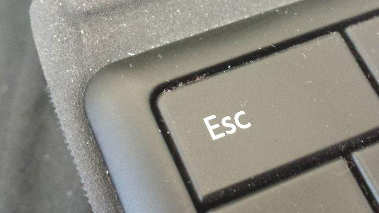

=====================================================================
Disconnect Completely During "Quiet Hours" to Boost Your Productivity
=====================================================================

:URL: http://lifehacker.com/disconnect-completely-during-quiet-hours-to-boost-you-1617464440

|quiet-hours-01|

The idea of multitasking sounds great, but it's actually highly
inefficient. Try putting your phone down between certain hours, ignore
those work emails, and you'll actually give yourself less work.

Unlike computers, we're `not really able to properly
multitask <http://lifehacker.com/5922453/what-multitasking-does-to-our-brains>`__.
Instead, our brain struggles to constantly switch tasks. We take our
phones to bed, and deal with work-related emails at all hours. Author
`Michael Harris <http://www.endofabsence.com/>`__ advocates
disconnecting more often and creating proper periods of downtime,
particularly from technology.

|image1|

We've all heard it hundreds of times: to work efficiently we have to
single task. `Read more on <http://lifehacker.com/5922453/what-multitasking-does-to-our-brains>`__

Just as sites like Facebook and Twitter distract people from work, so
dealing with work outside of office hours distracts from rest and
personal time.

    Each shift of focus sets our brain back and creates a cumulative
    attention debt, resulting in a harried workforce incapable of
    producing sustained burst of creative energy. Constant connection
    means that we're "always at work", yes, but also that we're "never
    at work"—fully.

Harris suggests that we should avoid "multi-switching" and give
ourselves a break from "the digital maelstrom".

    We can't keep falling prey to ambient work or play. Instead, we must
    actively decide on our level of tech engagement at different times
    to maximize productivity, success, and happiness.

`If You're Always Working, You're Never Working
Well <http://blogs.hbr.org/2014/08/if-youre-always-working-youre-never-working-well/>`__
\| Harvard Business Review

