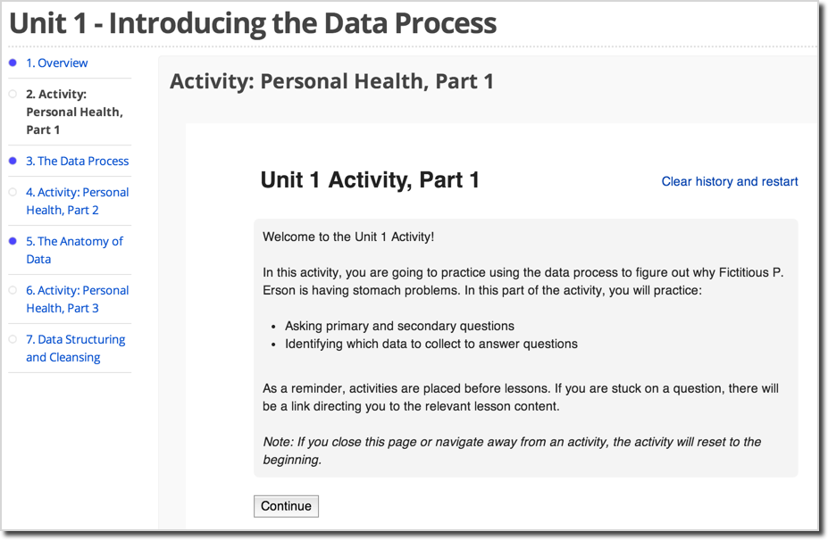

===========================
 Making Sense of MOOC Data
===========================

:URL: http://googleresearch.blogspot.com/2014/03/making-sense-of-mooc-data.html

Posted by Julia Wilkowski, Staff Instructional Designer

In order to further evolve the open education system and online platforms,
Google's course design and development teams continually experiment with
massive, open online courses. Recently, at the Association for Computing
Machinery's recent `Learning@Scale conference
<http://learningatscale.acm.org/index.html>`__ in Atlanta, GA, several members
of our team presented findings about our online courses. Our research focuses on
`learners' goals and activities
<http://static.googleusercontent.co%20m/media/research.google.com/en/us/pubs/archive/41929.pdf>`__
as well as `self- evaluation as an assessment tool
<http://static.googleusercontent.com/media/re%20search.google.com/en/us/pubs/archive/41928.pdf>`__.
In this post, I will present highlights from our research as well as how we've
applied this research to our current course, `Making Sense of Data
<https://datasense.withgoogle.com/>`__.

Google's five online courses over the past two years have provided an
opportunity for us to identify learning trends and refine instructional design.
As we `posted previously
<http://googleresearch.blogspot.com/2013/09/a%20-comparison-of-five-google-online.html>`__,
learners register for online courses for a variety of reasons. During
registration, we ask learners to identify their primary goal for taking the
class. We found that just over half (52.5%) of 41,000 registrants intended to
complete the `Mapping with Google course <https://mapping.withgoogle.com/>`__;
the other half aimed to learn portions of the curriculum without earning a
certificate. Next we measured how well participants achieved those goals by
observing various interaction behaviors in the course, such as watching videos,
viewing text lessons, and activity completion. We found that 42.4% of 21,000
active learners (who did something in the course other than register) achieved
the goals they selected during registration. Similarly, for our `Introduction to
Web Accessibility course <https://webaccessibility.withgoogle.com/>`__, we found
that 56.1% of 4,993 registrants intended to complete the course. Based on their
interactions with course materials, we measured that 49.5% of 1,037 active
learners achieved their goals.

Although imperfect, these numbers are more accurate measures of course success
than completion rates. Because students come to the course for many different
reasons, course designers should make it easier for learners to meet a variety
of objectives. Since many participants in online courses may just want to learn
a few new things, we can help them by releasing all course content at the outset
of the course and enabling them to search for specific topics of interest. We
are exploring other ways of personalizing courses to help learners achieve
individual goals.

Our research also indicates that learners who complete activities are more
likely to complete the course than peers who completed no activities. Activities
include auto-graded multiple-choice or short-answer questions that encourage
learners to practice skills from the course and receive instant feedback. In the
Mapping with Google course, learners who completed at least sixty percent of
course activities were much more likely to submit final projects than peers who
finished fewer activities. This leads us to believe that as course designers, we
should be paying more attention to creating effective, relevant activities than
focusing so heavily on course content. We hypothesize that learners also use
activities' instant feedback to help them determine whether they should spend
time reviewing the associated content. In this scenario, we believe that
learners could benefit from experiencing activities before course content.

As technological solutions for assessing qualitative work are still evolving, an
active area of our research involves self-evaluation. We are also intrigued by
`previous research
<http://hci.stanford.edu/publications/2012/SelfAssessmen%20tInDesignSpring2012TR.pdf>`__
showing the links between `self- evaluation
<http://www.cogsci.ucsd.edu/~mboyle/COGS1/readings/Klemmer-%20COGS1-Peer%20and%20self%20assesment%20in%20massive%20online%20classes.pdf>`__
and `enhanced metacognition
<http://www.cfa.harvard.edu/sed/staff/Sadler/articles/%20Sadler%20and%20Good%20EA.pdf>`__.
In several courses, we have asked learners to submit projects aligned with
course objectives, calibrate themselves by evaluating sample work, then apply a
rubric to assess their own work. Course staff graded a random sample of project
submissions then compared the learners' scores with course staff's scores. In
general, we found a moderate agreement on Advanced Power Searching (APS) case
studies (55.1% within 1 point of each other on a 16-point scale), with an
increased agreement on the Mapping projects (71.6% within 2 points of each other
on a 27-point scale). We also observed that students submitted high quality
projects overall, with course staff scoring 73% of APS assignments a B (80%) or
above; similarly, course staff evaluated 94% of Mapping projects as a B or
above.

What changed between the two courses that allowed for a higher agreement with
the mapping course? The most important change seems to be more objective
criteria for the mapping project rubric. We also believe that we haven't given
enough weight to teaching learners how to evaluate their own work. We plan to
keep experimenting with self-evaluation in future courses.

Since we are dedicated to experimenting with courses, we have not only
applied these findings to the `Making Sense of
Data <https://datasense.withgoogle.com/>`__ course, but we have also
chosen to experiment with new open-source software and tools. We're
exploring the following aspects of online education in this class:

-  Placing activities before content
-  Reduced use of videos
-  Final project that includes self-reflection without scores
-  New open-source technologies, including authoring the course using
   edX studio and importing it into
   `cbX <https://code.google.com/p/course-builder/>`__ (running on
   Google's AppEngine platform) as well as
   `Oppia <http://google-opensource.blogspot.com/2014/02/oppia-tool-for-interactive-learning.html>`__
   explorations.

We hope that our research and the open-source technologies we're using will
inspire educators and researchers to continue to evolve the next generation of
online learning platforms.
