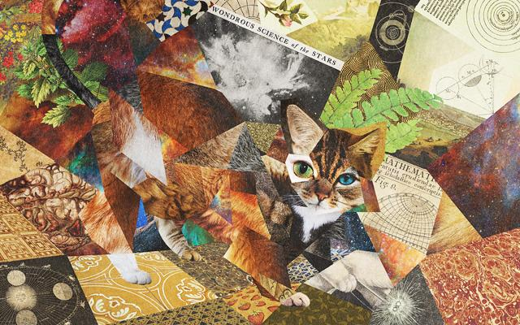
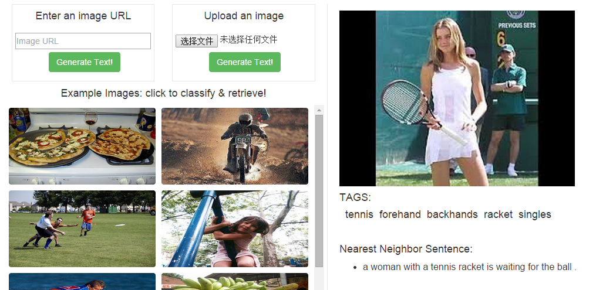
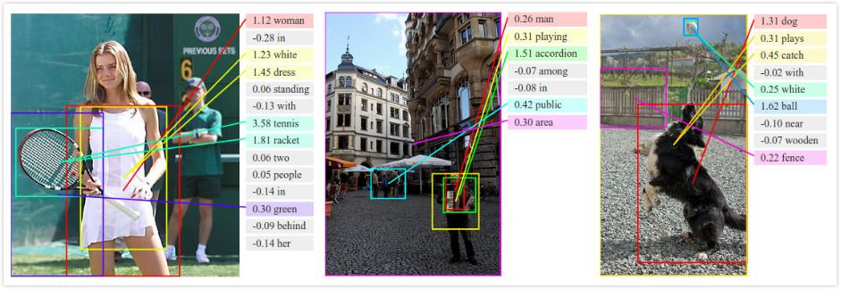
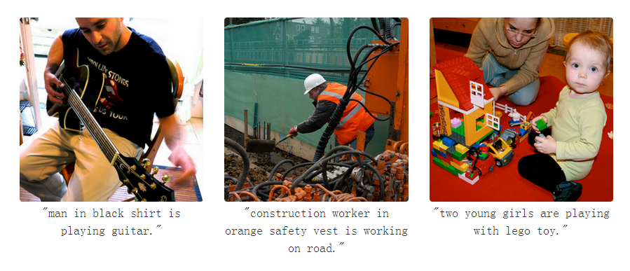

======================================
一台计算机的自我修养 | 36氪
======================================

:URL: http://www.36kr.com/p/217568.html

`多伦多大学网站 <http://web.cs.toronto.edu/>`__\ 上有一个好玩的\ `图像识别 <http://www.36kr.com/search/?q=%E5%9B%BE%E5%83%8F%E8%AF%86%E5%88%AB>`__\ Demo应用。简单点说，这个Demo可以把输入图像转化成文字描述的输出：比如，你上传一张喵星人在玩球的图片，系统就会用自然语言的形式输出他对该图片的“认识”：猫在玩球。如果你想去这个网站瞧瞧可以\ `点这里 <http://deeplearning.cs.toronto.edu/i2t>`__\ 。

斯坦福大学也有类似的研究，他们建立了一个可以对图像内容产生自然语言描述的模型，虽然目前还没有做出Demo，但是他们已经在\ `Github <http://www.36kr.com/search/?q=Github>`__\ 里\ `上传了模型源码 <https://github.com/karpathy/neuraltalk>`__\ 。

`Google <http://www.36kr.com/p/207751.html>`__\ 在上个月17号\ `发了篇官方博文 <http://googleresearch.blogspot.com/2014/11/a-picture-is-worth-thousand-coherent.html>`__\ ，也是介绍类似的技术：同样是让计算机“认识”图像的内容，并用文字描述出来。

你可能想到了\ `昨天梵高那篇文章 <http://www.36kr.com/p/217539.html>`__\ ，或者是普通的\ `机器学习 <http://www.36kr.com/search?q=%E6%9C%BA%E5%99%A8%E5%AD%A6%E4%B9%A0>`__\ ：程序猿事先准备庞大的训练集，抽取图像的多维特征向量，然后训练分类器，再让程序进行图像处理。

不不不，我们这里讨论的比这还要再高端一点。

你大概知道我想聊什么了。

单个物体的识别其实是不太够的，我们经常专注于识别具体的物体，而忽略了物体的动作，以及物体和物体间的联系。这样的程序很“傻”，我们只是试图让程序记住某个物体对应的名字，而不是正确理解图像里的内容——也就是说，他们无法“认知”图像。

但\ `深度学习（deep
learning） <http://www.36kr.com/search/?q=%E6%B7%B1%E5%BA%A6%E5%AD%A6%E4%B9%A0>`__\ 突破了这一点，\ **深度学习让计算机可以自我修养**\ 。上面那三个例子，多伦多大学、斯坦福大学以及Google的研究，都是基于深度学习这项技术。用自然语言描述图像内容的意义在于，程序必须精确识别图像中所有重要的信息，包括物体相互之间的联系。在这种情况下程序具备了“认知”的能力。

深度学习模仿了人脑的学习过程：人总是先学习简单的概念，再用这些概念去描述更抽象的内容。

比如当我们看到某只喵星人在草坪里散步的情景，我们的大脑将一大波光子转化成一系列有意义的概念：视觉皮层会连续性的分层处理这一图像，利用每一层里的神经元把信息传导到后面更高一层，高层再把这些信息慢慢聚合成更好理解的特征。具体点说，视网膜神经元检测到视野里有一些反差（物体边缘或端点），会把这一信息传导给高层神经元，高层神经元再试图把所有接收到的这些边缘信息组合配对，然后再进行传导，配合上声音信息，顶层神经元最后就形成某个具体的概念：猫。

深度学习就是利用类似的人类视觉皮层分层架构——\ `人工神经网络（ANN） <http://zh.wikipedia.org/zh-cn/%E4%BA%BA%E5%B7%A5%E7%A5%9E%E7%BB%8F%E7%BD%91%E7%BB%9C>`__\ 。深度学习先构建多层感知器，通过组合低层特征形成更加抽象的高层来表示属性类别（或者是更高级的特征），以发现数据的分布式特征表示。简单点说，深度学习可以自己挖掘相关的特征训练自己，拥有自主学习的能力，他们可以自我修养。

对于大脑这个神秘的构造，我们其实了解的非常少。深度学习也出现了这种情况：工程师对程序具体是怎么搞定训练特征的，其实也不太明白。很多情况下\ `连程序员都不知道程序该如何学习理解某个概念 <http://www.36kr.com/p/207751.html>`__\ ，程序自己就搞定了。

但近日\ `据quantamagazine的消息 <http://www.quantamagazine.org/20141204-a-common-logic-to-seeing-cats-and-cosmos/>`__\ ，两个物理学家\ `Pankaj
Mehta（波士顿大学） <http://physics.bu.edu/%7Epankajm/>`__\ 和\ `David
Schwab（美国西北大学） <http://www.physics.northwestern.edu/people/personalpages/DavidSchwab.html>`__\ 发现了一些新东西。他们在\ `一篇论文 <http://arxiv.org/abs/1410.3831>`__\ 里指出：深度学习和基本粒子、液体、宇宙等物理系统里大规模物理行为的计算方法有类似的地方。在他们的论文里，这种统计方式被称作\ `renormalization <http://www.baidu.com/link?url=RHxSeMcesfiZbeAn9FSpA0FVYS-7ZM9YsWZ9TrSuqSQ5ee4ph9sCzhX1HGYPK2tkOQ8nilJiYL9vzNtNlOUBga>`__\ ，用来帮助物理学家在不知道系统具体组成部分所处状态的情况下精确的描述系统。他们指出，这种方法也可以让人工神经网络在不知道猫的具体颜色、大小、形态的情况下概括出猫的特征，“认识”并描述各种各样的猫。

鉴于深度学习是模仿人脑认知的过程，深度学习和物理学上renormalization的相似性，表明了人脑可能也是利用了某种renormalization方式来认知这个世界的。

人脑、物理、计算机，搞了半天，原来大家殊途同归啊。宇宙真奇妙。

这件事真正让人激动的地方或许在于，人脑认知、深度学习和物理学renormalization这三者在信息理论（information
theory）领域的共同性：他们都致力于减少信息数据的冗余。进一步地，他们也都可以压缩信息的本质——压缩成互相之间毫无关联的基础概念：一只喵星人有那么多表现形态，深度神经网络会把所有的形态信息聚集起来，压缩成核心的最简形态。

一只猫如此，宇宙何尝不可以这样。

深度学习没有道理做不到这一点，因为我们自己就是成功的先例：我们已经用和深度学习相似的人脑成功认知了一遍这个世界。如果你觉得计算机相比人脑要呆板很多的话，那看看描绘了整个宇宙的物理学吧。

当然，这些结论现在下得都还太早。

我只是单纯的期待，或许有一天，计算机也能这样去描述、概括、认知这个世界。

*对深度学习感兴趣或者有所了解的同学欢迎邮件交流：suxiaoqiang#36kr.com*

[36氪原创文章，作者: Retric]

