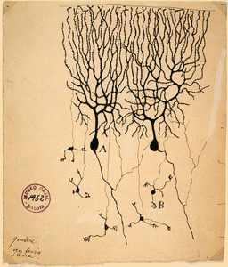
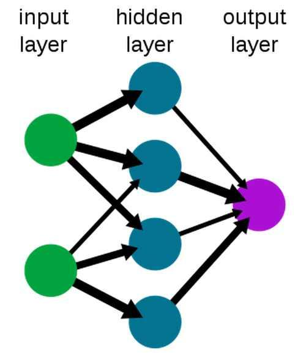

============================
The Triumph Of Deep Learning
============================

:URL: http://www.i-programmer.info/programming/artificial-intelligence/5206-the-triumph-of-deep-learning.html
:URL: http://www.i-programmer.info/programming/artificial-intelligence/5206-the-triumph-of-deep-learning.html?start=1

Deep Neural Networks are succeeding at AI tasks in a way that can only
be described as spectacular. What is the secret behind their success?

Artificial Intelligence (AI) is full of false dawns where the next great
breakthrough is here and intelligent machines and more will soon be with
us. In this case the dawning has been very slow and it's more like
progress than a revolution. Deep learning seems to have brought neural
networks to their own particular breakthrough moment.

How will we look back on this era?

To a time when the solution was first found and all we had to do was push on in
mostly the same direction?

Or just another delusion?

First we need to take a look at the long road that leads to where we
are. If you know this history feel free to skip forward.

In the Beginning
----------------

Neural networks represent the "obvious" way of creating artificial
intelligence. Look at the brain. Look very hard and work out what its
components are doing. Then build the same components, using different
technologies and put the components together - you must end up with a
brain. This is like not know how to build a computer but trying to do so
by creating transistor like elements and putting them together in the
same arrangement.

This bottom up approach to AI has been going on since the early days of
computing and it has been alternately hailed as a great invention or
damed as the latest snake oil, perhaps well intentioned but not going
anywhere.

The problem is that it is fairly easy to create things that behave like
neurons, the brains major component. What is not easy is working out
what the whole thing does once you have assembled it. It is assumed that
neurons get excited by other neurons and when they get excited enough
they "fire" and send their excitement on to other connected neurons.
This is very easy to model but how do you determine how the neurons
should be connected and what should govern the strengths of connection?

In other words how do you organize a neural network and how do you train
it?

One Layer Goes To Many
----------------------

This problem was solved for single layers of artificial neurons back in
the 1950s and it was the first of the great breakthroughs. Then some
one, Minsky and Papert to be precise, pointed out that single layers of
neurons couldn't learn a lot of things that we really would like them to
learn. The limitations of single layer neuronal nets was a real blow and
for some time work on neural networks was regarded as a waste of time.

Then in 1970s a learning rule for multi-layer networks - back
propagation was invented - and it looked as if neural networks were back
in favor. With back propagation neural networks could learn anything.

Multilayer networks could learn complicated things and they did - but
very slowly. What emerged from this second neural network revolution was
that we had a good theory but learning was slow and results while good
but not amazing. It was difficult to believe that the typical neural
network of the time could approach human intelligence. It seemed that
even multilayer neural networks weren't particularly intelligent.

As a result they fell out of favor once again and simpler but more
effective techniques such as support vector machines came into fashion.
AI went into applied engineering - it was a matter of what could be done
with tweaked classical statistics and software.

The real question, that received very little attention for such an
important one, was - why don't multilayer networks learn?

A Mediocre Performance
----------------------

The answer was pieced together in the 1990s and it all had to do with
the way the training errors were being passed back from the output layer
to the deeper layers of artificial neurons. The so called "vanishing
gradient" problem meant that as soon as a neural network got reasonably
good at a task the lower layers didn't really get any information about
how to change to help do the task better.

The problem is that there are many many possible ways for the lower
layers to be set up and most of them don't help the upper layers do
better but they don't make things worse either. In fact the only time
the lower layers helped a neural network much is when they were
essential to doing the job at all.

The problem is that there may be many configurations of the lower layers
that make it much easier for the upper layers to do their job but
back-propagation will take a very long time to find them. The problem is
made worse by the fact that the optimum configuration of a layer may
also depend on the configuration of the layers below. What this means is
that as training proceeds a layer may be optimizing its performance
based on the non-optimal configuration of lower layers.

Put simply the lower layers in a deep network are very difficult to
train unless they are absolutely essential for putting up even a
reasonable performance.

All of this and other considerations account for the reason why neural
networks trained using back-propagation generally don't produce great
results and when they do it is because they have been hand tuned and
coaxed into producing a better performance.

For this reason it became common practice to believe that there wasn't
much point using lots of layers. Deep neural networks generally didn't
perform any better than shallow networks. This was also assumed to be an
indication that the whole idea was something of a failure.

After all if neural networks are a good idea then the deeper the network
surely the better?

Deep Networks and Structure
---------------------------

Now all of this has changed.

Neural networks trained using back-propagation work better than any
alternative methods. They are regularly winning competitions and
generally showing how good they are. They are making possible speech
recognition, translation and all the sorts of things that we thought
they would be able to do when first invented.

What exactly is the breakthrough?

The answer is pre-training.

The idea here is that the lower layers of the neural network need to
absorb some of the structure of the input so that the later layers have
an easier job.

One way to think of this is to realize that the raw data has a lot of
complexity and redundancy. If this can be reduces to a set of features
that summarize it reasonably well then these features are easier to work
with than the original data. It seems reasonable that the lower layers
of a neural network should be about extracting features from the raw
data and the subsequent layers are about extracting features of the
features and so on.

For example, if you are training a neural network to recognize a face
then it would be an advantage if the lower layers recognized features
that are the fundamental parts of a face - mouth, eyes, nose and so on.
A the next level these features would be organized into higher level
features - pairs of eyes with different spacings, mouth and nose and so
on.

A general neural network directly trained on the data will take a very
long time to find an organization that delegates the low level features
to the lower layers and so on. Its training doesn't carry with it any
notion of a hierarchy and it is simply free to adopt any configuration
that gets the job done. It would probably get to a hierarchical
organization eventually but it would take far more time than we ever
give it.

The temptation is to hand create the low level features, and indeed if
you do this then the network does learn to recognize a face much faster.
Hand-crafted low-level features are the way we have made AI work in the
past, but for true AI we need the features to be learned along with the
rest of the task.

How can we get a structure into the network so that lower levels
automatically extract features that might be useful?

This is what the pre-training idea is all about.

Boltzmann Machines and Auto-Encoders
------------------------------------

There are two basic variations on this idea depending on whether the
data you are trying to work with has a lot of statistical variation or
not.

If the data isn't noisy then you can simply take the first layers and
train them as an auto-encoder. An auto-encoder is a neural network that
learns to reproduce its inputs as its outputs. You might think that this
is just a memory but if you set the neural network up so that it doesn't
have enough resources to memorize the inputs then something really
interesting happens.

To reproduce the inputs the neural network has to find an internal
representation of the data that isn't a simple memory of the inputs. It
has to find features that allow the inputs to be stored in less space.
You might say that to reproduce a face I could do it by saying things
like "big mouth, wide eyes, small nose" and so on. By describing
features I can tell you what a face is like using much less data than a
photo say. You don't have to remember a pixel perfect representation of
a face because you can reconstruct it from your memory of its features. 

A memory restricted auto-encoder has to discover a feature
representation of the input data to be able to reconstruct it.

Notice that the features that an auto encoder deduces aren't guaranteed
to be useful to the next layers of the network, but you can see that
there is every chance that it will be. What you do next is to take the
auto-encoder and use the features it has found as features as the input
to the next layer, which you train as an auto-encoder. You train this to
reproduce the output and so it learns higher features, and so on until
you have pre-trained all of the layers of the deep network. At this
point you can put the entire network together and use back propagation
to fine tune its settings.

The result is a network that delivers on the promise of deep networks.

If the data is noisy or statistical in nature then you can do the same
thing, but instead of using auto-encoder pre-training you can use the
lower layers as a Restricted Boltzmann Machine (RBM) which learns to
reproduce the statistical distribution of the input data. The same
arguments about not having enough memory to simply store the
distributions means that the RBM has to learn statistical features to do
a good job of reproducing the input data. Once the first RBM has been
trained, you can use its output to train the next layer as an RMB, and
so on until the entire network has been trained. Then you stack the RBMs
together and throw away the extra mechanisms needed to make the
sub-layers work like an RBM - and you have a standard neural network
again. A little back-propagation fine-tuning and once again you have a
network that delivers the performance you are looking for.

There are other justifications of why the RBM approach works and there
are even some weak theoretical results which suggest that it should work
but what really matters is that we have practical evidence that deep
learning does work. It is not that the original idea was wrong it was
just that we need more data than we imagined - a lot more data - and we
needed more computational power than we imagined. Put simply deep neural
networks didn't learn in the past because we didn't give them long
enough. Pre-training reduces the time that a neural network takes to
learn by allowing it to build a structure that is likely to succeed when
the training proper actually starts. There is evidence however that if
you have enough computer power then perhaps you don't even need
pre-training.

Biology
-------

Neural networks were first put forward as analogs of the way the brain
works. Surely this sort of pre-training can't be an analog of how a
biological brain works? it does seem fairly obvious that there isn't an
initial pre-training phase of an infant brain, trained layer-by-layer
and then stacked together to create a deep network. So the whole analogy
probably breaks down and what ever we are doing at the moment it doesn't
have much to do with biology.

This view misses the simple fact that brains are the product of
evolution as well as training. It could be that layer-by-layer training
is part of the evolutionary development of a brain. This could be how
the structure comes about and what we think of as learning is just the
fine tuning.

Of course this is speculation intended more to make you think about the
problem rather than present a solution. We really don't understand that
much about how the brain works.

The Promise
-----------

There is still a lot of work to be done but it really does seem that
deep neural networks work after all. In the future we need more computer
power to make them work even better but it really does seem to be a
matter of doing the job correctly and throwing what back in the early
days would have seemed to have been a ridiculous amount of computing
power at the problem.

If you would like to see the state of the art in 2010 then the following
video by Geoffry Hinton gives you a good idea of what what going on -
but remember things have moved on a great deal since then!
