===================================================================
Deep Learning（深度学习）学习笔记整理系列
===================================================================

:作者: **Zouxy** `zouxy09@qq.com <mailto:zouxy09@qq.com>`__
:作者博客: `http://blog.csdn.net/zouxy09 <http://blog.csdn.net/zouxy09>`__
:Version: **1.0 2013-04-08**

**Original URLs**

:URL: http://blog.csdn.net/lee_cv/article/details/10180485
:URL: http://blog.csdn.net/lee_cv/article/details/10183791
:URL: http://blog.csdn.net/lee_cv/article/details/10186837
:URL: http://blog.csdn.net/lee_cv/article/details/10187605
:URL: http://blog.csdn.net/lee_cv/article/details/10188683
:URL: http://blog.csdn.net/lee_cv/article/details/10189169
:URL: http://blog.csdn.net/lee_cv/article/details/10189283
:URL: http://blog.csdn.net/lee_cv/article/details/10189713

**声明**

  1）该Deep Learning的学习系列是整理自网上很大牛和机器学习专家所无私奉献的资料的。
  具体引用的资料请看参考文献。具体的版本声明也参考原文献。

  2）本文仅供学术交流，非商用。所以每一部分具体的参考资料并没有详细对应。如果某部
  分不小心侵犯了大家的利益，还望海涵，并联系博主删除。

  3）本人才疏学浅，整理总结的时候难免出错，还望各位前辈不吝指正，谢谢。

  4）阅读本文需要机器学习、计算机视觉、神经网络等等基础（如果没有也没关系了，没有
  就看看，能不能看懂，呵呵）。

  5）此属于第一版本，若有错误，还需继续修正与增删。还望大家多多指点。大家都共享一
  点点，一起为祖国科研的推进添砖加瓦（呵呵，好高尚的目标啊）。请联系：
  zouxy09@qq.com

.. contents:: 目录
   :depth: 2

一、概述
========

Artificial Intelligence，也就是人工智能，就像长生不老和星际漫游一样，是人类最美好
的梦想之一。虽然计算机技术已经取得了长足的进步，但是到目前为止，还没有一台电脑能
产生“自我”的意识。是的，在人类和大量现成数据的帮助下，电脑可以表现的十分强大， 但
是离开了这两者，它甚至都不能分辨一个喵星人和一个汪星人。

图灵（图灵，大家都知道吧。计算机和人工智能的鼻祖，分别对应于其著名的“图灵机”和“图
灵测试”）在1950年的论文里，提出图灵试验的设想，即，隔墙对话，你将不知道与你谈话的，
是人还是电脑。这无疑给计算机，尤其是人工智能，预设了一个很高的期望值。但是半个世
纪过去了，人工智能的进展，远远没有达到图灵试验的标准。这不仅让多年翘首以待的人们，
心灰意冷，认为人工智能是忽悠，相关领域是“伪科学”。

但是自 2006年以来，机器学习领域，取得了突破性的进展。图灵试验，至少不是那么可望而
不可及了。至于技术手段，不仅仅依赖于云计算对大数据的并行处理能力，而且依赖于算法。
这个算法就是，Deep Learning。借助于 Deep Learning算法，人类终于找到了如何处理“抽
象概念”这个亘古难题的方法。

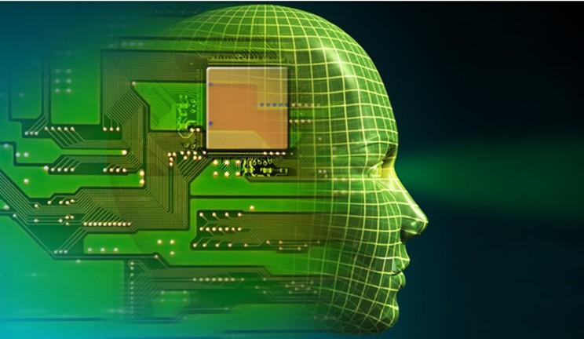

2012年6月，《纽约时报》披露了Google Brain项目，吸引了公众的广泛关注。这个项目是由
著名的斯坦福大学的机器学习教授Andrew Ng和在大规模计算机系统方面的世界顶尖专家
JeffDean共同主导，用16000个CPU Core的并行计算平台训练一种称为“深度神经网络”（DNN，
Deep Neural Networks）的机器学习模型（内部共有10亿个节点。这一网络自然是不能跟人
类的神经网络相提并论的。要知道，人脑中可是有150多亿个神经元，互相连接的节点也就是
突触数更是如银河沙数。曾经有人估算过，如果将一个人的大脑中所有神经细胞的轴突和树
突依次连接起来，并拉成一根直线，可从地球连到月亮，再从月亮返回地球），在语音识别
和图像识别等领域获得了巨大的成功。

项目负责人之一Andrew称：“我们没有像通常做的那样自己框定边界，而是直接把海量数据投
放到算法中，让数据自己说话，系统会自动从数据中学习。”另外一名负责人Jeff则说：“我
们在训练的时候从来不会告诉机器说：‘这是一只猫。’系统其实是自己发明或者领悟了“猫”
的概念。”

`<http://www.36kr.com/p/122132.html/40_513199340_20120221103948>`__

2012年11月，微软在中国天津的一次活动上公开演示了一个全自动的同声传译系统，讲演者
用英文演讲，后台的计算机一气呵成自动完成语音识别、英中机器翻译和中文语音合成，效
果非常流畅。据报道，后面支撑的关键技术也是DNN，或者深度学习（DL，DeepLearning）。

2013年1月，在百度年会上，创始人兼CEO李彦宏高调宣布要成立百度研究院，其中第一个成
立的就是“深度学习研究所”（IDL，Institue of Deep Learning）。

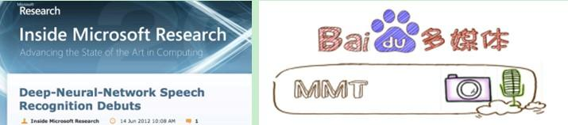

为什么拥有大数据的互联网公司争相投入大量资源研发深度学习技术。听起来感觉
deeplearning很牛那样。那什么是deep learning？为什么有deep learning？它是怎么来的？
又能干什么呢？目前存在哪些困难呢？这些问题的简答都需要慢慢来。咱们先来了解下机器
学习（人工智能的核心）的背景。

二、背景
========

机器学习（Machine Learning）是一门专门研究计算机怎样模拟或实现人类的学习行为，以
获取新的知识或技能，重新组织已有的知识结构使之不断改善自身的性能的学科。机器能否
像人类一样能具有学习能力呢？1959年美国的塞缪尔(Samuel)设计了一个下棋程序，这个程
序具有学习能力，它可以在不断的对弈中改善自己的棋艺。4年后，这个程序战胜了设计者本
人。又过了3年，这个程序战胜了美国一个保持8年之久的常胜不败的冠军。这个程序向人们
展示了机器学习的能力，提出了许多令人深思的社会问题与哲学问题（呵呵，人工智能正常
的轨道没有很大的发展，这些什么哲学伦理啊倒发展的挺快。什么未来机器越来越像人，人
越来越像机器啊。什么机器会反人类啊，ATM是开第一枪的啊等等。人类的思维无穷啊）。

机器学习虽然发展了几十年，但还是存在很多没有良好解决的问题：

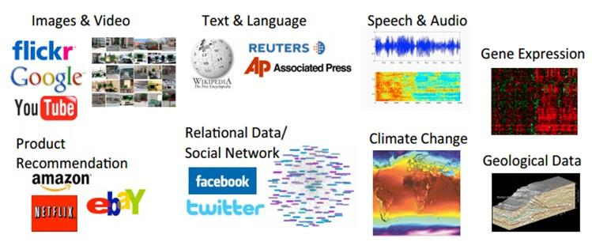

例如图像识别、语音识别、自然语言理解、天气预测、基因表达、内容推荐等等。目前我们
通过机器学习去解决这些问题的思路都是这样的（以视觉感知为例子）：

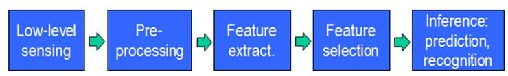

从开始的通过传感器（例如CMOS）来获得数据。然后经过预处理、特征提取、特征选择，再
到推理、预测或者识别。最后一个部分，也就是机器学习的部分，绝大部分的工作是在这方
面做的，也存在很多的paper和研究。

而中间的三部分，概括起来就是特征表达。良好的特征表达，对最终算法的准确性起了非常
关键的作用，而且系统主要的计算和测试工作都耗在这一大部分。但，这块实际中一般都是
人工完成的。靠人工提取特征。

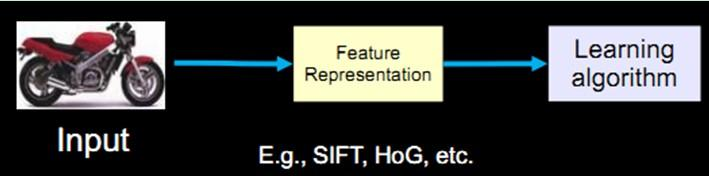

截止现在，也出现了不少NB的特征（好的特征应具有不变性（大小、尺度和旋转等）和可区
分性）：例如Sift的出现，是局部图像特征描述子研究领域一项里程碑式的工作。由于SIFT
对尺度、旋转以及一定视角和光照变化等图像变化都具有不变性，并且SIFT具有很强的可区
分性，的确让很多问题的解决变为可能。但它也不是万能的。

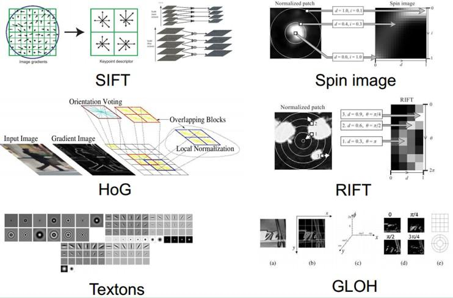

然而，手工地选取特征是一件非常费力、启发式（需要专业知识）的方法，能不能选取好很
大程度上靠经验和运气，而且它的调节需要大量的时间。既然手工选取特征不太好，那么能
不能自动地学习一些特征呢？答案是能！Deep Learning就是用来干这个事情的，看它的一个
别名UnsupervisedFeature Learning，就可以顾名思义了，Unsupervised的意思就是不要人
参与特征的选取过程。

那它是怎么学习的呢？怎么知道哪些特征好哪些不好呢？我们说机器学习是一门专门研究计
算机怎样模拟或实现人类的学习行为的学科。好，那我们人的视觉系统是怎么工作的呢？为
什么在茫茫人海，芸芸众生，滚滚红尘中我们都可以找到另一个她（因为，你存在我深深的
脑海里，我的梦里我的心里我的歌声里……）。人脑那么NB，我们能不能参考人脑，模拟人脑
呢？（好像和人脑扯上点关系的特征啊，算法啊，都不错，但不知道是不是人为强加的，为
了使自己的作品变得神圣和高雅。）

近几十年以来，认知神经科学、生物学等等学科的发展，让我们对自己这个神秘的而又神奇
的大脑不再那么的陌生。也给人工智能的发展推波助澜。

三、人脑视觉机理
================

1981 年的诺贝尔医学奖，颁发给了 David Hubel（出生于加拿大的美国神经生物学家） 和
TorstenWiesel，以及 Roger Sperry。前两位的主要贡献，是“发现了视觉系统的信息处理”：
可视皮层是分级的：

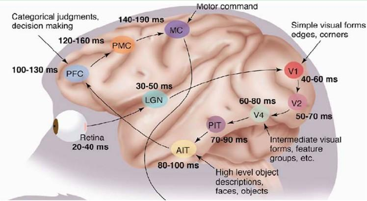

我们看看他们做了什么。1958年，DavidHubel 和Torsten Wiesel 在JohnHopkins
University，研究瞳孔区域与大脑皮层神经元的对应关系。他们在猫的后脑头骨上，开了一
个3毫米的小洞，向洞里插入电极，测量神经元的活跃程度。

然后，他们在小猫的眼前，展现各种形状、各种亮度的物体。并且，在展现每一件物体时，
还改变物体放置的位置和角度。他们期望通过这个办法，让小猫瞳孔感受不同类型、不同强
弱的刺激。

之所以做这个试验，目的是去证明一个猜测。位于后脑皮层的不同视觉神经元，与瞳孔所受
刺激之间，存在某种对应关系。一旦瞳孔受到某一种刺激，后脑皮层的某一部分神经元就会
活跃。经历了很多天反复的枯燥的试验，同时牺牲了若干只可怜的小猫，David Hubel 和
Torsten Wiesel 发现了一种被称为“方向选择性细胞（Orientation Selective Cell）”的神
经元细胞。当瞳孔发现了眼前的物体的边缘，而且这个边缘指向某个方向时，这种神经元细
胞就会活跃。

这个发现激发了人们对于神经系统的进一步思考。神经-中枢-大脑的工作过程，或许是一个
不断迭代、不断抽象的过程。

这里的关键词有两个，一个是抽象，一个是迭代。从原始信号，做低级抽象，逐渐向高级抽
象迭代。人类的逻辑思维，经常使用高度抽象的概念。

例如，从原始信号摄入开始（瞳孔摄入像素Pixels），接着做初步处理（大脑皮层某些细胞
发现边缘和方向），然后抽象（大脑判定， 眼前的物体的形状，是圆形的），然后进一步抽
象（大脑进一步判定该物体是只气球）。

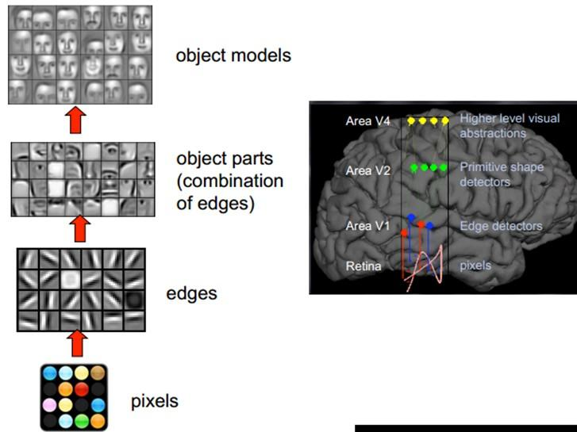

这个生理学的发现，促成了计算机人工智能，在四十年后的突破性发展。

总的来说，人的视觉系统的信息处理是分级的。从低级的V1区提取边缘特征，再到V2区的形
状或者目标的部分等，再到更高层，整个目标、目标的行为等。也就是说高层的特征是低层
特征的组合，从低层到高层的特征表示越来越抽象，越来越能表现语义或者意图。而抽象层
面越高，存在的可能猜测就越少，就越利于分类。例如，单词集合和句子的对应是多对一的，
句子和语义的对应又是多对一的，语义和意图的对应还是多对一的，这是个层级体系。

敏感的人注意到关键词了：分层。而Deep learning的deep是不是就表示我存在多少层，也就
是多深呢？没错。那Deep learning是如何借鉴这个过程的呢？毕竟是归于计算机来处理，面
对的一个问题就是怎么对这个过程建模？

因为我们要学习的是特征的表达，那么关于特征，或者说关于这个层级特征，我们需要了解
地更深入点。所以在说Deep Learning之前，我们有必要再啰嗦下特征（呵呵，实际上是看到
那么好的对特征的解释，不放在这里有点可惜，所以就塞到这了）。

四、关于特征
============

特征是机器学习系统的原材料，对最终模型的影响是毋庸置疑的。如果数据被很好的表达成
了特征，通常线性模型就能达到满意的精度。那对于特征，我们需要考虑什么呢？

4.1、特征表示的粒度
-------------------

学习算法在一个什么粒度上的特征表示，才有能发挥作用？就一个图片来说，像素级的特征
根本没有价值。例如下面的摩托车，从像素级别，根本得不到任何信息，其无法进行摩托车
和非摩托车的区分。而如果特征是一个具有结构性（或者说有含义）的时候，比如是否具有
车把手（handle），是否具有车轮（wheel），就很容易把摩托车和非摩托车区分，学习算法
才能发挥作用。

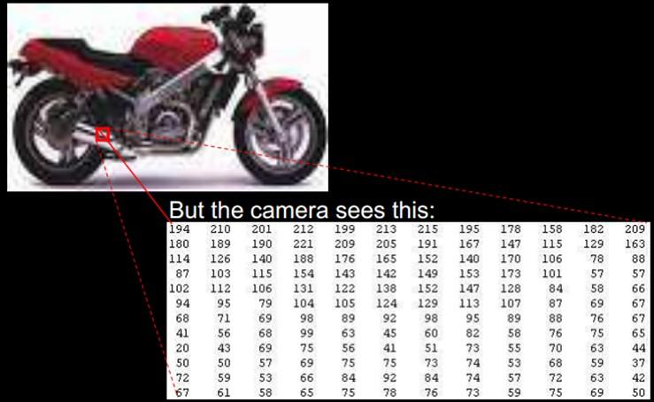

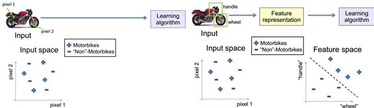

4.2、初级（浅层）特征表示
-------------------------

既然像素级的特征表示方法没有作用，那怎样的表示才有用呢？

1995 年前后，Bruno Olshausen和 David Field 两位学者任职Cornell University，他们试
图同时用生理学和计算机的手段，双管齐下，研究视觉问题。

他们收集了很多黑白风景照片，从这些照片中，提取出400个小碎片，每个照片碎片的尺寸均
为16x16 像素，不妨把这400个碎片标记为 S[i], i = 0,.. 399。接下来，再从这些黑白风
景照片中，随机提取另一个碎片，尺寸也是 16x16像素，不妨把这个碎片标记为 T。

他们提出的问题是，如何从这400个碎片中，选取一组碎片，S[k],通过叠加的办法，合成出
一个新的碎片，而这个新的碎片，应当与随机选择的目标碎片T，尽可能相似，同时，S[k]
的数量尽可能少。用数学的语言来描述，就是：

Sum\_k (a[k] \* S[k]) --> T, 其中 a[k] 是在叠加碎片 S[k]时的权重系数。

为解决这个问题，Bruno Olshausen和 David Field发明了一个算法，稀疏编码（Sparse
Coding）。

稀疏编码是一个重复迭代的过程，每次迭代分两步：

#. 选择一组 S[k]，然后调整 a[k]，使得Sum\_k (a[k] \* S[k]) 最接近 T。

#. 固定住 a[k]，在 400 个碎片中，选择其它更合适的碎片S’[k]，替代原先的
S[k]，使得Sum\_k (a[k] \* S’[k]) 最接近 T。

经过几次迭代后，最佳的 S[k]组合，被遴选出来了。令人惊奇的是，被选中的S[k]，基本上
都是照片上不同物体的边缘线，这些线段形状相似，区别在于方向。

Bruno Olshausen和 David Field 的算法结果，与 David Hubel和Torsten Wiesel 的生理发
现，不谋而合！

也就是说，复杂图形，往往由一些基本结构组成。比如下图：一个图可以通过用64种正交的
edges（可以理解成正交的基本结构）来线性表示。比如样例的x可以用1-64个edges中的三个
按照0.8,0.3,0.5的权重调和而成。而其他基本edge没有贡献，因此均为0。

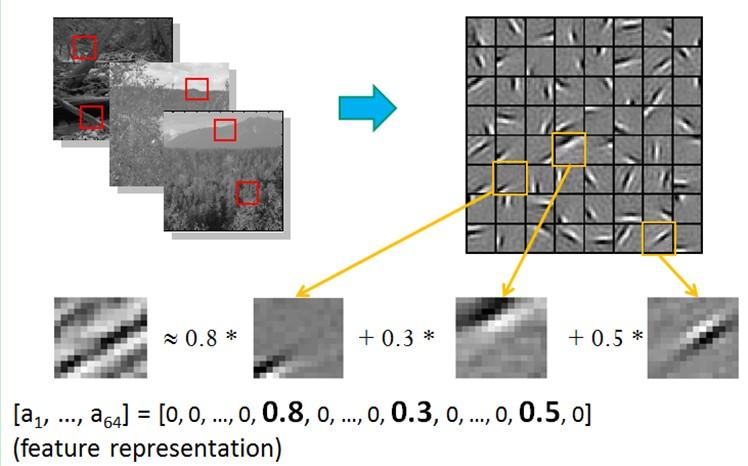

另外，大牛们还发现，不仅图像存在这个规律，声音也存在。他们从未标注的声音中发现了
20种基本的声音结构，其余的声音可以由这20种基本结构合成。

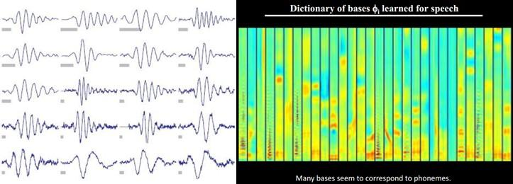

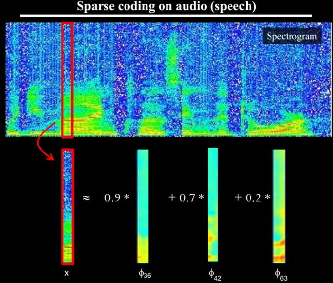

4.3、结构性特征表示
-------------------

小块的图形可以由基本edge构成，更结构化，更复杂的，具有概念性的图形如何表示呢？这
就需要更高层次的特征表示，比如V2，V4。因此V1看像素级是像素级。V2看V1是像素级，这
个是层次递进的，高层表达由底层表达的组合而成。专业点说就是基basis。V1取提出的
basis是边缘，然后V2层是V1层这些basis的组合，这时候V2区得到的又是高一层的basis。即
上一层的basis组合的结果，上上层又是上一层的组合basis……（所以有大牛说Deep
learning就是“搞基”，因为难听，所以美其名曰Deep learning或者Unsupervised Feature
Learning）

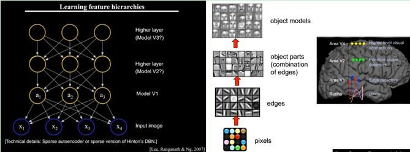

直观上说，就是找到make sense的小patch再将其进行combine，就得到了上一层的feature，
递归地向上learning feature。

在不同object上做training是，所得的edge basis是非常相似的，但object parts和models
就会completely different了（那咱们分辨car或者face是不是容易多了）：

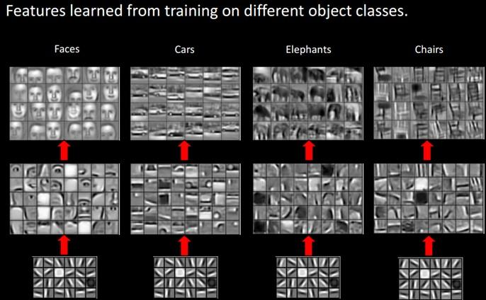

从文本来说，一个doc表示什么意思？我们描述一件事情，用什么来表示比较合适？用一个一
个字嘛，我看不是，字就是像素级别了，起码应该是term，换句话说每个doc都由term构成，
但这样表示概念的能力就够了嘛，可能也不够，需要再上一步，达到topic级，有了topic，
再到doc就合理。但每个层次的数量差距很大，比如doc表示的概念->topic（千-万量
级）->term（10万量级）->word（百万量级）。

一个人在看一个doc的时候，眼睛看到的是word，由这些word在大脑里自动切词形成term，在
按照概念组织的方式，先验的学习，得到topic，然后再进行高层次的learning。

4.4、需要有多少个特征？
-----------------------

我们知道需要层次的特征构建，由浅入深，但每一层该有多少个特征呢？

任何一种方法，特征越多，给出的参考信息就越多，准确性会得到提升。但特征多意味着计
算复杂，探索的空间大，可以用来训练的数据在每个特征上就会稀疏，都会带来各种问题，
并不一定特征越多越好。

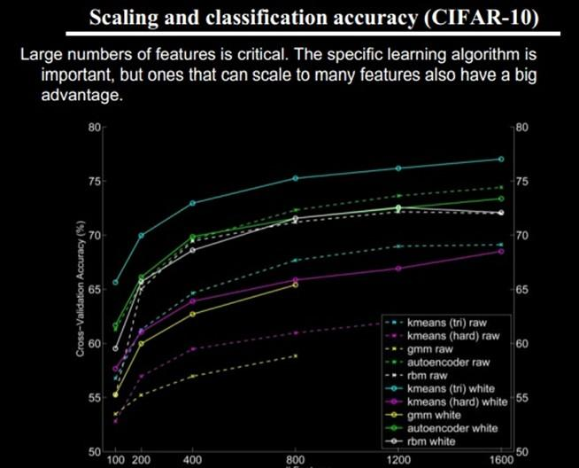

好了，到了这一步，终于可以聊到Deep learning了。上面我们聊到为什么会有Deep
learning（让机器自动学习良好的特征，而免去人工选取过程。还有参考人的分层视觉处理
系统），我们得到一个结论就是Deep learning需要多层来获得更抽象的特征表达。那么多少
层才合适呢？用什么架构来建模呢？怎么进行非监督训练呢？

五、Deep Learning的基本思想
===========================

假设我们有一个系统S，它有n层（S1,…Sn），它的输入是I，输出是O，形象地表示为：I
=>S1=>S2=>…..=>Sn => O，如果输出O等于输入I，即输入I经过这个系统变化之后没有任何的
信息损失（呵呵，大牛说，这是不可能的。信息论中有个“信息逐层丢失”的说法（信息处理
不等式），设处理a信息得到b，再对b处理得到c，那么可以证明：a和c的互信息不会超过a和
b的互信息。这表明信息处理不会增加信息，大部分处理会丢失信息。当然了，如果丢掉的是
没用的信息那多好啊），保持了不变，这意味着输入I经过每一层Si都没有任何的信息损失，
即在任何一层Si，它都是原有信息（即输入I）的另外一种表示。现在回到我们的主题Deep
Learning，我们需要自动地学习特征，假设我们有一堆输入I（如一堆图像或者文本），假设
我们设计了一个系统S（有n层），我们通过调整系统中参数，使得它的输出仍然是输入I，那
么我们就可以自动地获取得到输入I的一系列层次特征，即S1，…, Sn。

对于深度学习来说，其思想就是对堆叠多个层，也就是说这一层的输出作为下一层的输入。
通过这种方式，就可以实现对输入信息进行分级表达了。

另外，前面是假设输出严格地等于输入，这个限制太严格，我们可以略微地放松这个限制，
例如我们只要使得输入与输出的差别尽可能地小即可，这个放松会导致另外一类不同的Deep
Learning方法。上述就是Deep Learning的基本思想。

六、浅层学习（Shallow Learning）和深度学习（Deep Learning）
===========================================================

浅层学习是机器学习的第一次浪潮
------------------------------

20世纪80年代末期，用于人工神经网络的反向传播算法（也叫Back Propagation算法或者BP
算法）的发明，给机器学习带来了希望，掀起了基于统计模型的机器学习热潮。这个热潮一
直持续到今天。人们发现，利用BP算法可以让一个人工神经网络模型从大量训练样本中学习
统计规律，从而对未知事件做预测。这种基于统计的机器学习方法比起过去基于人工规则的
系统，在很多方面显出优越性。这个时候的人工神经网络，虽也被称作多层感知机
（Multi-layer Perceptron），但实际是种只含有一层隐层节点的浅层模型。

20世纪90年代，各种各样的浅层机器学习模型相继被提出，例如支撑向量机（SVM，Support
Vector Machines）、 Boosting、最大熵方法（如LR，Logistic Regression）等。这些模型
的结构基本上可以看成带有一层隐层节点（如SVM、Boosting），或没有隐层节点（如LR）。
这些模型无论是在理论分析还是应用中都获得了巨大的成功。相比之下，由于理论分析的难
度大，训练方法又需要很多经验和技巧，这个时期浅层人工神经网络反而相对沉寂。

深度学习是机器学习的第二次浪潮
------------------------------

2006年，加拿大多伦多大学教授、机器学习领域的泰斗Geoffrey Hinton和他的学生
RuslanSalakhutdinov在《科学》上发表了一篇文章，开启了深度学习在学术界和工业界的浪
潮。这篇文章有两个主要观点：1）多隐层的人工神经网络具有优异的特征学习能力，学习得
到的特征对数据有更本质的刻画，从而有利于可视化或分类；2）深度神经网络在训练上的难
度，可以通过“逐层初始化”（layer-wise pre-training）来有效克服，在这篇文章中，逐层
初始化是通过无监督学习实现的。

当前多数分类、回归等学习方法为浅层结构算法，其局限性在于有限样本和计算单元情况下
对复杂函数的表示能力有限，针对复杂分类问题其泛化能力受到一定制约。深度学习可通过
学习一种深层非线性网络结构，实现复杂函数逼近，表征输入数据分布式表示，并展现了强
大的从少数样本集中学习数据集本质特征的能力。（多层的好处是可以用较少的参数表示复
杂的函数）

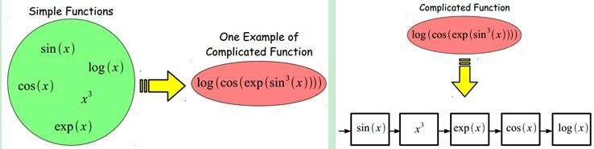

深度学习的实质，是通过构建具有很多隐层的机器学习模型和海量的训练数据，来学习更有
用的特征，从而最终提升分类或预测的准确性。因此，“深度模型”是手段，“特征学习”是目
的。区别于传统的浅层学习，深度学习的不同在于：1）强调了模型结构的深度，通常有5层、
6层，甚至10多层的隐层节点；2）明确突出了特征学习的重要性，也就是说，通过逐层特征
变换，将样本在原空间的特征表示变换到一个新特征空间，从而使分类或预测更加容易。与
人工规则构造特征的方法相比，利用大数据来学习特征，更能够刻画数据的丰富内在信息。

七、Deep learning与Neural Network
=================================

深度学习是机器学习研究中的一个新的领域，其动机在于建立、模拟人脑进行分析学习的神
经网络，它模仿人脑的机制来解释数据，例如图像，声音和文本。深度学习是无监督学习的
一种。

深度学习的概念源于人工神经网络的研究。含多隐层的多层感知器就是一种深度学习结构。
深度学习通过组合低层特征形成更加抽象的高层表示属性类别或特征，以发现数据的分布式
特征表示。

Deep learning本身算是machine learning的一个分支，简单可以理解为neural network的发
展。大约二三十年前，neural network曾经是ML领域特别火热的一个方向，但是后来确慢慢
淡出了，原因包括以下几个方面：

#. 1）比较容易过拟合，参数比较难tune，而且需要不少trick；

#. 2）训练速度比较慢，在层次比较少（小于等于3）的情况下效果并不比其它方法更优；

所以中间有大约20多年的时间，神经网络被关注很少，这段时间基本上是SVM和boosting算法
的天下。但是，一个痴心的老先生Hinton，他坚持了下来，并最终（和其它人一起Bengio、
Yann.lecun等）提成了一个实际可行的deep learning框架。

Deep learning与传统的神经网络之间有相同的地方也有很多不同。

二者的相同在于deep learning采用了神经网络相似的分层结构，系统由包括输入层、隐层
（多层）、输出层组成的多层网络，只有相邻层节点之间有连接，同一层以及跨层节点之间
相互无连接，每一层可以看作是一个logistic regression模型；这种分层结构，是比较接近
人类大脑的结构的。

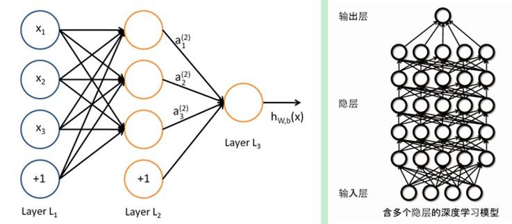

而为了克服神经网络训练中的问题，DL采用了与神经网络很不同的训练机制。传统神经网络
中，采用的是back propagation的方式进行，简单来讲就是采用迭代的算法来训练整个网络，
随机设定初值，计算当前网络的输出，然后根据当前输出和label之间的差去改变前面各层的
参数，直到收敛（整体是一个梯度下降法）。而deep learning整体上是一个layer-wise的训
练机制。这样做的原因是因为，如果采用back propagation的机制，对于一个deep network
（7层以上），残差传播到最前面的层已经变得太小，出现所谓的gradient diffusion（梯度
扩散）。这个问题我们接下来讨论。

八、Deep learning训练过程
=========================

8.1、传统神经网络的训练方法为什么不能用在深度神经网络
-----------------------------------------------------

BP算法作为传统训练多层网络的典型算法，实际上对仅含几层网络，该训练方法就已经很不
理想。深度结构（涉及多个非线性处理单元层）非凸目标代价函数中普遍存在的局部最小是
训练困难的主要来源。

**BP算法存在的问题：**

（1）梯度越来越稀疏：从顶层越往下，误差校正信号越来越小；

（2）收敛到局部最小值：尤其是从远离最优区域开始的时候（随机值初始化会导致这种情况
的发生）；

（3）一般，我们只能用有标签的数据来训练：但大部分的数据是没标签的，而大脑可以从没
有标签的的数据中学习；

8.2、deep learning训练过程
--------------------------

如果对所有层同时训练，时间复杂度会太高；如果每次训练一层，偏差就会逐层传递。这会
面临跟上面监督学习中相反的问题，会严重欠拟合（因为深度网络的神经元和参数太多了）。

2006年，hinton提出了在非监督数据上建立多层神经网络的一个有效方法，简单的说，分为
两步，一是每次训练一层网络，二是调优，使原始表示x向上生成的高级表示r和该高级表示
r向下生成的x'尽可能一致。方法是：

  #. 首先逐层构建单层神经元，这样每次都是训练一个单层网络。
  #. 当所有层训练完后，Hinton使用wake-sleep算法进行调优。

将除最顶层的其它层间的权重变为双向的，这样最顶层仍然是一个单层神经网络，而其它层
则变为了图模型。向上的权重用于“认知”，向下的权重用于“生成”。然后使用Wake-Sleep算
法调整所有的权重。让认知和生成达成一致，也就是保证生成的最顶层表示能够尽可能正确
的复原底层的结点。比如顶层的一个结点表示人脸，那么所有人脸的图像应该激活这个结点，
并且这个结果向下生成的图像应该能够表现为一个大概的人脸图像。Wake-Sleep算法分为醒
（wake）和睡（sleep）两个部分。

**1）wake阶段** 认知过程，通过外界的特征和向上的权重（认知权重）产生每一层的抽象
  表示（结点状态），并且使用梯度下降修改层间的下行权重（生成权重）。也就是“如果现
  实跟我想象的不一样，改变我的权重使得我想象的东西就是这样的”。

**2）sleep阶段** ：生成过程，通过顶层表示（醒时学得的概念）和向下权重，生成底层的
  状态，同时修改层间向上的权重。也就是“如果梦中的景象不是我脑中的相应概念，改变我
  的认知权重使得这种景象在我看来就是这个概念”。

**deep learning训练过程具体如下：**

1）使用自下上升非监督学习（就是从底层开始，一层一层的往顶层训练）：

采用无标定数据（有标定数据也可）分层训练各层参数，这一步可以看作是一个无监督训练
过程，是和传统神经网络区别最大的部分（这个过程可以看作是feature learning过程）：

具体的，先用无标定数据训练第一层，训练时先学习第一层的参数（这一层可以看作是得到
一个使得输出和输入差别最小的三层神经网络的隐层），由于模型capacity的限制以及稀疏
性约束，使得得到的模型能够学习到数据本身的结构，从而得到比输入更具有表示能力的特
征；在学习得到第n-1层后，将n-1层的输出作为第n层的输入，训练第n层，由此分别得到各
层的参数；

2）自顶向下的监督学习（就是通过带标签的数据去训练，误差自顶向下传输，对网络进行微调）：

基于第一步得到的各层参数进一步fine-tune整个多层模型的参数，这一步是一个有监督训练
过程；第一步类似神经网络的随机初始化初值过程，由于DL的第一步不是随机初始化，而是
通过学习输入数据的结构得到的，因而这个初值更接近全局最优，从而能够取得更好的效果；
所以deep learning效果好很大程度上归功于第一步的feature learning过程。

九、Deep Learning的常用模型或者方法
===================================

9.1、AutoEncoder自动编码器
--------------------------

Deep Learning最简单的一种方法是利用人工神经网络的特点，人工神经网络（ANN）本身就
是具有层次结构的系统，如果给定一个神经网络，我们假设其输出与输入是相同的，然后训
练调整其参数，得到每一层中的权重。自然地，我们就得到了输入I的几种不同表示（每一层
代表一种表示），这些表示就是特征。自动编码器就是一种尽可能复现输入信号的神经网络。
为了实现这种复现，自动编码器就必须捕捉可以代表输入数据的最重要的因素，就像PCA那样，
找到可以代表原信息的主要成分。

具体过程简单的说明如下：

**1）给定无标签数据，用非监督学习学习特征：**

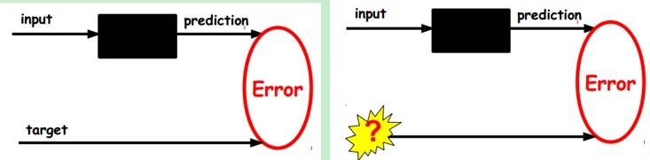

在我们之前的神经网络中，如第一个图，我们输入的样本是有标签的，即（input, target），
这样我们根据当前输出和target（label）之间的差去改变前面各层的参数，直到收敛。但现
在我们只有无标签数据，也就是右边的图。那么这个误差怎么得到呢？

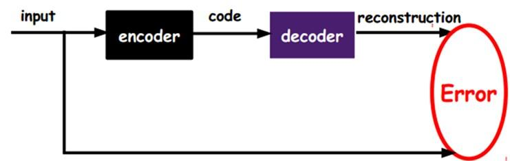

如上图，我们将input输入一个encoder编码器，就会得到一个code，这个code也就是输入的
一个表示，那么我们怎么知道这个code表示的就是input呢？我们加一个decoder解码器，这
时候decoder就会输出一个信息，那么如果输出的这个信息和一开始的输入信号input是很像
的（理想情况下就是一样的），那很明显，我们就有理由相信这个code是靠谱的。所以，我
们就通过调整encoder和decoder的参数，使得重构误差最小，这时候我们就得到了输入
input信号的第一个表示了，也就是编码code了。因为是无标签数据，所以误差的来源就是直
接重构后与原输入相比得到。

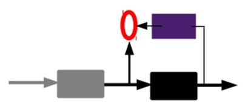

**2）通过编码器产生特征，然后训练下一层。这样逐层训练：**

那上面我们就得到第一层的code，我们的重构误差最小让我们相信这个code就是原输入信号
的良好表达了，或者牵强点说，它和原信号是一模一样的（表达不一样，反映的是一个东
西）。那第二层和第一层的训练方式就没有差别了，我们将第一层输出的code当成第二层的
输入信号，同样最小化重构误差，就会得到第二层的参数，并且得到第二层输入的code，也
就是原输入信息的第二个表达了。其他层就同样的方法炮制就行了（训练这一层，前面层的
参数都是固定的，并且他们的decoder已经没用了，都不需要了）。

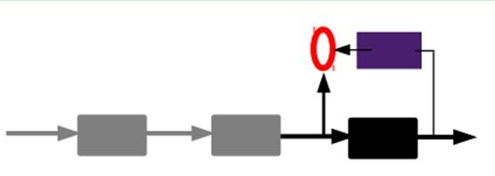

**3）有监督微调：**

经过上面的方法，我们就可以得到很多层了。至于需要多少层（或者深度需要多少，这个目
前本身就没有一个科学的评价方法）需要自己试验调了。每一层都会得到原始输入的不同的
表达。当然了，我们觉得它是越抽象越好了，就像人的视觉系统一样。

到这里，这个AutoEncoder还不能用来分类数据，因为它还没有学习如何去连结一个输入和一
个类。它只是学会了如何去重构或者复现它的输入而已。或者说，它只是学习获得了一个可
以良好代表输入的特征，这个特征可以最大程度上代表原输入信号。那么，为了实现分类，
我们就可以在AutoEncoder的最顶的编码层添加一个分类器（例如罗杰斯特回归、SVM等），
然后通过标准的多层神经网络的监督训练方法（梯度下降法）去训练。

也就是说，这时候，我们需要将最后层的特征code输入到最后的分类器，通过有标签样本，
通过监督学习进行微调，这也分两种，一个是只调整分类器（黑色部分）：

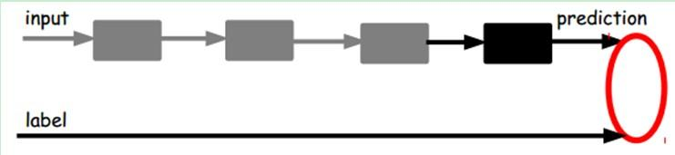

另一种：通过有标签样本，微调整个系统：（如果有足够多的数据，这个是最好的。
end-to-end learning端对端学习）

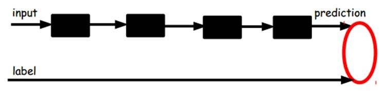

一旦监督训练完成，这个网络就可以用来分类了。神经网络的最顶层可以作为一个线性分类
器，然后我们可以用一个更好性能的分类器去取代它。

在研究中可以发现，如果在原有的特征中加入这些自动学习得到的特征可以大大提高精确度，
甚至在分类问题中比目前最好的分类算法效果还要好！

AutoEncoder存在一些变体，这里简要介绍下两个：
~~~~~~~~~~~~~~~~~~~~~~~~~~~~~~~~~~~~~~~~~~~~~

**Sparse AutoEncoder稀疏自动编码器：**

当然，我们还可以继续加上一些约束条件得到新的Deep Learning方法，如：如果在
AutoEncoder的基础上加上L1的Regularity限制（L1主要是约束每一层中的节点中大部分都要
为0，只有少数不为0，这就是Sparse名字的来源），我们就可以得到Sparse AutoEncoder法。

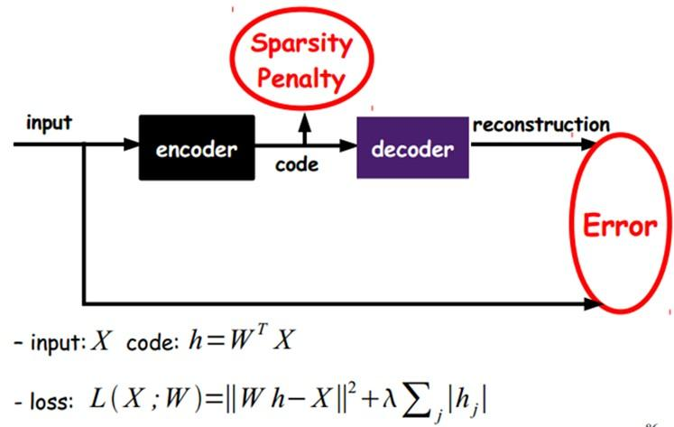

如上图，其实就是限制每次得到的表达code尽量稀疏。因为稀疏的表达往往比其他的表达要
有效（人脑好像也是这样的，某个输入只是刺激某些神经元，其他的大部分的神经元是受到
抑制的）。

**Denoising AutoEncoders降噪自动编码器：**

降噪自动编码器DA是在自动编码器的基础上，训练数据加入噪声，所以自动编码器必须学习
去去除这种噪声而获得真正的没有被噪声污染过的输入。因此，这就迫使编码器去学习输入
信号的更加鲁棒的表达，这也是它的泛化能力比一般编码器强的原因。DA可以通过梯度下降
算法去训练。

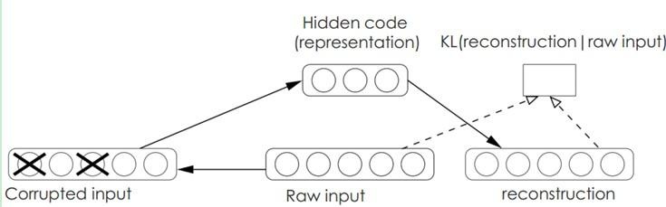

9.2、Sparse Coding稀疏编码
--------------------------

如果我们把输出必须和输入相等的限制放松，同时利用线性代数中基的概念，即O = a\
:sub:`1`\ \*Φ\ :sub:`1` + a\ :sub:`2`\ \*Φ\ :sub:`2`\ +….+ a\ :sub:`n`\ \*Φ\
:sub:`n`\ ， Φ\ :sub:`i`\ 是基，a\ :sub:`i`\ 是系数，我们可以得到这样一个优化问题：

Min \|I – O\|，其中I表示输入，O表示输出。

通过求解这个最优化式子，我们可以求得系数a:sub:`i`\ 和基Φ\ :sub:`i`\ ，这些系数和
基就是输入的另外一种近似表达。

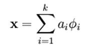

因此，它们可以用来表达输入I，这个过程也是自动学习得到的。如果我们在上述式子上加上
L1的Regularity限制，得到：

Min \|I – O\| + u\*(\|a\ :sub:`1`\ \| + \|a\ :sub:`2`\ \| + ... + \|a\
:sub:`n` \|)

这种方法被称为Sparse Coding。通俗的说，就是将一个信号表示为一组基的线性组合，而且
要求只需要较少的几个基就可以将信号表示出来。“稀疏性”定义为：只有很少的几个非零元
素或只有很少的几个远大于零的元素。要求系数a\ :sub:`i` 是稀疏的意思就是说：对于一
组输入向量，我们只想有尽可能少的几个系数远大于零。选择使用具有稀疏性的分量来表示
我们的输入数据是有原因的，因为绝大多数的感官数据，比如自然图像，可以被表示成少量
基本元素的叠加，在图像中这些基本元素可以是面或者线。同时，比如与初级视觉皮层的类
比过程也因此得到了提升（人脑有大量的神经元，但对于某些图像或者边缘只有很少的神经
元兴奋，其他都处于抑制状态）。

稀疏编码算法是一种无监督学习方法，它用来寻找一组“超完备”基向量来更高效地表示样本
数据。虽然形如主成分分析技术（PCA）能使我们方便地找到一组“完备”基向量，但是这里我
们想要做的是找到一组“超完备”基向量来表示输入向量（也就是说，基向量的个数比输入向
量的维数要大）。超完备基的好处是它们能更有效地找出隐含在输入数据内部的结构与模式。
然而，对于超完备基来说，系数a\ :sub:`i`\ 不再由输入向量唯一确定。因此，在稀疏编码
算法中，我们另加了一个评判标准“稀疏性”来解决因超完备而导致的退化（degeneracy）问
题。（ `详细过程请参考：UFLDL Tutorial稀疏编码
<http://deeplearning.stanford.edu/wiki/index.php/%E7%A8%80%E7%96%8F%E7%BC%96%E7%A0%81>`__
）

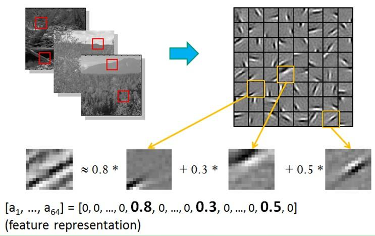

比如在图像的Feature Extraction的最底层要做Edge Detector的生成，那么这里的工作就是
从Natural Images中randomly选取一些小patch，通过这些patch生成能够描述他们的“基”，
也就是右边的8\*8=64个basis组成的basis，然后给定一个test patch, 我们可以按照上面的
式子通过basis的线性组合得到，而sparse matrix就是a，下图中的a中有64个维度，其中非
零项只有3个，故称“sparse”。

这里可能大家会有疑问，为什么把底层作为Edge Detector呢？上层又是什么呢？这里做个简
单解释大家就会明白，之所以是Edge Detector是因为不同方向的Edge就能够描述出整幅图像，
所以不同方向的Edge自然就是图像的basis了……而上一层的basis组合的结果，上上层又是上
一层的组合basis……（就是上面第四部分的时候咱们说的那样）

Sparse coding分为两个部分：

**1）Training阶段：**\ 给定一系列的样本图片[x1, x 2, …]，我们需要学习得到一组基
[Φ1, Φ2, …]，也就是字典。

稀疏编码是k-means算法的变体，其训练过程也差不多（EM算法的思想：如果要优化的目标函
数包含两个变量，如L(W, B)，那么我们可以先固定W，调整B使得L最小，然后再固定B，调整
W使L最小，这样迭代交替，不断将L推向最小值。EM算法可以见我的博客：“ `从最大似然到
EM算法浅解 <http://blog.csdn.net/zouxy09/article/details/8537620>`__ ”）。

训练过程就是一个重复迭代的过程，按上面所说，我们交替的更改a和Φ使得下面这个目标函数最小。

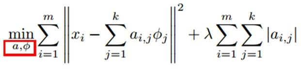

每次迭代分两步：

a）固定字典Φ[k]，然后调整a[k]，使得上式，即目标函数最小（即解LASSO问题）。

b）然后固定住a [k]，调整Φ [k]，使得上式，即目标函数最小（即解凸QP问题）。

不断迭代，直至收敛。这样就可以得到一组可以良好表示这一系列x的基，也就是字典。

**2）Coding阶段：** 给定一个新的图片x，由上面得到的字典，通过解一个LASSO问题得到
 稀疏向量 **a** 。这个稀疏向量就是这个输入向量x的一个稀疏表达了。

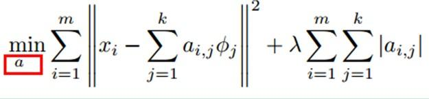

例如：

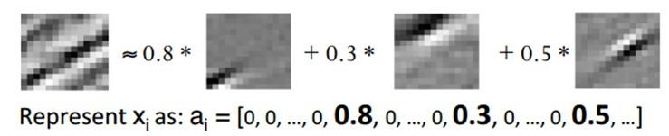

注：下面的两个Deep Learning方法说明需要完善，但为了保证文章的连续性和完整性，先贴
一些上来，后面再修改好了。

9.3、Restricted Boltzmann Machine (RBM)限制波尔兹曼机
-----------------------------------------------------

假设有一个二部图，每一层的节点之间没有链接，一层是可视层，即输入数据层（v)，一层
是隐藏层(h)，如果假设所有的节点都是随机二值变量节点（只能取0或者1值），同时假设全
概率分布p(v,h)满足Boltzmann分布，我们称这个模型是Restricted BoltzmannMachine
(RBM)。

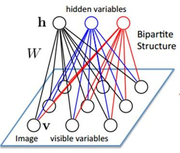

下面我们来看看为什么它是Deep Learning方法。首先，这个模型因为是二部图，所以在已知
v的情况下，所有的隐藏节点之间是条件独立的（因为节点之间不存在连接），即
p(h\|v)=p(h\ :sub:`1`\ \|v)…p(h\ :sub:`n`\ \|v)。同理，在已知隐藏层h的情况下，所
有的可视节点都是条件独立的。同时又由于所有的v和h满足Boltzmann分布，因此，当输入v
的时候，通过p(h\|v)可以得到隐藏层h，而得到隐藏层h之后，通过p(v\|h)又能得到可视层，
通过调整参数，我们就是要使得从隐藏层得到的可视层v1与原来的可视层v如果一样，那么得
到的隐藏层就是可视层另外一种表达，因此隐藏层可以作为可视层输入数据的特征，所以它
就是一种Deep Learning方法。

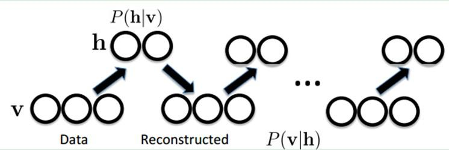

如何训练呢？也就是可视层节点和隐节点间的权值怎么确定呢？我们需要做一些数学分析。
也就是模型了。

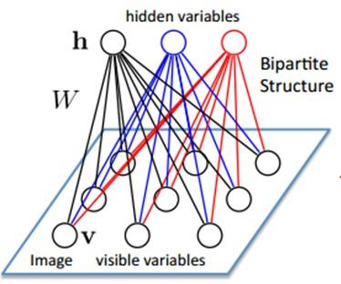

联合组态（jointconfiguration）的能量可以表示为：

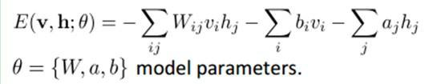

而某个组态的联合概率分布可以通过Boltzmann分布（和这个组态的能量）来确定：

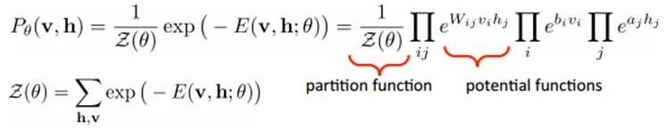

因为隐藏节点之间是条件独立的（因为节点之间不存在连接），即：

.. image:: zouxy09-deep-learning-images/image-9-19.jpeg

然后我们可以比较容易（对上式进行因子分解Factorizes）得到在给定可视层v的基础上，隐
层第j个节点为1或者为0的概率：

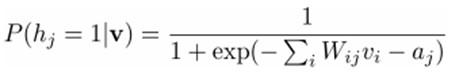

同理，在给定隐层h的基础上，可视层第i个节点为1或者为0的概率也可以容易得到：

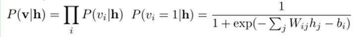

给定一个满足独立同分布的样本集：D={**v**\ :sup:`(1)`,\ ** v**\ :sup:`(2)`,…,\ ** v**\ :sup:`(N)`}，我们需要学习参数θ={W,a,b}。

我们最大化以下对数似然函数（最大似然估计：对于某个概率模型，我们需要选择一个参数，让我们当前的观测样本的概率最大）：

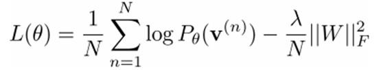

也就是对最大对数似然函数求导，就可以得到L最大时对应的参数W了。

.. image:: zouxy09-deep-learning-images/image-9-23.jpeg

如果，我们把隐藏层的层数增加，我们可以得到Deep Boltzmann Machine(DBM)；如果我们在
靠近可视层的部分使用贝叶斯信念网络（即有向图模型，当然这里依然限制层中节点之间没
有链接），而在最远离可视层的部分使用Restricted Boltzmann Machine，我们可以得到
DeepBelief Net（DBN）。

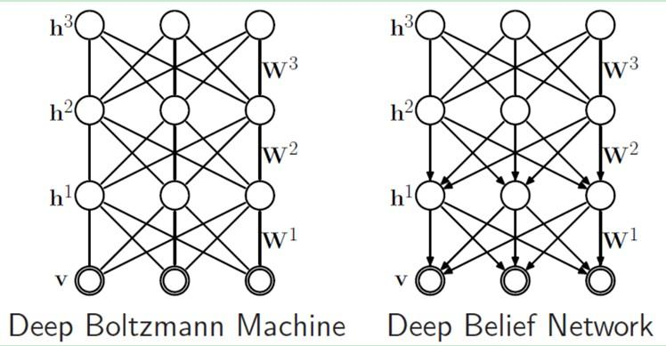

9.4、Deep Belief Networks深信度网络
-----------------------------------

DBNs是一个概率生成模型，与传统的判别模型的神经网络相对，生成模型是建立一个观察数
据和标签之间的联合分布，对P(Observation\|Label)和P(Label\|Observation)都做了评估，
而判别模型仅仅而已评估了后者，也就是P(Label\|Observation)。对于在深度神经网络应用
传统的BP算法的时候，DBNs遇到了以下问题：

（1）需要为训练提供一个有标签的样本集；

（2）学习过程较慢；

（3）不适当的参数选择会导致学习收敛于局部最优解。

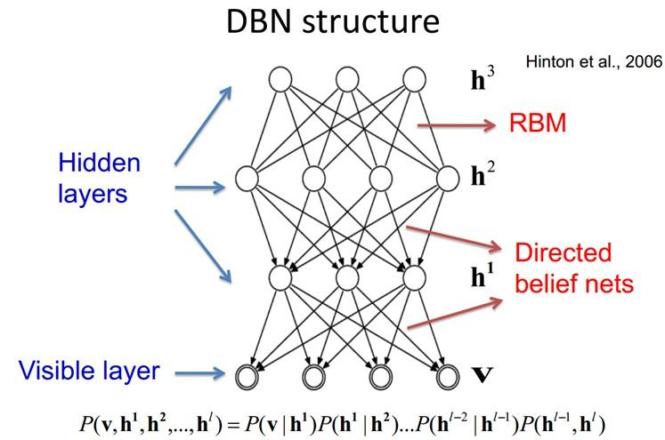

DBNs由多个限制玻尔兹曼机（Restricted Boltzmann Machines）层组成，一个典型的神经网
络类型如图三所示。这些网络被“限制”为一个可视层和一个隐层，层间存在连接，但层内的
单元间不存在连接。隐层单元被训练去捕捉在可视层表现出来的高阶数据的相关性。

首先，先不考虑最顶构成一个联想记忆（associative memory）的两层，一个DBN的连接是通
过自顶向下的生成权值来指导确定的，RBMs就像一个建筑块一样，相比传统和深度分层的
sigmoid信念网络，它能易于连接权值的学习。

最开始的时候，通过一个非监督贪婪逐层方法去预训练获得生成模型的权值，非监督贪婪逐
层方法被Hinton证明是有效的，并被其称为对比分歧（contrastive divergence）。

在这个训练阶段，在可视层会产生一个向量v，通过它将值传递到隐层。反过来，可视层的输
入会被随机的选择，以尝试去重构原始的输入信号。最后，这些新的可视的神经元激活单元
将前向传递重构隐层激活单元，获得h（在训练过程中，首先将可视向量值映射给隐单元；然
后可视单元由隐层单元重建；这些新可视单元再次映射给隐单元，这样就获取新的隐单元。
执行这种反复步骤叫做吉布斯采样）。这些后退和前进的步骤就是我们熟悉的Gibbs采样，而
隐层激活单元和可视层输入之间的相关性差别就作为权值更新的主要依据。

训练时间会显著的减少，因为只需要单个步骤就可以接近最大似然学习。增加进网络的每一
层都会改进训练数据的对数概率，我们可以理解为越来越接近能量的真实表达。这个有意义
的拓展，和无标签数据的使用，是任何一个深度学习应用的决定性的因素。

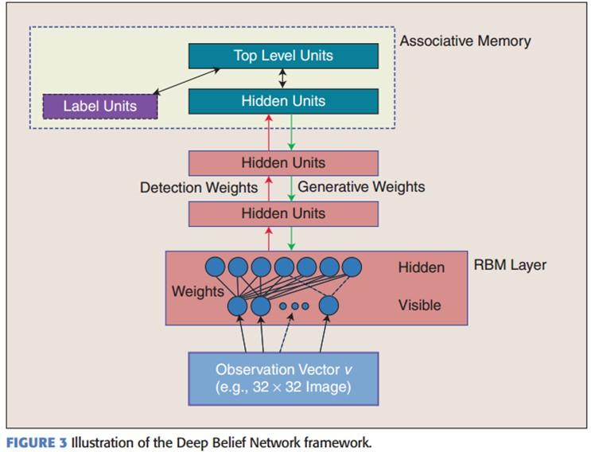

在最高两层，权值被连接到一起，这样更低层的输出将会提供一个参考的线索或者关联给顶
层，这样顶层就会将其联系到它的记忆内容。而我们最关心的，最后想得到的就是判别性能，
例如分类任务里面。

在预训练后，DBN可以通过利用带标签数据用BP算法去对判别性能做调整。在这里，一个标签
集将被附加到顶层（推广联想记忆），通过一个自下向上的，学习到的识别权值获得一个网
络的分类面。这个性能会比单纯的BP算法训练的网络好。这可以很直观的解释，DBNs的BP算
法只需要对权值参数空间进行一个局部的搜索，这相比前向神经网络来说，训练是要快的，
而且收敛的时间也少。

DBNs的灵活性使得它的拓展比较容易。一个拓展就是卷积DBNs（Convolutional Deep
Belief Networks(CDBNs)）。DBNs并没有考虑到图像的2维结构信息，因为输入是简单的从一
个图像矩阵一维向量化的。而CDBNs就是考虑到了这个问题，它利用邻域像素的空域关系，通
过一个称为卷积RBMs的模型区达到生成模型的变换不变性，而且可以容易得变换到高维图像。
DBNs并没有明确地处理对观察变量的时间联系的学习上，虽然目前已经有这方面的研究，例
如堆叠时间RBMs，以此为推广，有序列学习的dubbed temporal convolutionmachines，这种
序列学习的应用，给语音信号处理问题带来了一个让人激动的未来研究方向。

目前，和DBNs有关的研究包括堆叠自动编码器，它是通过用堆叠自动编码器来替换传统DBNs
里面的RBMs。这就使得可以通过同样的规则来训练产生深度多层神经网络架构，但它缺少层
的参数化的严格要求。与DBNs不同，自动编码器使用判别模型，这样这个结构就很难采样输
入采样空间，这就使得网络更难捕捉它的内部表达。但是，降噪自动编码器却能很好的避免
这个问题，并且比传统的DBNs更优。它通过在训练过程添加随机的污染并堆叠产生场泛化性
能。训练单一的降噪自动编码器的过程和RBMs训练生成模型的过程一样。

9.5、Convolutional Neural Networks卷积神经网络
----------------------------------------------

卷积神经网络是人工神经网络的一种，已成为当前语音分析和图像识别领域的研究热点。它
的权值共享网络结构使之更类似于生物神经网络，降低了网络模型的复杂度，减少了权值的
数量。该优点在网络的输入是多维图像时表现的更为明显，使图像可以直接作为网络的输入，
避免了传统识别算法中复杂的特征提取和数据重建过程。卷积网络是为识别二维形状而特殊
设计的一个多层感知器，这种网络结构对平移、比例缩放、倾斜或者共他形式的变形具有高
度不变性。

CNNs是受早期的延时神经网络（TDNN）的影响。延时神经网络通过在时间维度上共享权值降
低学习复杂度，适用于语音和时间序列信号的处理。

CNNs是第一个真正成功训练多层网络结构的学习算法。它利用空间关系减少需要学习的参数
数目以提高一般前向BP算法的训练性能。CNNs作为一个深度学习架构提出是为了最小化数据
的预处理要求。在CNN中，图像的一小部分（局部感受区域）作为层级结构的最低层的输入，
信息再依次传输到不同的层，每层通过一个数字滤波器去获得观测数据的最显著的特征。这
个方法能够获取对平移、缩放和旋转不变的观测数据的显著特征，因为图像的局部感受区域
允许神经元或者处理单元可以访问到最基础的特征，例如定向边缘或者角点。

1）卷积神经网络的历史
~~~~~~~~~~~~~~~~~~~~~

1962年Hubel和Wiesel通过对猫视觉皮层细胞的研究，提出了感受野(receptive field)的概
念，1984年日本学者Fukushima基于感受野概念提出的神经认知机(neocognitron)可以看作是
卷积神经网络的第一个实现网络，也是感受野概念在人工神经网络领域的首次应用。神经认
知机将一个视觉模式分解成许多子模式（特征），然后进入分层递阶式相连的特征平面进行
处理，它试图将视觉系统模型化，使其能够在即使物体有位移或轻微变形的时候，也能完成
识别。

通常神经认知机包含两类神经元，即承担特征抽取的S-元和抗变形的C-元。S-元中涉及两个
重要参数，即感受野与阈值参数，前者确定输入连接的数目，后者则控制对特征子模式的反
应程度。许多学者一直致力于提高神经认知机的性能的研究：在传统的神经认知机中，每个
S-元的感光区中由C-元带来的视觉模糊量呈正态分布。如果感光区的边缘所产生的模糊效果
要比中央来得大，S-元将会接受这种非正态模糊所导致的更大的变形容忍性。我们希望得到
的是，训练模式与变形刺激模式在感受野的边缘与其中心所产生的效果之间的差异变得越来
越大。为了有效地形成这种非正态模糊，Fukushima提出了带双C-元层的改进型神经认知机。

Van Ooyen和Niehuis为提高神经认知机的区别能力引入了一个新的参数。事实上，该参数作
为一种抑制信号，抑制了神经元对重复激励特征的激励。多数神经网络在权值中记忆训练信
息。根据Hebb学习规则，某种特征训练的次数越多，在以后的识别过程中就越容易被检测。
也有学者将进化计算理论与神经认知机结合，通过减弱对重复性激励特征的训练学习，而使
得网络注意那些不同的特征以助于提高区分能力。上述都是神经认知机的发展过程，而卷积
神经网络可看作是神经认知机的推广形式，神经认知机是卷积神经网络的一种特例。

2）卷积神经网络的网络结构
~~~~~~~~~~~~~~~~~~~~~~~~~

卷积神经网络是一个多层的神经网络，每层由多个二维平面组成，而每个平面由多个独立神
经元组成。

.. image:: zouxy09-deep-learning-images/image-9-27.jpeg

图：卷积神经网络的概念示范：输入图像通过和三个可训练的滤波器和可加偏置进行卷积，
滤波过程如图一，卷积后在C1层产生三个特征映射图，然后特征映射图中每组的四个像素再
进行求和，加权值，加偏置，通过一个Sigmoid函数得到三个S2层的特征映射图。这些映射图
再进过滤波得到C3层。这个层级结构再和S2一样产生S4。最终，这些像素值被光栅化，并连
接成一个向量输入到传统的神经网络，得到输出。

一般地，C层为特征提取层，每个神经元的输入与前一层的局部感受野相连，并提取该局部的
特征，一旦该局部特征被提取后，它与其他特征间的位置关系也随之确定下来；S层是特征映
射层，网络的每个计算层由多个特征映射组成，每个特征映射为一个平面，平面上所有神经
元的权值相等。特征映射结构采用影响函数核小的sigmoid函数作为卷积网络的激活函数，使
得特征映射具有位移不变性。

此外，由于一个映射面上的神经元共享权值，因而减少了网络自由参数的个数，降低了网络
参数选择的复杂度。卷积神经网络中的每一个特征提取层（C-层）都紧跟着一个用来求局部
平均与二次提取的计算层（S-层），这种特有的两次特征提取结构使网络在识别时对输入样
本有较高的畸变容忍能力。

3）关于参数减少与权值共享
~~~~~~~~~~~~~~~~~~~~~~~~~

上面聊到，好像CNN一个牛逼的地方就在于通过感受野和权值共享减少了神经网络需要训练的
参数的个数。那究竟是啥的呢？

下图左：如果我们有1000x1000像素的图像，有1百万个隐层神经元，那么他们全连接的话
（每个隐层神经元都连接图像的每一个像素点），就有1000x1000x1000000=10^12个连接，也
就是10^12个权值参数。然而图像的空间联系是局部的，就像人是通过一个局部的感受野去感
受外界图像一样，每一个神经元都不需要对全局图像做感受，每个神经元只感受局部的图像
区域，然后在更高层，将这些感受不同局部的神经元综合起来就可以得到全局的信息了。这
样，我们就可以减少连接的数目，也就是减少神经网络需要训练的权值参数的个数了。如下
图右：假如局部感受野是10x10，隐层每个感受野只需要和这10x10的局部图像相连接，所以
1百万个隐层神经元就只有一亿个连接，即10^8个参数。比原来减少了四个0（数量级），这
样训练起来就没那么费力了，但还是感觉很多的啊，那还有啥办法没？

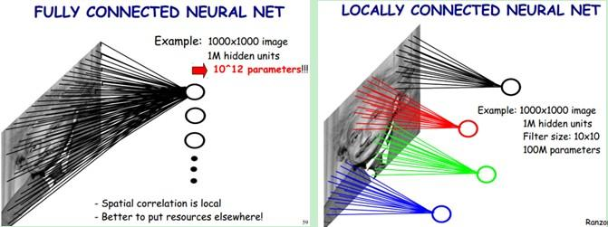

我们知道，隐含层的每一个神经元都连接10x10个图像区域，也就是说每一个神经元存在
10x10=100个连接权值参数。那如果我们每个神经元这100个参数是相同的呢？也就是说每个
神经元用的是同一个卷积核去卷积图像。这样我们就只有多少个参数？？只有100个参数
啊！！！亲！不管你隐层的神经元个数有多少，两层间的连接我只有100个参数啊！亲！这就
是权值共享啊！亲！这就是卷积神经网络的主打卖点啊！亲！（有点烦了，呵呵）也许你会
问，这样做靠谱吗？为什么可行呢？这个……共同学习。

好了，你就会想，这样提取特征也忒不靠谱吧，这样你只提取了一种特征啊？对了，真聪明，
我们需要提取多种特征对不？假如一种滤波器，也就是一种卷积核就是提出图像的一种特征，
例如某个方向的边缘。那么我们需要提取不同的特征，怎么办，加多几种滤波器不就行了吗？
对了。所以假设我们加到100种滤波器，每种滤波器的参数不一样，表示它提出输入图像的不
同特征，例如不同的边缘。这样每种滤波器去卷积图像就得到对图像的不同特征的放映，我
们称之为Feature Map。所以100种卷积核就有100个Feature Map。这100个Feature Map就组
成了一层神经元。到这个时候明了了吧。我们这一层有多少个参数了？100种卷积核x每种卷
积核共享100个参数=100x100=10K，也就是1万个参数。才1万个参数啊！亲！（又来了，受不
了了！）见下图右：不同的颜色表达不同的滤波器。

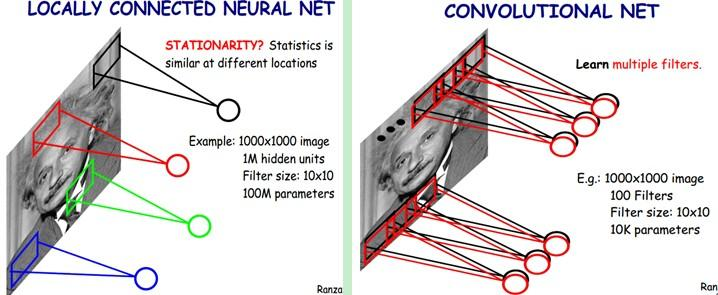

嘿哟，遗漏一个问题了。刚才说隐层的参数个数和隐层的神经元个数无关，只和滤波器的大
小和滤波器种类的多少有关。那么隐层的神经元个数怎么确定呢？它和原图像，也就是输入
的大小（神经元个数）、滤波器的大小和滤波器在图像中的滑动步长都有关！例如，我的图
像是1000x1000像素，而滤波器大小是10x10，假设滤波器没有重叠，也就是步长为10，这样
隐层的神经元个数就是(1000x1000 )/ (10x10)=100x100个神经元了，假设步长是8，也就是
卷积核会重叠两个像素，那么……我就不算了，思想懂了就好。注意了，这只是一种滤波器，
也就是一个Feature Map的神经元个数哦，如果100个Feature Map就是100倍了。由此可见，
图像越大，神经元个数和需要训练的权值参数个数的贫富差距就越大。

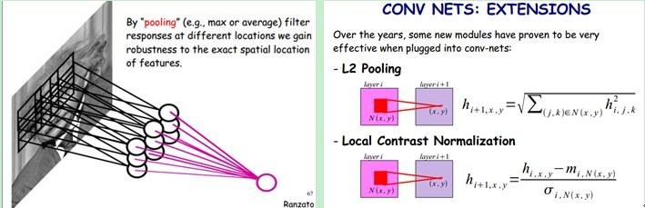

需要注意的一点是，上面的讨论都没有考虑每个神经元的偏置部分。所以权值个数需要加1。
这个也是同一种滤波器共享的。

总之，卷积网络的核心思想是将：局部感受野、权值共享（或者权值复制）以及时间或空间
亚采样这三种结构思想结合起来获得了某种程度的位移、尺度、形变不变性。

4）一个典型的例子说明
~~~~~~~~~~~~~~~~~~~~~

一种典型的用来识别数字的卷积网络是LeNet-5（ `效果和paper等见这
<http://yann.lecun.com/exdb/lenet/index.html>`__ ）。当年美国大多数银行就是用它来
识别支票上面的手写数字的。能够达到这种商用的地步，它的准确性可想而知。毕竟目前学
术界和工业界的结合是最受争议的。

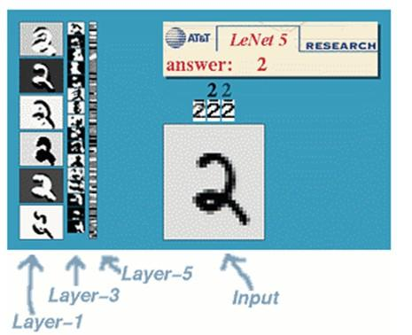

那下面咱们也用这个例子来说明下。

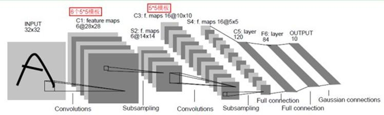

LeNet-5共有7层，不包含输入，每层都包含可训练参数（连接权重）。输入图像为32\*32大
小。这要比 `Mnist数据库 <http://yann.lecun.com/exdb/mnist/>`__ （一个公认的手写数
据库）中最大的字母还大。这样做的原因是希望潜在的明显特征如笔画断电或角点能够出现
在最高层特征监测子感受野的中心。

我们先要明确一点：每个层有多个Feature Map，每个Feature Map通过一种卷积滤波器提取
输入的一种特征，然后每个Feature Map有多个神经元。

C1层是一个卷积层（为什么是卷积？卷积运算一个重要的特点就是，通过卷积运算，可以使
原信号特征增强，并且降低噪音），由6个特征图Feature Map构成。特征图中每个神经元与
输入中5\*5的邻域相连。特征图的大小为28\*28，这样能防止输入的连接掉到边界之外（是
为了BP反馈时的计算，不致梯度损失，个人见解）。C1有156个可训练参数（每个滤波器
5\*5=25个unit参数和一个bias参数，一共6个滤波器，共(5\*5+1)\*6=156个参数），共
156\*(28\*28)=122,304个连接。

S2层是一个下采样层（为什么是下采样？利用图像局部相关性的原理，对图像进行子抽样，
可以减少数据处理量同时保留有用信息），有6个14\*14的特征图。特征图中的每个单元与
C1中相对应特征图的2\*2邻域相连接。S2层每个单元的4个输入相加，乘以一个可训练参数，
再加上一个可训练偏置。结果通过sigmoid函数计算。可训练系数和偏置控制着sigmoid函数
的非线性程度。如果系数比较小，那么运算近似于线性运算，亚采样相当于模糊图像。如果
系数比较大，根据偏置的大小亚采样可以被看成是有噪声的“或”运算或者有噪声的“与”运算。
每个单元的2\*2感受野并不重叠，因此S2中每个特征图的大小是C1中特征图大小的1/4（行和
列各1/2）。S2层有12个可训练参数和5880个连接。

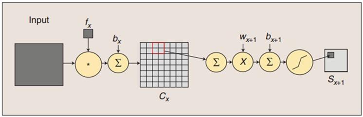

图：卷积和子采样过程：卷积过程包括：用一个可训练的滤波器f :sub:`x` 去卷积一个输入
的图像（第一阶段是输入的图像，后面的阶段就是卷积特征map了），然后加一个偏置b
:sub:`x` ，得到卷积层C :sub:`x` 。子采样过程包括：每邻域四个像素求和变为一个像素，
然后通过标量W :sub:`x+1` 加权，再增加偏置b :sub:`x+1` ，然后通过一个sigmoid激活函
数，产生一个大概缩小四倍的特征映射图S :sub:`x+1` 。

所以从一个平面到下一个平面的映射可以看作是作卷积运算，S-层可看作是模糊滤波器，起
到二次特征提取的作用。隐层与隐层之间空间分辨率递减，而每层所含的平面数递增，这样
可用于检测更多的特征信息。

C3层也是一个卷积层，它同样通过5x5的卷积核去卷积层S2，然后得到的特征map就只有
10x10个神经元，但是它有16种不同的卷积核，所以就存在16个特征map了。这里需要注意的
一点是：C3中的每个特征map是连接到S2中的所有6个或者几个特征map的，表示本层的特征
map是上一层提取到的特征map的不同组合（这个做法也并不是唯一的）。（看到没有，这里
是组合，就像之前聊到的人的视觉系统一样，底层的结构构成上层更抽象的结构，例如边缘
构成形状或者目标的部分）。

刚才说C3中每个特征图由S2中所有6个或者几个特征map组合而成。为什么不把S2中的每个特
征图连接到每个C3的特征图呢？原因有2点。第一，不完全的连接机制将连接的数量保持在合
理的范围内。第二，也是最重要的，其破坏了网络的对称性。由于不同的特征图有不同的输
入，所以迫使他们抽取不同的特征（希望是互补的）。

例如，存在的一个方式是：C3的前6个特征图以S2中3个相邻的特征图子集为输入。接下来6个
特征图以S2中4个相邻特征图子集为输入。然后的3个以不相邻的4个特征图子集为输入。最后
一个将S2中所有特征图为输入。这样C3层有1516个可训练参数和151600个连接。

S4层是一个下采样层，由16个5\*5大小的特征图构成。特征图中的每个单元与C3中相应特征
图的2\*2邻域相连接，跟C1和S2之间的连接一样。S4层有32个可训练参数（每个特征图1个因
子和一个偏置）和2000个连接。

C5层是一个卷积层，有120个特征图。每个单元与S4层的全部16个单元的5\*5邻域相连。由于
S4层特征图的大小也为5\*5（同滤波器一样），故C5特征图的大小为1\*1：这构成了S4和C5
之间的全连接。之所以仍将C5标示为卷积层而非全相联层，是因为如果LeNet-5的输入变大，
而其他的保持不变，那么此时特征图的维数就会比1\*1大。C5层有48120个可训练连接。

F6层有84个单元（之所以选这个数字的原因来自于输出层的设计），与C5层全相连。有
10164个可训练参数。如同经典神经网络，F6层计算输入向量和权重向量之间的点积，再加上
一个偏置。然后将其传递给sigmoid函数产生单元i的一个状态。

最后，输出层由欧式径向基函数（Euclidean Radial Basis Function）单元组成，每类一个
单元，每个有84个输入。换句话说，每个输出RBF单元计算输入向量和参数向量之间的欧式距
离。输入离参数向量越远，RBF输出的越大。一个RBF输出可以被理解为衡量输入模式和与
RBF相关联类的一个模型的匹配程度的惩罚项。用概率术语来说，RBF输出可以被理解为F6层
配置空间的高斯分布的负log-likelihood。给定一个输入模式，损失函数应能使得F6的配置
与RBF参数向量（即模式的期望分类）足够接近。这些单元的参数是人工选取并保持固定的
（至少初始时候如此）。这些参数向量的成分被设为-1或1。虽然这些参数可以以-1和1等概
率的方式任选，或者构成一个纠错码，但是被设计成一个相应字符类的7\*12大小（即84）的
格式化图片。这种表示对识别单独的数字不是很有用，但是对识别可打印ASCII集中的字符串
很有用。

使用这种分布编码而非更常用的“1 of N”编码用于产生输出的另一个原因是，当类别比较大
的时候，非分布编码的效果比较差。原因是大多数时间非分布编码的输出必须为0。这使得用
sigmoid单元很难实现。另一个原因是分类器不仅用于识别字母，也用于拒绝非字母。使用分
布编码的RBF更适合该目标。因为与sigmoid不同，他们在输入空间的较好限制的区域内兴奋，
而非典型模式更容易落到外边。

RBF参数向量起着F6层目标向量的角色。需要指出这些向量的成分是+1或-1，这正好在F6
sigmoid的范围内，因此可以防止sigmoid函数饱和。实际上，+1和-1是sigmoid函数的最大弯
曲的点处。这使得F6单元运行在最大非线性范围内。必须避免sigmoid函数的饱和，因为这将
会导致损失函数较慢的收敛和病态问题。

5）训练过程
~~~~~~~~~~~

神经网络用于模式识别的主流是有指导学习网络，无指导学习网络更多的是用于聚类分析。
对于有指导的模式识别，由于任一样本的类别是已知的，样本在空间的分布不再是依据其自
然分布倾向来划分，而是要根据同类样本在空间的分布及不同类样本之间的分离程度找一种
适当的空间划分方法，或者找到一个分类边界，使得不同类样本分别位于不同的区域内。这
就需要一个长时间且复杂的学习过程，不断调整用以划分样本空间的分类边界的位置，使尽
可能少的样本被划分到非同类区域中。

卷积网络在本质上是一种输入到输出的映射，它能够学习大量的输入与输出之间的映射关系，
而不需要任何输入和输出之间的精确的数学表达式，只要用已知的模式对卷积网络加以训练，
网络就具有输入输出对之间的映射能力。卷积网络执行的是有导师训练，所以其样本集是由
形如：（输入向量，理想输出向量）的向量对构成的。所有这些向量对，都应该是来源于网
络即将模拟的系统的实际“运行”结果。它们可以是从实际运行系统中采集来的。在开始训练
前，所有的权都应该用一些不同的小随机数进行初始化。“小随机数”用来保证网络不会因权
值过大而进入饱和状态，从而导致训练失败；“不同”用来保证网络可以正常地学习。实际上，
如果用相同的数去初始化权矩阵，则网络无能力学习。

训练算法与传统的BP算法差不多。主要包括4步，这4步被分为两个阶段：

**第一阶段，向前传播阶段：**

  a）从样本集中取一个样本(X,Y :sub:`p`)，将X输入网络；

  b）计算相应的实际输出O :sub:`p` 。

在此阶段，信息从输入层经过逐级的变换，传送到输出层。这个过程也是网络在完成训练后
正常运行时执行的过程。在此过程中，网络执行的是计算（实际上就是输入与每层的权值矩
阵相点乘，得到最后的输出结果）：

O :sub:`p` =F :sub:`n` （…（F :sub:`2` （F :sub:`1` （X :sub:`p` W :sup:`（1）` ）W :sup:`（2）` ）…）W :sup:`（n）` ）

**第二阶段，向后传播阶段**

  a）算实际输出O :sub:`p` 与相应的理想输出Y :sub:`p` 的差；

  b）按极小化误差的方法反向传播调整权矩阵。

6）卷积神经网络的优点
~~~~~~~~~~~~~~~~~~~~~

卷积神经网络CNN主要用来识别位移、缩放及其他形式扭曲不变性的二维图形。由于CNN的特
征检测层通过训练数据进行学习，所以在使用CNN时，避免了显式的特征抽取，而隐式地从训
练数据中进行学习；再者由于同一特征映射面上的神经元权值相同，所以网络可以并行学习，
这也是卷积网络相对于神经元彼此相连网络的一大优势。卷积神经网络以其局部权值共享的
特殊结构在语音识别和图像处理方面有着独特的优越性，其布局更接近于实际的生物神经网
络，权值共享降低了网络的复杂性，特别是多维输入向量的图像可以直接输入网络这一特点
避免了特征提取和分类过程中数据重建的复杂度。

流的分类方式几乎都是基于统计特征的，这就意味着在进行分辨前必须提取某些特征。然而，
显式的特征提取并不容易，在一些应用问题中也并非总是可靠的。卷积神经网络，它避免了
显式的特征取样，隐式地从训练数据中进行学习。这使得卷积神经网络明显有别于其他基于
神经网络的分类器，通过结构重组和减少权值将特征提取功能融合进多层感知器。它可以直
接处理灰度图片，能够直接用于处理基于图像的分类。

卷积网络较一般神经网络在图像处理方面有如下优点：a）输入图像和网络的拓扑结构能很好
的吻合；b）特征提取和模式分类同时进行，并同时在训练中产生；c）权重共享可以减少网
络的训练参数，使神经网络结构变得更简单，适应性更强。

7）小结
~~~~~~~

CNNs中这种层间联系和空域信息的紧密关系，使其适于图像处理和理解。而且，其在自动提
取图像的显著特征方面还表现出了比较优的性能。在一些例子当中，Gabor滤波器已经被使用
在一个初始化预处理的步骤中，以达到模拟人类视觉系统对视觉刺激的响应。在目前大部分
的工作中，研究者将CNNs应用到了多种机器学习问题中，包括人脸识别，文档分析和语言检
测等。为了达到寻找视频中帧与帧之间的相干性的目的，目前CNNs通过一个时间相干性去训
练，但这个不是CNNs特有的。

呵呵，这部分讲得太啰嗦了，又没讲到点上。没办法了，先这样的，这样这个过程我还没有
走过，所以自己水平有限啊，望各位明察。需要后面再改了，呵呵。

十、总结与展望
==============

1）Deep learning总结
--------------------

深度学习是关于自动学习要建模的数据的潜在（隐含）分布的多层（复杂）表达的算法。换
句话来说，深度学习算法自动的提取分类需要的低层次或者高层次特征。高层次特征，一是
指该特征可以分级（层次）地依赖其他特征，例如：对于机器视觉，深度学习算法从原始图
像去学习得到它的一个低层次表达，例如边缘检测器，小波滤波器等，然后在这些低层次表
达的基础上再建立表达，例如这些低层次表达的线性或者非线性组合，然后重复这个过程，
最后得到一个高层次的表达。

Deep learning能够得到更好地表示数据的feature，同时由于模型的层次、参数很多，
capacity足够，因此，模型有能力表示大规模数据，所以对于图像、语音这种特征不明显
（需要手工设计且很多没有直观物理含义）的问题，能够在大规模训练数据上取得更好的效
果。此外，从模式识别特征和分类器的角度，deep learning框架将feature和分类器结合到
一个框架中，用数据去学习feature，在使用中减少了手工设计feature的巨大工作量（这是
目前工业界工程师付出努力最多的方面），因此，不仅仅效果可以更好，而且，使用起来也
有很多方便之处，因此，是十分值得关注的一套框架，每个做ML的人都应该关注了解一下。

当然，deep learning本身也不是完美的，也不是解决世间任何ML问题的利器，不应该被放大
到一个无所不能的程度。

2）Deep learning未来
--------------------

深度学习目前仍有大量工作需要研究。目前的关注点还是从机器学习的领域借鉴一些可以在
深度学习使用的方法，特别是降维领域。例如：目前一个工作就是稀疏编码，通过压缩感知
理论对高维数据进行降维，使得非常少的元素的向量就可以精确的代表原来的高维信号。另
一个例子就是半监督流行学习，通过测量训练样本的相似性，将高维数据的这种相似性投影
到低维空间。另外一个比较鼓舞人心的方向就是evolutionary programming approaches（遗
传编程方法），它可以通过最小化工程能量去进行概念性自适应学习和改变核心架构。

Deep learning还有很多核心的问题需要解决：

（1）对于一个特定的框架，对于多少维的输入它可以表现得较优（如果是图像，可能是上百
万维）？

（2）对捕捉短时或者长时间的时间依赖，哪种架构才是有效的？

（3）如何对于一个给定的深度学习架构，融合多种感知的信息？

（4）有什么正确的机理可以去增强一个给定的深度学习架构，以改进其鲁棒性和对扭曲和数
据丢失的不变性？

（5）模型方面是否有其他更为有效且有理论依据的深度模型学习算法？

探索新的特征提取模型是值得深入研究的内容。此外有效的可并行训练算法也是值得研究的
一个方向。当前基于最小批处理的随机梯度优化算法很难在多计算机中进行并行训练。通常
办法是利用图形处理单元加速学习过程。然而单个机器GPU对大规模数据识别或相似任务数据
集并不适用。在深度学习应用拓展方面，如何合理充分利用深度学习在增强传统学习算法的
性能仍是目前各领域的研究重点。

十一、参考文献和Deep Learning学习资源（持续更新……）
===================================================

先是机器学习领域大牛的微博：@余凯_西二旗民工；@老师木；@梁斌penny；@张栋_机器学习；
@邓侃；@大数据皮东；@djvu9……

（1）Deep Learning http://deeplearning.net/

（2）Deep Learning Methods for Vision http://cs.nyu.edu/~fergus/tutorials/deep_learning_cvpr12/

（3）Neural Network for Recognition of Handwritten Digits[Project]
http://www.codeproject.com/Articles/16650/Neural-Network-for-Recognition-of-Handwritten-Digi

（4）Training a deep autoencoder or a classifier on MNIST digits
http://www.cs.toronto.edu/~hinton/MatlabForSciencePaper.html

（5）Ersatz：deep neural networks in the cloud http://www.ersatz1.com/

（6）Deep Learning http://www.cs.nyu.edu/~yann/research/deep/

（7）Invited talk "A Tutorial on Deep Learning" by Dr. Kai Yu (余凯)
http://vipl.ict.ac.cn/News/academic-report-tutorial-deep-learning-dr-kai-yu

（8）CNN - Convolutional neural network class
http://www.mathworks.cn/matlabcentral/fileexchange/24291

（9）Yann LeCun's Publications
http://yann.lecun.com/exdb/publis/index.html#lecun-98

（10） LeNet-5, convolutional neural networks
http://yann.lecun.com/exdb/lenet/index.html

（11） Deep Learning 大牛Geoffrey E. Hinton's HomePage
http://www.cs.toronto.edu/~hinton/

（12）Sparse coding simulation software[Project]
http://redwood.berkeley.edu/bruno/sparsenet/

（13）Andrew Ng's homepage
http://robotics.stanford.edu/~ang/

（14）stanford deep learning tutorial
http://deeplearning.stanford.edu/wiki/index.php/UFLDL_Tutorial

（15）「深度神经网络」（deep neural network）具体是怎样工作的
http://www.zhihu.com/question/19833708?group_id=15019075#1657279

（16）A shallow understanding on deep learning
http://blog.sina.com.cn/s/blog_6ae183910101dw2z.html

（17）Bengio's Learning Deep Architectures for AI
 http://www.iro.umontreal.ca/~bengioy/papers/ftml_book.pdf

（18）andrew ng's talk video:
http://techtalks.tv/talks/machine-learning-and-ai-via-brain-simulations/57862/

（19）cvpr 2012 tutorial：
http://cs.nyu.edu/~fergus/tutorials/deep_learning_cvpr12/tutorial_p2_nnets_ranzato_short.pdf

（20）Andrew ng清华报告听后感
http://blog.sina.com.cn/s/blog_593af2a70101bqyo.html

（21）Kai Yu：CVPR12 Tutorial on Deep Learning Sparse Coding

（22）Honglak Lee：Deep Learning Methods for Vision

（23）Andrew Ng ：Machine Learning and AI via Brain simulations

（24）Deep Learning 【2,3】
http://blog.sina.com.cn/s/blog_46d0a3930101gs5h.html

（25）deep learning这件小事……
http://blog.sina.com.cn/s/blog_67fcf49e0101etab.html

（26）Yoshua Bengio, U. Montreal：Learning Deep Architectures

（27）Kai Yu：A Tutorial on Deep Learning

（28）Marc'Aurelio Ranzato：NEURAL NETS FOR VISION

（29）Unsupervised feature learning and deep learning
http://blog.csdn.net/abcjennifer/article/details/7804962

（30）机器学习前沿热点–Deep Learning http://elevencitys.com/?p=1854

（31）机器学习——深度学习(Deep Learning)
http://blog.csdn.net/abcjennifer/article/details/7826917

（32）卷积神经网络 http://wenku.baidu.com/view/cd16fb8302d276a200292e22.html

（33）浅谈Deep Learning的基本思想和方法
http://blog.csdn.net/xianlingmao/article/details/8478562

（34）深度神经网络 http://blog.csdn.net/txdb/article/details/6766373

（35）Google的猫脸识别:人工智能的新突破 http://www.36kr.com/p/122132.html

（36）余凯，深度学习-机器学习的新浪潮，Technical News程序天下事
http://blog.csdn.net/datoubo/article/details/8577366

（37）Geoffrey Hinton：UCLTutorial on: Deep Belief Nets

（38）Learning Deep Boltzmann Machines http://web.mit.edu/~rsalakhu/www/DBM.html

（39）Efficient Sparse Coding Algorithm
http://blog.sina.com.cn/s/blog_62af19190100gux1.html

（40）Itamar Arel, Derek C. Rose, and Thomas P. Karnowski： Deep Machine
Learning—A New Frontier in Artificial Intelligence Research

（41）Francis Quintal Lauzon：An introduction to deep learning

（42）Tutorial on Deep Learning and Applications

（43）Boltzmann神经网络模型与学习算法
http://wenku.baidu.com/view/490dcf748e9951e79b892785.html

（44）Deep Learning 和 Knowledge Graph 引爆大数据革命
http://blog.sina.com.cn/s/blog_46d0a3930101fswl.html

（45）……
