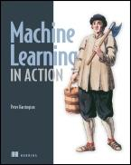
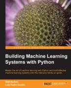

===============================
Machine Learning Using Pylearn2
===============================

:URL: https://blog.safaribooksonline.com/2014/02/10/pylearn2-regression-3rd-party-data/

|code-01|

A guest post by `Ian Goodfellow
<http://www-etud.iro.umontreal.ca/~goodfeli/>`__, a Ph.D. student studying deep
learning at Yoshua Bengio’s LISA lab in Montréal, Québec. He is one of the lead
developers of `Pylearn2 <http://deeplearning.net/software/pylearn2/>`__, an open
source machine learning research library.

In this post we will talk about using a machine learning library called
Pylearn2. Pylearn2 is a machine learning research library, designed to
be easily reconfigurable to perform a wide range of possible machine
learning experiments. Pylearn2 contains classes for working with several
common machine learning benchmark datasets, but you may also want to
load your own data.

In this blog post, we’ll see an example of how to load a 3rd party
dataset into Pylearn2, and use Pylearn2 to solve a regression problem on
that dataset. But first, a little background.

What is regression?
-------------------

Regression is a machine learning problem in which the goal is for a
machine learning algorithm to predict some output variable ``y`` given
some input variable ``x``. Both ``x`` and ``y`` may be vector-valued
variables, i.e., they may contain sets of multiple measurements rather
than just one measurement. In this blog post, we’ll work with a dataset
where ``x`` is a vector containing several measurements of a sample of
red wine, such as its pH or alcohol content, and ``y`` is a subjective
measure of its quality. Solving this regression problem will give us a
machine learning model that can predict the quality of a new sample of
wine that hasn’t been rated by a human yet.

What is Pylearn2?
-----------------

Pylearn2 is an open source software library. It is designed for
researchers studying machine learning to be able to easily configure
advanced machine learning experiments. The library divides most machine
learning problems into three parts: the *dataset*, the *model*, and the
*training algorithm*. The training algorithm works to adapt the model to
fit the values provided in the dataset. Today we will discuss how to
provide a new dataset. We will then show how to set up a model to solve
a regression problem.

Obtaining the red wine quality dataset
~~~~~~~~~~~~~~~~~~~~~~~~~~~~~~~~~~~~~~

Now that we’ve covered the necessary background, we can dive into
solving a regression problem. First, we need to download the data.
Create a new directory for all of the files to be used in this example.
Within that directory, download `the CSV
file <http://archive.ics.uci.edu/ml/machine-learning-databases/wine-quality/winequality-red.csv>`__
defining the dataset. This file should be saved as
“winequality-red.csv.”

Obtaining Pylearn2
~~~~~~~~~~~~~~~~~~

Next, we need to install the necessary software. Follow `these
instructions <http://deeplearning.net/software/pylearn2/#download-and-installation>`__
to install Pylearn2. Be sure to install the dependencies Theano and
PyYAML.

Setting up the regression problem
---------------------------------

We now need to write a YAML file describing the regression problem to
Pylearn2. Most of the process is already described in the existing
tutorials for Pylearn2. Today, we’ll focus on how to solve a regression
problem. One way to do this is with a deep neural net, or “multilayer
perceptron” (MLP). If you’re not already familiar with deep neural nets,
you should read the ``multilayer_perceptron.ipynb`` tutorial found in
the ``pylearn2/scripts/tutorials`` directory.

Some multilayer perceptrons output an estimate of a discrete variable,
such as which category the input belongs to. For regression, we want to
output an estimate of a continuous valued variable; in this case, the
wine quality. To do this, we need the final layer of the multilayer
perceptron to be one that models a continous layer. Pylearn2 provides
two such MLP layers: ``Linear`` and ``LinearGaussian``. To know this,
you just need to have read the documentation about the available MLP
layers and seen that these layers are described this way. These layers
can also be used as hidden layers so they are not singled out in a
regression-specific module or anything like that. You can also write
your own layer that outputs continuous valued variables using a scheme
of your own devising. The following YAML file configures an experiment
to train an MLP with a LinearGaussian final layer:

.. code-block:: yaml

  !obj:pylearn2.train.Train {
	  dataset: &train !obj:winequality_red.load_data {
		  start: 0,
		  stop: 1024
	  },
	  model: !obj:pylearn2.models.mlp.MLP {
		  layers: [
				   !obj:pylearn2.models.mlp.RectifiedLinear {
					   layer_name: 'h0',
					   dim: 1200,
					   irange: .05,
					   max_col_norm: 1.9365,
				   },
				   !obj:pylearn2.models.mlp.RectifiedLinear {
					   layer_name: 'h1',
					   dim: 1200,
					   irange: .05,
					   max_col_norm: 1.9365,
				   },
				   !obj:pylearn2.models.mlp.LinearGaussian {
					   init_bias: !obj:pylearn2.models.mlp.mean_of_targets { 
						 dataset: *train },
					   init_beta: !obj:pylearn2.models.mlp.beta_from_targets { 
						 dataset: *train },
					   min_beta: 1.,
					   max_beta: 100.,
					   beta_lr_scale: 1.,
					   dim: 1,
					   # max_col_norm: 1.9365,
					   layer_name: 'y',
					   irange: .005
				   }
				  ],
		  nvis: 11,
	  },
	  algorithm: !obj:pylearn2.training_algorithms.bgd.BGD {
		  line_search_mode: 'exhaustive',
		  batch_size: 1024,
		  conjugate: 1,
		  reset_conjugate: 0,
		  reset_alpha: 0,
		  updates_per_batch: 10,
		  monitoring_dataset:
			  {
				  'train' : *train,
				  'valid' : !obj:winequality_red.load_data {
							  start: 1024,
							  stop: 1280
							},
				  'test'  : !obj:winequality_red.load_data {
							  start: 1280,
							  stop: 1599
							}
			  },
		  termination_criterion: !obj:pylearn2.termination_criteria.MonitorBased {
			  channel_name: "valid_y_mse",
			  prop_decrease: 0.,
			  N: 100
		  },
	  },
	  extensions: [
		  !obj:pylearn2.train_extensions.best_params.MonitorBasedSaveBest {
			   channel_name: 'valid_y_mse',
			   save_path: "${PYLEARN2_TRAIN_FILE_FULL_STEM}_best.pkl"
		  },
	  ],
	  save_freq: 1
  }

Note the calls to ``redwine_quality.load_data``. This is a function we
will write shortly, which will provide the third party data. Also, note
that the final layer of the MLP is configured to be a ``LinearGaussian``
layer. That’s all you have to do to make it a regression problem.
Everything else in this YAML file is Pylearn2 basics that you can learn
in the `included tutorials <http://deeplearning.net/software/pylearn2/>`__.

Wrapping the data
-----------------

Next we need to write a small Python wrapper to put the data in the
right format for Pylearn2. We can do this by creating an instance of
Pylearn2′s ``DenseDesignMatrix`` class, which is used to store simple
datasets, where the dataset of features can be represented as a single
matrix with examples in rows and features in columns. This class expects
the features (wine measurments) in a matrix ``X`` and the targets (the
wine quality) in a matrix ``y``. (Here, ``y`` only has one column, but
we must still make it a matrix, rather than a vector to fit the format
the ``LinearGaussian`` class expects) Here is the implementation of
``winequality_red.py``:

.. code-block:: python

  # We'll need the csv module to read the file
  import csv
  # We'll need numpy to manage arrays of data
  import numpy as np

  # We'll need the DenseDesignMatrix class to return the data
  from pylearn2.datasets.dense_design_matrix import DenseDesignMatrix

  def load_data(start, stop):
	  """
	  Loads the red wine quality dataset from:

	  P. Cortez, A. Cerdeira, F. Almeida, T. Matos and J. Reis.
	  Modeling wine preferences by data mining from physicochemical properties.
	  In Decision Support Systems, Elsevier, 47(4):547-553, 2009.

	  The dataset contains 1,599 examples, including a floating point regression
	  target.

	  Parameters
	  ----------
	  start: int
	  stop: int

	  Returns
	  -------

	  dataset : DenseDesignMatrix
		  A dataset include examples start (inclusive) through stop (exclusive).
		  The start and stop parameters are useful for splitting the data into
		  train, validation, and test data.
	  """
	  with open('winequality-red.csv', 'r') as f:
		  reader = csv.reader(f, delimiter=';')
		  X = []
		  y = []
		  header = True
		  for row in reader:
			  # Skip the first row containing the string names of each attribute
			  if header:
				  header = False
				  continue
			  # Convert the row into numbers
			  row = [float(elem) for elem in row]
			  X.append(row[:-1])
			  y.append(row[-1])
	  X = np.asarray(X)
	  y = np.asarray(y)
	  y = y.reshape(y.shape[0], 1)

	  X = X[start:stop, :]
	  y = y[start:stop, :]

	  return DenseDesignMatrix(X=X, y=y)

Conclusion
----------

It’s now possible to run the regression problem. You can observe the
mean squared error on the validation set as the “\ ``valid_y_mse``\ ”
monitoring channel. You should be able to obtain an MSE of less than 0.5
on the test set and less than 0.4 on the training set.

Look below for some great Machine Learning resources from Safari Books Online.

Not a subscriber? Sign up for a `free trial <https://ssl.safaribooksonline.com/trial?iid=2012-10-01-freetrial-SBOBlog&promocode=blog1999_1307>`__.

Safari Books Online has the content you need
--------------------------------------------

+------------+---------------------------------------------------------------------------------------------------------------------------------------------------------------------------------------------------------------------------------------------------------------------------------------------------------------------------------------------------------------------------------------------------------------------------------------------------------------------------------------------------------------------------------------------+
| |image4|   | `Machine Learning in Action <http://my.safaribooksonline.com/9781617290183?iid=2014-02-blog-pylearn2-book-9781617290183-SBOBlog&promocode=blog1999_1308>`__ is a unique book that blends the foundational theories of machine learning with the practical realities of building tools for everyday data analysis. You’ll use the flexible Python programming language to build programs that implement algorithms for data classification, forecasting, recommendations, and higher-level features like summarization and simplification.   |
+------------+---------------------------------------------------------------------------------------------------------------------------------------------------------------------------------------------------------------------------------------------------------------------------------------------------------------------------------------------------------------------------------------------------------------------------------------------------------------------------------------------------------------------------------------------+
| |image5|   | `Machine Learning for Hackers <http://my.safaribooksonline.com/9781449330514?iid=2014-02-blog-pylearn2-book-9781449330514-SBOBlog&promocode=blog1999_1308>`__ will get you started with machine learning—a toolkit of algorithms that enables computers to train themselves to automate useful tasks. Authors Drew Conway and John Myles White help you understand machine learning and statistics tools through a series of hands-on case studies, instead of a traditional math-heavy presentation.                                       |
+------------+---------------------------------------------------------------------------------------------------------------------------------------------------------------------------------------------------------------------------------------------------------------------------------------------------------------------------------------------------------------------------------------------------------------------------------------------------------------------------------------------------------------------------------------------+
| |image6|   | `Building Machine Learning Systems with Python <http://my.safaribooksonline.com/9781782161400?iid=2014-02-blog-pylearn2-book-9781782161400-SBOBlog&promocode=blog1999_1308>`__ shows you exactly how to find patterns through raw data. The book starts by brushing up on your Python ML knowledge and introducing libraries, and then moves on to more serious projects on datasets, Modelling, Recommendations, improving recommendations through examples and sailing through sound and image processing in detail.                      |
+------------+---------------------------------------------------------------------------------------------------------------------------------------------------------------------------------------------------------------------------------------------------------------------------------------------------------------------------------------------------------------------------------------------------------------------------------------------------------------------------------------------------------------------------------------------+

.. |image5| image:: ml-pylearn2-images/image2.jpeg
   :target: http://my.safaribooksonline.com/9781449330514?iid=2014-02-blog-pylearn2-book-9781449330514-SBOBlog&promocode=blog1999_1308

