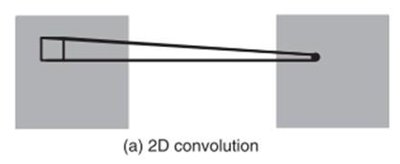
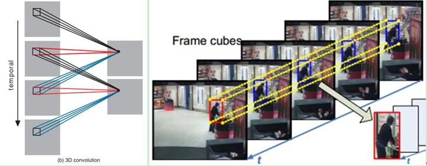
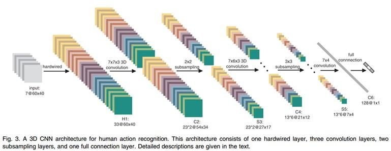
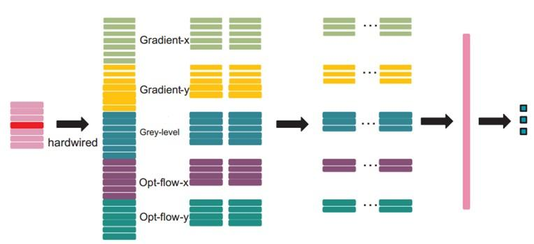
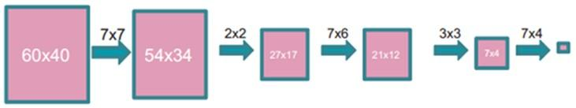
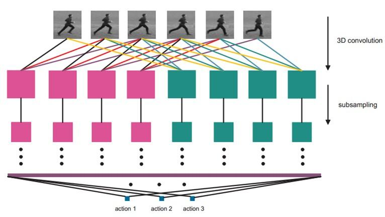
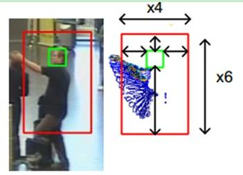
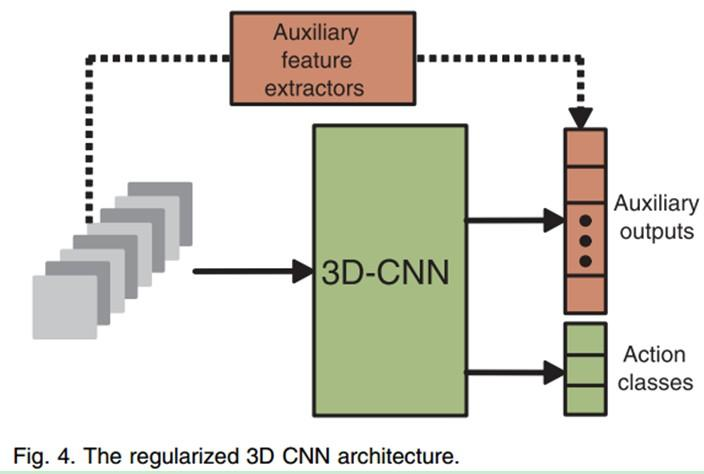

==============================================
 基于3D卷积神经网络的人体行为理解（论文笔记）
==============================================

:URL: http://blog.csdn.net/zouxy09/article/details/9002508

**Author Information**

`zouxy09@qq.com <mailto:zouxy09@qq.com>`__

`http://blog.csdn.net/zouxy09 <http://blog.csdn.net/zouxy09>`__

最近看Deep Learning的论文，看到这篇论文：3D Convolutional Neural Networks for
Human Action Recognition。比较感兴趣是CNN是怎么应用于行为理解的，所以就看看。这篇
论文发表在TPAMI2013。它基本上没有公式的，论文倾于从论述角度描述它的基本方法和实现
效果。另外，对于怎么去训练也没有具体的介绍，不知道和普通的用于二维图像的卷积神经
网络有什么差别。另外，下面的总结是翻译加自己的理解组成的，学识有限，如有错误，还
望大家不吝指导。

该文关注的是在监控中人类行为的自动识别问题。这点还是挺有应用价值空间的，它可以自
动的理解识别监控中人的异常行为，例如打架啊，偷东西啊，老人摔倒啊，聚众事件啊，入
侵啊等等。这些行为如果可以检测出来，在安防等领域还是有很大价值的。还记得电影上面
那些保安每天都坐在无数的监控屏幕前，永不停息的睁开着疲乏的双眼……

一、概述
========

上面说到，人类行为识别很重要。在现实的环境中，不同的场景存在杂乱背景、阻挡和视角
变化等等情况，对于人来说，很容易就可以辨识出来，但对于计算机，就不是一件简单的事
了。而以前的Human Action Recognition方法都是基于一些对应用场景苛刻的假设上的，例
如目标小的尺度变化和小的视觉改变等。但这在现实世界中是很难满足的。

目前，在这方面，大部分当前的打法都是遵循两个步骤：

#. 在原始的输入中提取复杂的人工特征；

#. 在获取的特征上学习分类器。

但在现实世界的场景中，我们几乎很难知道对于一个具体的任务什么样的特征才是重要的，
因为特征的选择与具体的问题高度依赖。特别是行为识别上，不同的运动类型在外观和运动
模型上都呈现出非常大的不同。

CNN卷积神经网络是一种深度模型。它其实老早就已经可以成功训练并且应用了（最近可能
deep learning太火了，CNNs也往这里面靠。虽然CNNs也属于多层神经网络架构，但把它置身
于DL家族，还是有不少人保留自己的理解的）。它在原始的输入中应用可训练的滤波器
trainable filters和局部邻域池化操作local neighborhood pooling operations，得到一
个分级的且逐渐复杂的特征表示。有实践表示，如果采用合适的规则化项来训练，它可以达
到非常好的效果。CNN还让人青睐的一点就是它会对例如姿势、光照和复杂背景存在不变性。

CNN牛逼就在于它是一种可以直接在原始输入就大展拳脚的深度模型。然而，让人心淡的一点
是，它虽然具有强大的功力，但目前它宏大的梦想只受限在2D输入的舞台。但对于有梦想的
人，这也是让人心动的一点，因为还有改进和上升的空间。这篇文章提出了一个新的3D CNN
模型，用于运动识别。该模型可以从空间和时间的维度提取特征，然后进行3D卷积，以捕捉
从多个连续帧得到的运动信息。

该论文的贡献，其自组织为：

#. 提出通过3D卷积操作核去提取视频数据的时间和空间特征。这些3D特征提取器在空间和时
   间维度上操作，因此可以捕捉视频流的运动信息。

#. 基于3D卷积特征提取器构造了一个3D卷积神经网络。这个架构可以从连续视频帧中产生多通道的信息，然后在每一个通道都分离地进行卷积和下采样操作。最后将所有通道的信息组合起来得到最终的特征描述。

#. 提出通过计算高层运动特征得到的辅助输出来增强模型。为了应对不同环境的使用，还综合多个不同的CNN架构去综合判断识别结果。

#. 在TRECVID数据集中测试，并和一些基准方法进行比较。其实验证明文中方法outperforms二维CNNs方法和其他的基准方法。

那下面我们就依次来看看这些贡献的细节。

二、3D卷积神经网络
==================

1、3D卷积
---------

在video中应用CNN一个简单的方法就是对每一帧运用CNN来识别，但是这种方法并没有考虑到
连续帧间的运动信息。为了有效的综合运动信息，文中提出了一种3D卷积的方法。通过在
CNNs的卷积层进行3D卷积，以捕捉在时间和空间维度都具有区分性的特征。

|image0|

|image1|

3D卷积是通过堆叠多个连续的帧组成一个立方体，然后在立方体中运用3D卷积核。在这个结
构中，卷积层中每一个特征map都会与上一层中多个邻近的连续帧相连，因此捕捉运动信息。
例如上面左图，一个卷积map的某一位置的值是通过卷积上一层的三个连续的帧的同一个位置
的局部感受野得到的。

需要注意的是：3D卷积核只能从cube中提取一种类型的特征，因为在整个cube中卷积核的权
值都是一样的，也就是共享权值，都是同一个卷积核（图中同一个颜色的连接线表示相同的
权值）。我们可以采用多种卷积核，以提取多种特征。

对于CNNs，有一个通用的设计规则就是：在后面的层（离输出层近的）特征map的个数应该增
加，这样就可以从低级的特征maps组合产生更多类型的特征。

2、3D CNN架构
-------------

文中的3D CNN架构包含一个硬连线hardwired层、3个卷积层、2个下采样层和一个全连接层。
每个3D卷积核卷积的立方体是连续7帧，每帧patch大小是60x40；

|image2|

在第一层，我们应用了一个固定的hardwired的核去对原始的帧进行处理，产生多个通道的信息，然后对多个通道分别处理。最后再将所有通道的信息组合起来得到最终的特征描述。这个实线层实际上是编码了我们对特征的先验知识，这比随机初始化性能要好。

|image3|

每帧提取五个通道的信息，分别是：灰度、x和y方向的梯度，x和y方向的光流。其中，前面
三个都可以每帧都计算。然后水平和垂直方向的光流场需要两个连续帧才确定。所以是7x3
+ (7-1)x2=33个特征maps。

然后我们用一个7x7x3的3D卷积核（7x7在空间，3是时间维）在五个通道的每一个通道分别进
行卷积。为了增加特征map的个数（实际上就是提取不同的特征），我们在每一个位置都采用
两个不同的卷积核，这样在C2层的两个特征maps组中，每组都包含23个特征maps。23是
(7-3+1)x3+(6-3+1)x2前面那个是：七个连续帧，其灰度、x和y方向的梯度这三个通道都分别
有7帧，然后水平和垂直方向的光流场都只有6帧。54x34是(60-7+1)x(40-7+1)。

在紧接着的下采样层S3层max pooling，我们在C2层的特征maps中用2x2窗口进行下采样，这
样就会得到相同数目但是空间分辨率降低的特征maps。下采样后，就是
27x17=(52/2)\*(34/2)。

C4是在5个通道中分别采用7x6x3的3D卷积核。为了增加特征maps个数，我们在每个位置都采
用3个不同的卷积核，这样就可以得到6组不同的特征maps，每组有13个特征maps。13是
((7-3+1)-3+1)x3+((6-3+1)-3+1)x2前面那个是：七个连续帧，其灰度、x和y方向的梯度这三
个通道都分别有7帧，然后水平和垂直方向的光流场都只有6帧。21x12是(27-7+1)x(17-6+1)。

S5层用的是3x3的下采样窗口，所以得到7x4。

|image4|

到这个阶段，时间维上帧的个数已经很小了， (3 for gray, gradient-x, gradient-y,
and 2 for optflow-x and optflow-y)。在这一层，我们只在空间维度上面卷积，这时候我
们使用的核是7x4，然后输出的特征maps就被减小到1x1的大小。而C6层就包含有128个特征
map，每个特征map与S5层中所有78（13x6）个特征maps全连接，这样每个特征map就是1x1，
也就是一个值了，而这个就是最终的特征向量了。共128维。

|image5|

经过多层的卷积和下采样后，每连续7帧的输入图像都被转化为一个128维的特征向量，这个
特征向量捕捉了输入帧的运动信息。输出层的节点数与行为的类型数目一致，而且每个节点
与C6中这128个节点是全连接的。

在这里，我们采用一个线性分类器来对这128维的特征向量进行分类，实现行为识别。

模型中所有可训练的参数都是随机初始化的，然后通过在线BP算法进行训练。

3、模型规则化Model Regularization
---------------------------------

3D CNN模型的输入被限制为一个少的连续视频帧（这里我们取的是7帧），因为随着输入窗口
大小的增加，模型需要训练的参数也会增加。但是呢，很多人的行为是跨越很多帧的。例如
下面这个小伙子摆个手，跨越的帧数就有10帧以上了。

|image6|

因此，在3D CNN模型中，有必要捕捉这种高层的运动信息。为了达到这个目的，我们用大量
的帧来计算运动特征，然后把这些运动特征作为辅助输出去规则化3D CNN模型。

对于每一个需要训练的行为，我们提取其长时间的行为信息，作为其高级行为特征。这个运
动信息因为时间够长，所以要比CNN的输入帧的立方体包含的信息要丰富很多。然后我们就迫
使CNN学习一个非常接近这个特征的特征向量。这可以通过在CNN的最后一个隐层再连接一系
列的辅助输出节点，然后训练过程中，使提取的特征更好的逼近这个计算好的高层的行为运
动特征向量。

|image7|

试验中，我们在原始的灰度图像中计算稠密sift描述子，然后通过这些sift描述子和运
动边缘历史图像(MEHI)组合构造bag-of-words特征作为辅助特征。

|image8|

因为灰度图保留了外观信息，运动边缘历史图像只关心形状和运动模式，所以可以提取这两
个互补的信息作为两个连续帧的局部特征bag。MEHI的计算见上图右，先简单的计算两帧间的
差分，这样就可以保留运动信息，然后对其执行一次Canny边缘检测，这样可以使得观测图像
更加清楚简洁。最总的运动边缘图像就是将历史的这些图像乘以一个遗忘因子再累加起来得
到。具体的构造需要参考更多的论文了。

4、模型组合
-----------

不同的3D CNN模型在不同的应用环境下性能不一样。一种自适应的方法就是构造多个不同的
模型，然后对一个特定的输入，每个模型都做出预测，然后组合这些模型的预测得到最后的
决策。

本文中，我们构造多个不同的3D CNN模型，因此它可以从输入捕捉潜在的互补信息，然后在
预测阶段，每个模型都针对一个输入得到对应的输出，然后再组合这些输出得到最终的结果。

5、模型的实现
-------------

本文的3D CNN模型用C++实现，它是属于NEC's行为识别系统的一部分（具体见参考文献[2]）。
关于CNN具体的实现细节是基于原始CNN的（具体见参考文献[3][4]）。所有的子采样层都是
最大子采样。用于训练规则化模型的整体代价函数是由真实的行为类的误差和高层特征的辅
助输入的代价项的线性加权得到。权值分别是1和0.005（经验值）。模型的所有参数都是随
机初始化，然后通过随机diagonal Levenberg-Marquardt方法来优化训练。在这个方法中，
先通过1千个随机采样的样本来得到一个近似Hessian矩阵的Gauss-Newton近似，然后使用它
的对角项来决定每个参数的学习速率。

三、参考文献
============

实验结果就不说了，大家可以直接看论文。下面是一些参考文献：

[1] Shuiwang Ji, Wei Xu, Ming Yang and Kai Yu, D convolutional neural networks
    for human action recognition, Pattern Analysis and Machine Intelligence,
    IEEE Transactions on (Volume:35 , Issue: 1 ), 2013

[2] M. Yang, S. Ji, W. Xu, J. Wang, F. Lv, K. Yu, Y. Gong, M. Dikmen, D.J. Lin,
    and T.S. Huang, "Detecting Human Actions in Surveillance Videos," Proc. TREC
    Video Retrieval Evaluation Work-shop,2009

[3] Y. LeCun, L. Bottou, Y. Bengio, and P. Haffner, "Gradient-Based Learning
    Applied to Document Recognition," Proc. IEEE,vol. 86, no. 11, pp. 2278-2324,
    Nov. 1998

[4] Y. LeCun, L. Bottou, G. Orr, and K. Muller, "Efficient Backprop," Neural
    Networks: Tricks of the Trade,G. Orr and M. Klaus-Robert, eds.,
    Springer, 1998.

关于CNN的具体BP的细节（但不是实现细节）还可以参考下面的笔记：（具体哪里下载的忘了，
找不到的可以发邮件给我）

Jake Bouvrie, Notes on Convolutional Neural Networks

.. |image8| image:: 3d-cnn-action.images/image8.jpeg
