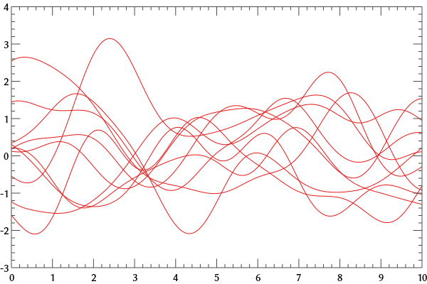
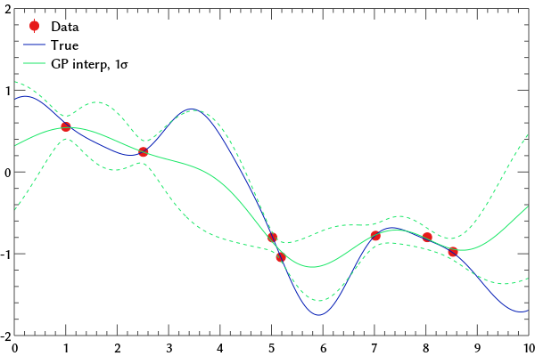

=======================================
Elementary Gaussian Processes in Python
=======================================

:URL: http://newton.cx/~peter/2014/03/elementary-gaussian-processes-in-python/
:URL: http://newton.cx/~peter/wp/wp-content/uploads/2014/03/elem_gau_proc.html

Introduction
============

Gaussian processes are `so hot right
now <https://speakerdeck.com/dfm/an-astronomers-introduction-to-gaussian-processes>`__,
but I haven’t seen examples of the very basic computations you do when
you’re "using Gaussian processes". There are tons of packages that do
these computations for you —
`scikit-learn <http://scikit-learn.org/stable/>`__,
`GPy <https://github.com/SheffieldML/GPy>`__,
`pygp <https://pypi.python.org/pypi/pygp>`__ —but I wanted to work
through some examples using, and showing, the basic linear algebra
involved. Below is what I came up with, as incarnated in an `IPython
notebook <http://ipython.org/notebook.html>`__ showing a few simple
analyses.

This post is also a pilot for embedding IPython notebooks on this blog.
Overall it was pretty straightforward, though I had to insert a few
small tweaks to get the layout to work right — definitely worth the
effort, though! I haven’t really used an IPython notebook before but I
gotta say it worked really well here. I generally prefer the console for
getting work done, but it’s a really nice format for pedagogy.

Method
======

We'll start by importing standard packages. ``omega`` is a personal
plotting package that I've written (``matplotlib`` is ugly); since
nobody else has it, I've made it optional. Plotting the results in
``matplotlib`` should be easy too.

.. code:: python

   import numpy as np
   from scipy.linalg import cho_factor, cho_solve

   try:
	   import omega as om, omega.ipynbInteg, omega.pango
	   omega.pango.setFont (size=12, family='Linux Biolinum O')
	   have_omega = True
   except ImportError:
	   have_omega = False

I'm going to assume that you've read some tutorials on what Gaussian
processes actually are. If so, you've probably seen that the key
characteristic of a Gaussian process is the covariance matrix that it
generates, which is derived from some "kernel". The squared-exponential
kernel is a pretty straightforward one taking two parameters scale.
Given the properties of a particular sample (sample locations *x*,
uncertainty per data point *u*), we can compute the covariance matrix
thus:

.. code:: python

   def sqexp_kernel (a, s, r):
	   return a * np.exp (-0.5 * (r / s)**2)

   def gp_cov (kernel, x, u):
	   # "kernel" is a one-parameter GP kernel function; we can
	   # derive it from (e.g.) sqexp_kernel using a Python
	   # lambda expression.

	   # Matrix of separations: r[i,j] = x[j] - x[i]
	   r = x[np.newaxis,:] - x[:,np.newaxis]
	   return kernel (r) + np.diag (u)

(It can be a bit confusing since we're using a Gaussian-looking equation
to generate a Gaussian covariance matrix. Other Gaussian-process kernels
have the covariance scale with separation differently: :math:`1/r` rather
than :math:`\exp(-r^2)`, say.)

Sampling
========

Every says "Oh, the first thing you should do is draw some samples from your
process to get a feel for it," but no one ever actually makes it clear how to do
this! Maybe it's just me but I had to do some research to find out.

Looking at ``sqexp_cov`` above, it seems like we can choose a dense mesh in *x*
and compute a covariance matrix. Then we somehow need to generate some random
data that "obey" that matrix. It turns out that there are some basic statistical
laws that make this easy. (I learned the following `from StackExchange
<http://stats.stackexchange.com/a/32171>`__ --- I should learn some real stats!)
Say we have a random vector :math:`\vec r` drawn from a multidimensional Gaussian
characterized by mean :math:`\vec \mu_r` and covariance :math:`C_r`. For some
matrix :math:`A`, we can compute the product :math:`\vec s = A \vec r`. It is true
that

.. math:: \qquad \vec \mu_s = A \vec \mu_r

and

.. math:: \qquad C_s = A C_r A^T.

How does this help us generate a correlated noise vector "obeying" some
covariance matrix :math:`C`? Say we have some :math:`\vec r` with zero
mean, unit variance, and zero covariance — which is easy to generate.
From the above, we see that we can create something obeying :math:`C` by
finding :math:`A` such that :math:`A A^T = C`. Such an :math:`A` happens to be
the the `Cholesky
decomposition <http://en.wikipedia.org/wiki/Cholesky_decomposition>`__
of :math:`C`, which is well-trodden numerical ground. In Python:

.. code:: python

   def corr_noise (cov):
	   uncorr_noise = np.random.normal (size=cov.shape[0])
	   return np.dot (np.linalg.cholesky (cov), uncorr_noise)

So let's create a Gaussian process covariance matrix and sample it a few
times. One subtlety is that the covariance matrix is `positive
definite <http://en.wikipedia.org/wiki/Positive-definite_matrix>`__
*only* if the per-sample uncertainties are positive, so we have to use a
small-but-nonzero vector for *u* in ``sqexp_cov``.

.. code:: python

   x = np.linspace (0, 10, 300)
   kern = lambda r: sqexp_kernel (1., 1., r)
   cov = gp_cov (kern, x, 1e-9 * np.ones_like (x))

   if have_omega:
	   p = om.RectPlot ()
	   for i in xrange (10):
		   p.addXY (x, corr_noise (cov), None, dsn=0)
	   p.show (dims=(400,300))

Hooray! That looks like a thing.

Kriging
=======

So far, so good. But we haven't dealt with any observed data yet! That
seems like an important thing to work on.

When people model data using a Gaussian process, they often end up
showing a plot of wiggly lines interpolating between the data points,
with the lines getting wigglier between the measurements because the
constraints are poorer there. Interpolation in the context of a
Gaussian-process model is apparently called
`kriging <http://en.wikipedia.org/wiki/Kriging>`__, after `this
guy <http://en.wikipedia.org/wiki/Danie_G._Krige>`__. We can operate in
a regime called "simple kriging" where the analysis is pretty
straightforward. We're doing a linear interpolation, so fundamentally
we're computing

.. math::  \qquad y_i(x_i) = \vec w(x_i,x_o) \cdot \vec y_o,

where *w* is some weighting vector, the subscript *i* stands for
"interpolated," and *o* for "observed". In simple kriging,

.. math::  \qquad \vec w = C_o^{-1} \: \vec c,

where :math:`C_o^{-1}` is the inverse covariance matrix of the observed
data and :math:`c` is a sort of "covariance vector": :math:`c_j` is the
expected covariance between the j'th measurement and the interpolant at
:math:`x_i`. In the Gaussian process formalism, :math:`\vec c` is easily
computed from the Gaussian process kernel.

There's also a nice expression to compute the expected variance of the
kriging interpolant at a given location:

.. math::  \qquad \sigma^2_i(x_i) = c_0 - \vec c^T \: C_o^{-1} \: \vec c,

where :math:`c_0` is the covariance kernel evaluated for :math:`r = 0`.
("Autocovariance"?)

So let's put together some tools to do this computation:

.. code:: python

   def krige_one (data_x, data_y, cov, kernel, interp_x):
	   # "covariance vector"
	   cvec = kernel (interp_x - data_x)

	   # weight vector
	   cinv = np.linalg.inv (cov)
	   wt = np.dot (cinv, cvec)

	   # interpolant and its std.dev.
	   interp_y = np.dot (wt, data_y)
	   interp_u = np.sqrt (kernel (0) - np.dot (cvec, wt))
	   return interp_y, interp_u

   def krige (data_x, data_y, cov, kernel, interp_x):
	   """This interpolates for a vector of X values all at once.
	   Looking at the notation above, you could imagine x_i being
	   a vector rather than a scalar. Below we need to do a few
	   transposes to get the matrix math to work out from Numpy's
	   point of view; above we were able to be a bit sloppy since
	   the difference between row vectors and column vectors
	   wasn't relevant."""

	   di_cov = kernel (data_x[:,np.newaxis] - interp_x[np.newaxis,:])

	   cinv = np.linalg.inv (cov)
	   wt = np.dot (cinv, di_cov)

	   interp_y = np.dot (wt.T, data_y)
	   interp_cov = kernel (0) - np.dot (di_cov.T, wt)
	   return interp_y, interp_cov

