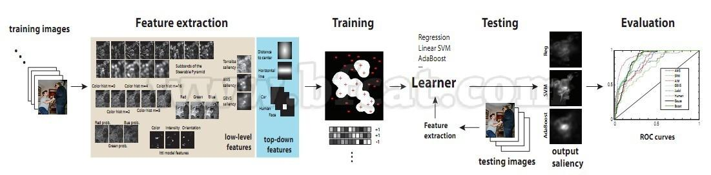
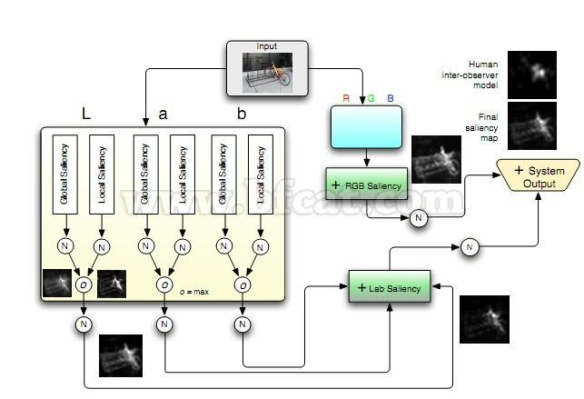
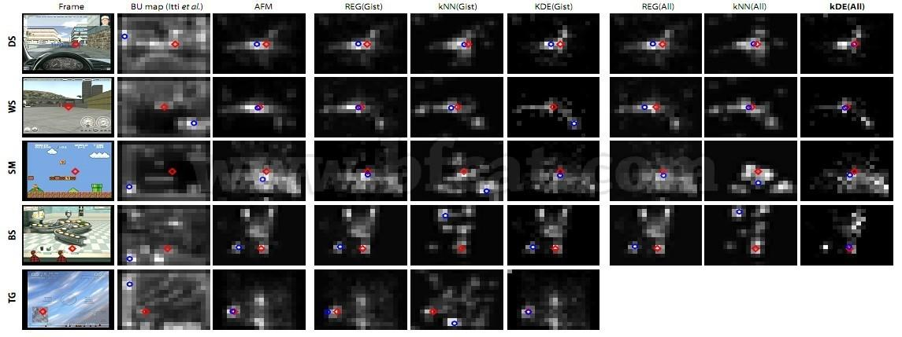
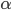

==============================================================================
读论文：CVPR2012--Ali Borji的三篇saliency | bfcat-计算机视觉博客
==============================================================================

:URL: http://www.bfcat.com/index.php/2012/05/cvpr2012-ali-borji/

Ali Borji是Laurent Itti的学生，他在这一年中就 `显著性
<http://www.bfcat.com/index.php/tag/xian-zhu-xing/>`__ 方面发表了5篇高水平的国际
会议。其中在\ `CVPR <http://www.bfcat.com/index.php/tag/cvpr/>`__\ 2012上面有三篇
第一作者的文章。先看一下题目：

1. Boosting Bottom-up and Top-down Visual Features for Saliency Estimation，
   (`PDF <http://ilab.usc.edu/~borji/papers/cvpr-2012-BUModel-v4.pdf>`__) `Ali
   Borji <http://ilab.usc.edu/~borji/Publications.html>`__

2. Exploiting Local and Global Patch Rarities for Saliency Detection，(`PDF
   <http://ilab.usc.edu/~borji/papers/BUModel6.pdf>`__) `Ali Borji
   <http://ilab.usc.edu/~borji/Publications.html>`__, Laurent Itti；

3. Probabilistic Learning of Task-Specific Visual Attention，(`PDF
   <http://ilab.usc.edu/~borji/papers/cvpr-2012-top-downV8.pdf>`__) `Ali Borji
   <http://ilab.usc.edu/~borji/Publications.html>`__, Dicky Sihite, Laurent Itti；

先看第一篇：
============

这篇文章将多种底层和高层特征进行组合来实现显著性检测。用到的底层特征包括颜色，方
向，以及一些现有的底层显著图，例如GBVS，Itti模型等。高层特征主要是目标级别的，包
括了行人，人脸，车辆等。

在训练数据集上提取出各种底层特征以及显著图（总共30种特征）以及几种高层检测器计算
出的概率映射图以后，他使用采集到的眼动数据作为groundtruth来提取正样本和负样本，
像素级的。

这篇文章的主要贡献就在于作者测试了多种分类器对于显著图计算的贡献。他将数据集分为
N组，然后使用leave-one-out的方式进行训练和测试。测试的分类器包括：线性回归，线性
核的SVM， 以及boosting方法。从实验结果对比来看，非线性的boosting方法取得的效果是
最好的。

在文章的最后一部分，作者就使用boosting方法进行了测试以及和其他方法的实验对比。

文章的贡献主要在于不同分类器效果的测试。三篇里只有这篇文章没有署Itti的名字，不知
道是不是Itti没看上这个工作，不愿意署名（个人猜测）。

文章的流程图如下：

|image0|

再看看第二篇：
==============

这篇文章有两个贡献点：1. 局部和全局的patch孤立性（rarity）作为互相补偿的两种度量；
其中，局部的孤立性就相当于中央周边的差异，而全局的孤立性就相当于全局对比度。2. 在
不同的图像中，RGB空间和Lab空间的其中一个会对显著性体现出更好的区分度。

作者在两个空间分别计算局部和全局的patch孤立性然后进行融合。与大部分人直接使用颜色
直方图的方式不同，本文通过1500张图像中，在各通道提取出的8\*8的patch，学到了一个自
然图像的字典。使用这个字典以及一系列的系数 :math:`\alpha` 就可以重组任何一个patch。各
通道分别进行。

因此，在学习了字典，并且使用Matlab中的LARS算法进行了稀疏编码系数 :math:`\alpha` 的估
计之后，每个patch通过系数表示成一个矢量。在这些矢量上进行局部和全局孤立性的计算和
以往的方法没有什么区别，最终每个通道会得到局部和全局两个显著图。

但是有一点值得注意，作者并没有将RGB和Lab的六个通道结果一起进行融合。本文的融合分
为三步：

1. 每一个通道内，局部和全局显著图进行归一化并相乘

2. 每一种颜色空间内，三个显著图归一化并相加

3. 两个颜色空间的显著图归一化并相加

这些虽然看似是技巧性的工作，但是归一化对于显著图最终的质量有着很重要影响。相乘表
示目标必须同时满足局部和全局的孤立性条件。相加表示各个通道之间是互补，或者竞争关
系。并且这个竞争是现在各个颜色空间内部几个通道之间进行，优胜者再和另一个颜色通道
的比较。

文章最后的结果是attention map，点亮了一些较稀疏的显著点，是针对于预测眼动的，并不
是直接针对于分割。

论文的流程图如下：

|image2|

最后看第三篇：
==============

第三篇的方向其实我不是很关注，因为是和任务相关的，任务驱动型的显著性检测。就全文
来看，这篇文章主要是针对驾驶游戏中的连续图像序列。

论文依然是将底层显著性和一些先验知识进行融合。用到的先验知识包括场景的上下文，上
一帧关注的区域，以及机械信号（方向，踏板，转向信号等）。作者在文章中对引入不同先
验知识的效果进行了分别实验，包括：1. 仅适用当前帧的场景信息；2. 加入上一帧对当前
帧的预测； 3. 加入外部驾驶信号。

对于每一种方法，作者均建立了一个简单的贝叶斯模型（见论文）。

模型中，场景信息（Gist）的概率 :math:`P(G_i | X_i)` 通过高斯核密度估计的方法计算。
即

.. math::
   P(G|x_i) =\frac{1}{m} \sum_{i=1}^{m} g \left( \frac{x - x_i}{h} \right)

其中g是高斯核，h为高斯核的带宽。这个和全局对比度的计算结果类似。对于人机交互的行
为（踏板，方向，或另一些游戏中的鼠标点击，手柄按键）等和注意区域之间的关系，作者
在文中进行了简单的数据分析。

最终的实验结果比较有意思，很多游戏中的实验：

|image5|

