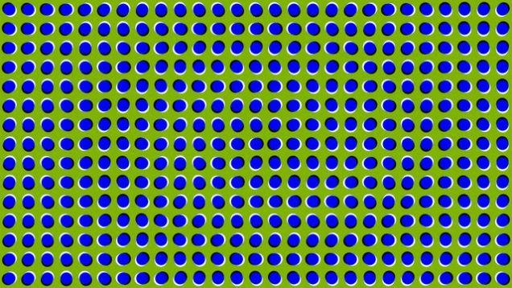

=========================================
Why does this still image appear to move?
=========================================

:URL: http://io9.com/5935588/why-does-this-still-image-appear-to-move

I think we've proven, through various optical illusions, that your eyes
know precisely nothing about anything. And yet it's still creepy when a
still image is crawling across your screen. Check out a couple of
reasons why people think this happens.

There's not much to be said, here. The image is moving. I see it. You
see it. We all see it. Why is it happening? The answer, as is so often
the case, is "no one knows." If scientists could claw open our eyeballs
and dig back to our brains to figure it out they would, bless them, but
that doesn't work. There are a couple theories.

One explanation is that the color white turns the receptors on our
retinas on, while the color black shuts them off. Having white and black
in close proximity, and in certain arrangements, makes them flicker
between on and off. The changes from on to off and on again are
interpreted by the brain as motion.

Another theory holds that our retina sections aren't flicking off and
on, they're perceiving color changes. It's been noticed that, when black
and white are striped, and those stripes move in different directions -
for example the stripes are oriented differently in each of four
sections of a grid - the eyes see illusory colors. The curves that we
see around the dots might serve as different angled black and white
lines, and we might see color changes that we interpret as motion.

All I know is that when I stare intently at a section it stills, but the
sections I see in my peripheral vision move around fast. It also moves
faster as I move my eyes. So whatever's happening is always happening
just at the edges of my vision as I sweep back and forth. Computer
ghosts?

Image: `Paul Nasca <http://www.flickr.com/photos/24892543@N00/>`__

Via `Akiyoshi's Illusion
Pages <http://www.ritsumei.ac.jp/~akitaoka/index-e.html>`__.

